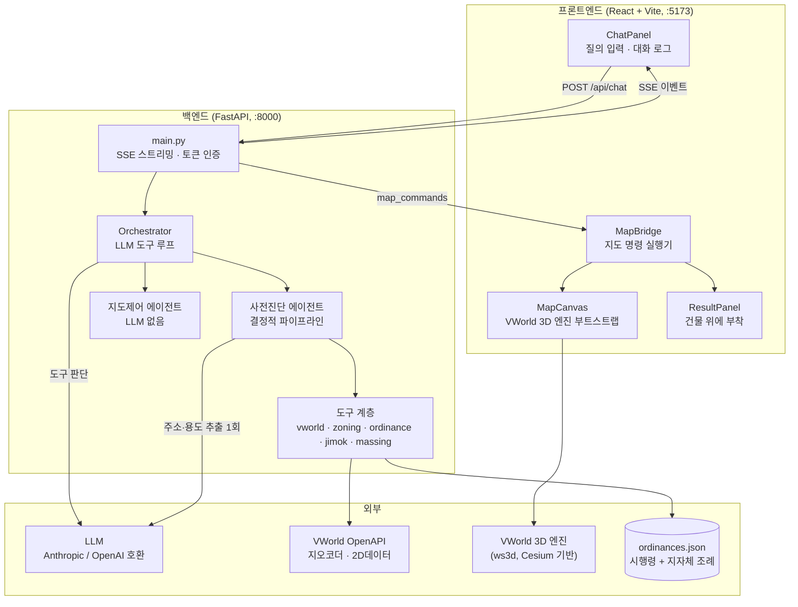
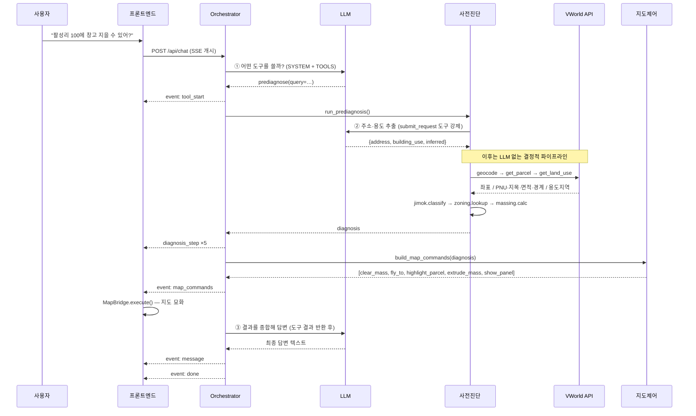
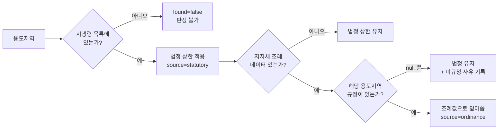

# 공간정보 기반 인허가 사전진단 시스템 — 아키텍처

자연어 질의 하나로 **필지를 찾고 → 법령·조례를 적용해 건축 가능 여부를 판정하고 →
VWorld 3D 지도 위에 건축 가능 규모를 세워 보여주는** 시스템.

> 이 문서는 2026-07-21 기준 실제 코드를 읽고 작성했다. 수치와 동작은
> 구현에서 확인한 것이고, 미구현·미수집 항목은 [10. 알려진 한계](#10-알려진-한계와-미완-항목)에 따로 적었다.

---

## 1. 무엇을 하는가

| 입력 | `"충청북도 음성군 생극면 팔성리 100에 창고 지을 수 있어?"` |
|---|---|
| 출력 (텍스트) | 조건부 가능 / 계획관리지역 / 건폐율 40% · 용적률 100% / 건축면적 276㎡ · 연면적 691㎡ · 2층 |
| 출력 (지도) | 해당 필지로 카메라 이동 → 필지 경계 강조 → 건축 가능 규모를 3D 입체로 생성 → 결과 패널을 건물 위에 부착 |

핵심 설계 판단은 **"LLM은 사람 말을 구조로 바꾸는 데만 쓰고, 판정·계산·묘화는 결정적 코드가 한다"**이다.
근거는 [4.2](#42-사전진단-에이전트--왜-도구-루프를-쓰지-않는가)에 있다.

---

## 2. 전체 구성



**포트 / 프로세스**

| | |
|---|---|
| 프론트 | Vite dev server `:5173`. `/api` 는 `:8000` 으로 프록시 (`vite.config.ts`) |
| 백엔드 | uvicorn `:8000`. 세션 상태는 프로세스 메모리 (`_sessions: dict`) |
| 외부 노출 | 프론트 포트만 열면 된다. `VITE_API_BASE` 기본값이 빈 문자열이라 같은 오리진으로 프록시된다 |

---

## 3. 질의 1건이 흐르는 경로



**LLM 호출은 질의 1건당 3회**다 (①오케스트레이터 판단, ②주소·용도 추출, ③최종 답변).
초기 구현은 9회였고, 무료 티어 일일 한도를 질의 두어 건으로 소진했다. 그 경위는 [4.2](#42-사전진단-에이전트--왜-도구-루프를-쓰지-않는가).

---

## 4. 백엔드

### 4.1 오케스트레이터 (`app/orchestrator.py`)

세션 1건 = `Orchestrator` 인스턴스 1개. 대화 이력(`messages`)과 직전 진단(`diagnosis`)을 들고 있다.

LLM에게 주는 도구는 3개뿐이다:

| 도구 | 역할 |
|---|---|
| `prediagnose` | 주소/좌표 → 필지·용도지역 조회 → 허용 여부·밀도 상한 검토 → 건축 가능 규모 산출 |
| `render_on_map` | 직전 진단을 지도 명령으로 변환 |
| `restudy_massing` | 좌표·규제 재조회 없이 밀도만 바꿔 재산출 (`"용적률 250%면 몇 층?"`) |

`ask()` 는 최대 8턴 루프를 돌며 `{event, data}` 를 async generator로 흘린다.

**의도적으로 LLM을 건너뛰는 지점** — `prediagnose` 가 끝나면 `render_on_map` 을
모델에게 다시 물어보지 않고 그 자리에서 실행한다 (`orchestrator.py:161-164`).
진단 후 지도 반영은 확정 절차라, 판단시켜봐야 결과는 항상 같고 LLM 호출만 한 번 더 는다.

모델에게 돌려주는 진단 결과는 `compact()` 로 축약한다 — 경계 폴리곤 좌표 수천 개가
컨텍스트를 잡아먹기 때문에 `geometry` 를 제거한다.

### 4.2 사전진단 에이전트 — 왜 도구 루프를 쓰지 않는가

`app/agents/prediagnosis.py` 의 설계 노트가 근거를 담고 있다.

조회 순서는 고정이다: **주소 → 좌표 → 필지 → 용도지역 → 규제 → 규모.**
분기도 하나뿐이다(불허면 규모 산출을 건너뛴다). 이 확정된 절차를 매 단계 LLM에게
물으면 호출이 6~7회로 늘고, 그만큼 지연·비용·실패 지점이 늘어난다.

그래서 LLM은 **자연어에서 구조를 뽑는 일 한 번**에만 쓴다:

```python
extract_request(client, query)   # "테헤란로 152에 업무시설" → (주소, 건축물 용도)
```

`submit_request` 도구를 강제해 `{address, lon?, lat?, building_use, inferred, far_target_pct?}` 를 받고,
`building_use`는 `시설물`을 포함한 11개 값(`BUILDING_USES`, 실제 건축물 대분류
10개)으로 정규화한다. 용도가 명시되지 않으면 임의의 단일 용도를 추측하지 않고
`시설물`, `inferred=true`로 표시해 지원 용도 전체를 검토한다.

이후는 전부 결정적 코드다. 판정 근거가 되는 수치는 어차피 도구가 계산하므로
정확성이 떨어지지 않고, 오히려 모델이 순서를 건너뛰거나 인자를 잘못 넣을 여지가 사라진다.

요약문(`_summarize`)도 LLM 없이 값에서 조립한다.

### 4.3 지도제어(2D) · 3D(매스) 에이전트 (`app/agents/map_control.py`)

**LLM을 쓰지 않는 순수 변환기.** 진단이 이미 판단을 끝냈으니 여기서는
'무엇을 어떻게 그릴지'만 정하면 되고, 그 규칙은 확정적이다. 한 모듈이지만 기능이
둘로 나뉜다.

- **지도제어(2D)** — 카메라 이동(`fly_to`), 필지 강조(`highlight_parcel`),
  용도지역 조각(`show_zone_pieces`), 결과 패널(`show_panel`)
- **3D(매스)** — 건축 가능 규모의 3D 입체(`extrude_mass`), 치수선(`show_dimensions`),
  용도별 건물 모델(`show_housing_model`: 주택/공장/상가/창고). **실제 3D 렌더링은
  백엔드가 아니라 프론트 `lib/mapBridge.ts` 가 VWorld 3D(ws3d/Cesium)에서** 한다.
  치수선은 가로·세로에 더해 두 치수선이 만나는 모서리에서 매스 지면 기준으로 `height_m`
  만큼 **수직 높이선(노랑)** 을 세워 3축(가로·세로·높이)을 완성한다.
- **선 오버레이** — `show_dimensions` 세그먼트로 특정 선만 얹는다. 도로 접촉선(마젠타),
  건축선·이격선(가능 판정일 때만), 우수·오수 '개념' 배수로(파랑) 또는 사유지 침범 경로
  (빨강), 그리고 치수(가로·세로·높이)·면적(대지·건축)을 `overlay_command`이 골라 그린다.
  사용자가 선만 청하면(제미나이 의도 해석) `build_lines_only_commands`가 카드·매스·팝업
  없이 `clear_mass·fly_to·highlight_parcel` + 요청 선만 낸다. `_may_show_building_dimensions`로
  불가 필지엔 건물 치수선을 그리지 않는다. 침범 경로 라벨은 방류 목적지(구거/도로/하천,
  `encroachment.outlet`)와 통과 사유지 지목을 함께 표시하며, 침범 빨강과 겹치지 않게 그때
  **건축선은 보라(#7E57C2)** 로 바뀐다.
- **불허 요청용도의 매스 재생성** — 요청 용도가 불허(`verdict=not_allowed`)면 매스를 세우지
  않지만, `possible_models`('다른 건물?')에서 그 지역에 지을 수 있는 용도(allowed/conditional)가
  있으면 그 용도로 재진단해 매스를 만들어 3D로 표시한다(매스는 용도 무관 = 건폐율·용적률 봉투,
  원본 불허 판정은 보존).

> 별표1의 4번째 에이전트 — `agents/area_recommender.py` (지역추천): "○○ 비도시
> 지역에서 농막 지을 데 찾아줘" 류 탐색형 질의를 처리한다.

`build_map_commands(diagnosis)` → 명령 배열:

```
clear_mass  →  fly_to  →  highlight_parcel  →  extrude_mass  →  show_panel
```

두 가지 계산이 들어 있다:

**카메라 고도** (`_view_altitude_m`) — 필지 크기에 비례시킨다.
```
side = √면적 ;  altitude = clamp(side × 2, 60, 700)   # 지면 위 높이
```
부각 35°에서 시거리는 `h/sin35 ≈ 1.74h`, 수직화각 60°면 화면에 담기는 폭이 `≈ 2h`.
필지가 화면의 1/4을 차지하려면 `h ≈ 2·side`. 고정 고도를 쓰면 691㎡ 필지는 점처럼
보이고 13,000㎡ 필지는 화면을 넘친다.

**카메라 방위각** (`_camera_heading`) — 필지의 **가장 긴 변이 화면 가로로 놓이도록** 한다.
길고 좁은 필지를 짧은 쪽에서 정면으로 보면 낮은 건물도 가느다란 탑처럼 보인다.

**불허 필지에는 건물을 세우지 않는다** (`verdict != "not_allowed"` 조건).
지을 수 없는 곳에 건물을 그려 보여주면 가능한 것처럼 읽힌다.

### 4.4 도구 계층 (`app/tools/`)

사전진단 에이전트가 sub-오케스트레이터로서 아래 도구들을 정해진 순서로 호출한다.
초기 5개에서 현재 **21개 모듈**로 확장됐다.

| 모듈 | 역할 |
|---|---|
| `vworld.py` | 지오코딩 / 필지 / 용도지역 / bbox 필지목록 (VWorld). `get_ledger_area_m2`(토지대장 공부면적 `lndpclAr`) · `get_planned_roads`(도시계획 도로 `lt_c_upisuq151`, 집행여부) 포함 |
| `landuse.py` | 용도지역·지구 상세 조회 |
| `zoning.py` | 용도별 허용 판정 `USE_MATRIX`(10개 용도) + 조례 밀도 상한 |
| `ordinance.py` | 건폐율/용적률 조례·법정 상한 `resolve_limits` (약 200개 관할) |
| `ordinance_index.py` | 전국 법령·관할 조례 근거 검색 (numpy TF-IDF, 범위 분리) |
| `permit_requirements.py` | `permit_rules.json` 조건 평가, 인허가 단계·선행관계 그래프 생성 |
| `legal_conflicts.py` | 명시적 금지·예외 미확정·독립 법률 누적 적용 평가 |
| `setback_rules.py` | 대지 안의 공지(이격) 조회 (119개 지자체 별표) |
| `site_constraints.py` | 이격·정북일조·주차 반영 개념 건축 가능 영역 |
| `road_access.py` | 도로 접도(연속지적도 지목 '도로' 인접, 접촉 길이 vs 접도 최소 2m) + 도시계획도로 접함 격상(`PLANNED_ROAD_ABUTS`) + 우수·오수 배수 방류처·가상 배수로·사유지 침범 경로 사전검토 |
| `land_ownership.py` | 필지 소유구분(국유·공유·사유) — 국토교통부 토지소유정보 API. 배수로 사유지 침범 판정 근거 |
| `jimok.py` | 지목 → 전용허가 필요성 (농지법/산지관리법) |
| `land_conversion.py` | 농지·산지 전용 규제 판정 |
| `regulatory_screen.py` | 재해·환경·국가유산 스크리닝 |
| `local_spatial.py` | 대용량 로컬 벡터 SQLite RTree 조회 (산지 106만 폴리곤) |
| `ogc.py` | OGC WFS/WMS 범용 클라이언트 + 필지 중첩 |
| `building_register.py` | 건축물대장 표제부 (국토부 건축HUB API). PNU로 0건이면 juso.go.kr 도로명주소로 건물 대표지번을 얻어 재조회(대단지·구축 아파트 검출) |
| `permit_requirements.py` | 인허가 단계·서류·부서 산출 |
| `conversion_charges.py` / `development_charge.py` | 농지보전부담금·개발부담금 참고액 |
| `massing.py` | 밀도 → 건축면적·연면적·층수·높이 |
| `footprint.py` | 건축면적 형상 계산 |
| `law_open.py` | 국가법령정보센터 현행 법령 검증 |

법률·조례 수집과 청킹의 입력·필터·메타데이터·TF-IDF 수식·관할 격리·LLM
전달 구조는 [LEGAL-ORDINANCE-INDEX.md](LEGAL-ORDINANCE-INDEX.md)를 기준으로
한다. 정형 JSON이 수치를 결정하고 조문 색인은 근거 검색에만 사용한다.

#### vworld.py — 실전에서 걸렸던 것들

- **`domain` 파라미터 필수.** 2D데이터 API(`service=data`)는 등록 도메인을 검증한다.
  브라우저는 Referer로 자동 확인되지만 백엔드 호출은 Referer가 없어 `INCORRECT_KEY` 로 거부된다.
  `VWORLD_DOMAIN` 을 `domain=` 으로 함께 보내야 통과한다. (지오코더는 검증하지 않는다)
  → **이 값은 브라우저 접속 URL이 아니라 인증키에 등록한 서비스URL이어야 한다.**
- **오류도 HTTP 200으로 온다.** `response.status == "ERROR"` 를 직접 확인해야 한다.
- **연속지적도에는 면적 필드가 없다.** 법적 기준인 공부면적을 우선 쓴다 — `get_ledger_area_m2`
  가 NED 토지특성(`getLandCharacteristics`)의 `lndpclAr`(토지대장 등록면적)을 조회해 `area_m2`
  로 삼고, 실패하면 경계 폴리곤에서 pyproj `Geod` 로 측지면적을 계산해 폴백한다. 어느 쪽을
  썼는지는 `area_source` 로 밝힌다. 걸침 조각 면적도 이 공부면적에 안분해 조각 합이 전체면적과
  맞고 토지이음과 일치한다(지도용 geometry 는 미변경).
- **지목은 지번 끝에 한글로 붙어 오고 띄어쓰기가 일정하지 않다** (`'737 대'`, `'100-10 도'`, `'1유'`).
  공백 분리가 아니라 끝에 오는 한글을 뽑는다(`_trailing_hangul`).
- **용도지역 레이어는 도시/비도시가 분리되어 있다.** `LT_C_UQ111`(도시) 하나만 조회하면
  비도시 필지가 통째로 "용도지역 정보 없음"이 된다. `LT_C_UQ112`(비도시)까지 둘 다 조회한다.

#### zoning.py + ordinance.py — 수치를 코드에 쓰지 않는다

`zoning.py` 는 **건폐율·용적률 수치를 하드코딩하지 않는다.** 전부 `data/ordinances.json` 에서 읽는다.
손으로 옮겨 적은 테이블에서 용적률 하한 7건이 틀렸던 전례가 있어서다.

`resolve_limits(zone, jurisdiction)` 의 우선순위:



`regulated` 판정이 중요하다 — 항목이 존재해도 `bcr_max_pct` / `far_max_pct` 가 모두
`null` 이면 '조례 미규정'이다. 데이터셋이 미규정 항목도 사유를 담은 placeholder로 넣어두기
때문에, 이걸 조례 적용으로 취급하면 **존재하지 않는 조문을 근거로 인용하게 된다.**

용적률 **하한**은 조례가 규정하지 않으므로 사실상 항상 법정값이다.

#### massing.py

```
건축면적 = 대지면적 × 건폐율/100
연면적   = 대지면적 × 용적률/100
층수     = 연면적 / 건축면적          (건폐율을 꽉 채워 지었을 때의 이론 층수)
높이     = 층수 × FLOOR_HEIGHT_M      (3.3m, 최상층이 반 층 남으면 한 층 추가)
```

### 4.5 LLM 어댑터 (`app/llm.py`)

Anthropic과 OpenAI(및 호환 엔드포인트)를 같은 인터페이스로 감싼다.
도구 루프의 **모양**은 두 provider가 같고 다른 건 요청/응답 형식뿐이라,
그 차이만 흡수해서 에이전트 코드가 provider를 모르게 한다.

| | Anthropic | OpenAI 호환 |
|---|---|---|
| 도구 정의 | `{name, description, input_schema}` 그대로 | `{type:"function", function:{…, parameters}}` 로 변환 |
| system | 별도 인자 | `messages[0]` 에 삽입 |
| 도구 결과 | user 메시지 1개에 `tool_result` 블록들 | 호출 1건당 `role:"tool"` 메시지 1개 |

**`_tool_call_to_dict()` 주의** — 응답의 tool_call을 이력에 되돌릴 때 필드를 골라 담으면 안 된다.
Gemini는 `extra_content.google.thought_signature` 를 함께 돌려주길 요구하고,
빠지면 `400 Function call is missing a thought_signature` 로 거부한다. 원본을 통째로 직렬화한다.

**무료 티어 프리셋** (`config.py`) — `LLM_BASE` 에 이름만 넣으면 base_url·모델·키 환경변수가 자동 적용된다.

| `LLM_BASE` | 엔드포인트 | 기본 모델 | 키 환경변수 |
|---|---|---|---|
| `gemini` | generativelanguage.googleapis.com/v1beta/openai/ | `gemini-flash-latest` | `GEMINI_API_KEY` |
| `groq` | api.groq.com/openai/v1 | `llama-3.3-70b-versatile` | `GROQ_API_KEY` |
| `cerebras` | api.cerebras.ai/v1 | `llama-3.3-70b` | `CEREBRAS_API_KEY` |
| `openrouter` | openrouter.ai/api/v1 | `llama-3.3-70b-instruct:free` | `OPENROUTER_API_KEY` |

### 4.6 HTTP 계층 (`app/main.py`)

| 엔드포인트 | 용도 |
|---|---|
| `GET /api/config` | 프론트가 지도를 띄우는 데 필요한 설정 (VWorld 키, mock 여부, provider·모델) |
| `POST /api/chat` | 질의 → SSE 스트림. `X-App-Token` 검증 |
| `GET /api/parcel-at?lon=&lat=` | 지도 클릭 즉시 선택 필지 |
| `GET /api/parcels?west=&south=&east=&north=` | 2D 모드용 주변 연속지적도 |
| `DELETE /api/session/{id}` | 세션 초기화 |

**SSE 이벤트**

| 이벤트 | payload |
|---|---|
| `message` | `{text}` — 모델 답변 |
| `tool_start` | `{tool}` |
| `diagnosis_step` | `{step, input}` — `geocode_address` / `get_parcel` / `get_land_use` / `lookup_zoning` / `calc_massing` |
| `diagnosis` | 진단 결과 전체 |
| `map_commands` | `{commands: [...]}` |
| `error` | `{message}` |
| `done` | `{}` |

**`APP_TOKEN` 은 비용 보호 장치다.** `/api/chat` 은 LLM API를 호출하므로,
인증 없이 공개 IP에 열어두면 누구든 토큰(=비용)을 소진시킬 수 있다.
미설정 시 기동 로그에 경고를 찍는다.

`friendly_error()` 는 SDK 원문 에러를 조치 가능한 문장으로 바꾼다.
**provider 이름을 하드코딩하지 않는다** — Gemini를 쓰면서 "OpenAI 결제를 확인하세요"라고
안내하던 버그가 있었다. `_provider_label()` 이 실제 호출 중인 서비스명을 돌려준다.

---

## 5. 프론트엔드

### 5.1 VWorld 3D 엔진 부트스트랩 (`MapCanvas.tsx`)

공식 문서가 아니라 **번들 소스를 읽어 확인한 사실들** 위에 세워져 있다.

1. **`webglMapInit.js.do` 는 엔진이 아니라 부트스트랩이다.** 전역 몇 개를 세팅한 뒤
   `document.write()` 로 엔진 스크립트 3개를 붙인다. `appendChild` 로 주입된 스크립트의
   `document.write()` 는 무시되므로 엔진이 끝내 로드되지 않는다.
   → **부트스트랩이 하는 일을 코드로 직접 재현한다.**
2. **엔진은 jQuery 전역(`$`)에 의존하는데 부트스트랩은 jQuery를 로드하지 않는다** (`$ is not defined`).
   게다가 jQuery 3에서 제거된 `.size()` 를 한 곳에서 호출하므로 shim이 필요하다.
3. **`vw.MapController.initMap()` 은 존재하지 않는다** (`MapController` 는 이벤트 상수 객체다).
   초기화는 `new vw.Map(opts)` → `setMapId()` → `start()`.
4. **`vw.BasemapType` 은 `GRAPHIC` 하나뿐이다.** `"PHOTO"` 는 렌더 후 깨진다.
5. **`ws3d.viewer` 는 재정의 불가 속성이다.** 두 번 초기화하면
   `Cannot redefine property: viewer` 로 죽는다. React StrictMode가 effect를 두 번 실행하므로
   모듈 레벨 메모이즈 promise로 **단 한 번만** 초기화한다. 실패해도 재시도하지 않는다.
6. **`vw.Direction` 의 tilt는 도(degree) 단위이고 Cesium pitch로 그대로 전달된다.**
   기본값 `Direction(0, 60, 0)` 은 pitch `+60` = **하늘을 본다.** `-45` 를 쓴다.
   (`scene.camera` 쪽은 라디안이다 — 단위가 섞여 있다.)

**초기 시점 고정 (`pinInitialView`, 8초)** — 엔진 안에 카메라를 움직이는 주체가 여럿이다
(Lookat / Drive / Fly 애니메이터, 초기 비행, 지형 로드 후 재배치). 하나를 막으면 다른 게 움직인다.
원인을 하나씩 쫓는 대신 `requestAnimationFrame` 으로 매 프레임 되돌린다. 우아하지 않지만 확실하다.
사용자가 조작하거나(`pointerdown`/`wheel`/`touchstart`/`keydown`) 지도 명령이 도착하면 즉시 해제한다.
지도 컨트롤 버튼이 캔버스 밖에 있어서 `document` 레벨에서도 듣는다 — 이게 없으면
8초 안에 누른 줌·내 위치가 먹통처럼 보인다.

### 5.2 지도 명령 실행기 (`mapBridge.ts`)

```ts
type MapCommand =
  | { type: "clear_mass" }
  | { type: "fly_to";           lon, lat, altitude, tilt, heading? }
  | { type: "highlight_parcel"; geometry, pnu, label, color }
  | { type: "extrude_mass";     geometry, height_m, floors, footprint_ratio, color, opacity, label }
  | { type: "show_panel";       [k: string]: any }
```

**`fly_to` 는 지연 실행된다.** 지형 상대 Entity가 먼저 생성돼야 카메라 목표가 실제
건물 위치와 일치하기 때문에, 루프에서 `deferredFly` 에 담아뒀다가 마지막에 실행한다.
카메라는 건물 **높이의 절반**을 겨냥한다.

**카메라 후퇴 계산** — 기울인 카메라는 발밑이 아니라 앞을 본다. 대상을 화면 중앙에 두려면
바라보는 방향 반대로 물러나야 한다.

```
depression = 90 - tilt                      # tilt 55 → 부각 35°
backOff    = altitude / tan(depression)     # 고정 오프셋(0.003°)을 쓰면 고도·각도가
latBackOff = backOff · cos(heading) / 111320   바뀔 때마다 대상이 화면 위아래로 밀린다
lonBackOff = backOff · sin(heading) / (111320 · cos(lat))
```

**지형고 2단계 보정** — 같은 지점의 표고가 첫 조회에서 140m, 재조회에서 −55m로 나오다가
타일이 안정된 뒤에야 수렴한다. 그래서 일단 그린 뒤(상세 타일 로딩 시작),
`requestAnimationFrame` 으로 표고가 0.2m 이내로 8프레임 안정되면 다시 정렬한다.
`cameraGeneration` 카운터가 새 명령이 오면 진행 중인 보정을 무효화한다.

### 5.3 좌표·높이 규약 (⚠ 이 시스템에서 버그가 가장 많이 났던 지점)

높이 기준이 **일관되지 않다.** API마다 다르므로 반드시 확인하고 써야 한다.

| 대상 | 높이 기준 |
|---|---|
| Cesium 카메라 고도 | **해수면 절대** — `flyTo` 에서 지형고를 직접 더한다 |
| 백엔드 `fly_to.altitude` | **지면 위** |
| 백엔드 `show_panel.anchor.height` | **지면 위** |
| `toScreen(lon, lat, height)` | **해수면 절대** |
| `toScreenAboveGround(...)` | 지면 위 → 내부에서 지형고를 더해 위임 |
| 필지 경계 / 건물 / 마커 / 지적선 | `RELATIVE_TO_GROUND` · `clampToGround` |

**`vw.geom.PolygonZ` 대신 Cesium Entity를 쓰는 이유** — `PolygonZ` 래퍼는
`height`/`extrudedHeight` 를 다시 얹어 지형 표고를 이중 적용한다.
VWorld 내부 Cesium Entity를 직접 쓰고 두 높이 기준을 모두 `RELATIVE_TO_GROUND` 로 고정하면
지형과 무관하게 지면에 정확히 앉는다.

> 여기서 실제로 겪은 실패: `setDistanceFromTerrain()` 은 이름과 달리 '지형으로부터의 거리'가
> 아니다. 번들을 보면 `createPolygons(poly, getDistanceFromTerrain()==0, {height: getDistanceFromTerrain(), …})`
> 로 쓰인다 — **0이면 지면 클램프, 0이 아니면 그 값이 바닥의 절대고도**다.
> 이름만 보고 상대값으로 읽어서 지형고를 더했다 뺐다 반복했고, 매스가 땅에 묻히거나
> 283m 상공의 기둥이 되는 증상이 오래 갔다. **엔진 API는 이름이 아니라 소스로 확인할 것.**

### 5.4 그 밖의 화면 기능

- **2D/3D 전환** — VWorld 컨트롤은 Cesium `SceneMode.2D` 와 호환되지 않는다
  (`morphTo2D` 가 경도 오류를 내고 렌더러가 멈춘다). SceneMode는 3D로 두고
  **카메라만 수직으로 세운다.** 전환 시 3D 시점을 저장했다 복원하고, heading은 보존한다.
  2D에서는 주변 연속지적도를 회색 선으로 깔아준다.
- **지도 클릭 → 질의** — 5px 이상 움직이면 드래그로 보고 무시한다.
  클릭 지점을 `globe.pick` 으로 좌표화 → `/api/parcel-at` 으로 경계를 먼저 그린 뒤 콜백한다.
- **결과 패널** — `toScreenAboveGround` 로 건물 위 화면 좌표를 계산해 부착하고,
  `camera.changed` + `postRender` 를 함께 구독해 카메라가 움직여도 따라다닌다.
- **"내 위치"** — SDK 버튼은 실패해도 알려주지 않아 직접 구현했다. `ipwho.is` 기반 **IP 위치**다.
  브라우저 `navigator.geolocation` 은 보안 컨텍스트(HTTPS 또는 localhost)에서만 동작하는데
  `http://<외부IP>:5173` 은 해당하지 않는다.

---

## 6. 데이터 — `ordinances.json`

건폐율/용적률 조례는 **두 파일·세 층위**로 담고 런타임에 함께 로드한다.

```
_meta.statutory_reference.limits   국토계획법 시행령 제84·85조 법정 상한 (21개 용도지역)
ordinances.json      검증 조례 — 사람이 ELIS 원문 HTML과 대조한 관할
ordinances_auto.json 자동수집 조례 — 국가법령정보센터에서 자동 수집(원문 대조 전)
_meta.sources[]                    조례명 · 조례번호 · 시행일 · 조문 · ELIS URL
```

수집 현황 (실측 2026-07-30):

| 층위 | 파일 | 관할 수 |
|---|---|---|
| 검증 조례 | `ordinances.json` (서울·부산·인천·대구·성남·아산 등) | **11** |
| 자동수집 조례 | `ordinances_auto.json` | **196** |
| 손상·수동검토 | `ordinances_needs_manual.json` | 1 |

즉 전국 **약 200개 관할**의 조례 건폐율/용적률이 실제 적용된다(검증분 우선, 미수집은
법정 상한 폴백). 자동수집분은 원문 대조 전이라 표본 검수가 필요하다. 검증분은 ELIS
자치법규정보시스템 **원문 HTML**에서 직접 확인했다(예: 인천·대구 21/21, 서울 16/21).

**값이 없으면 지어내지 않고 `null` 로 두고 사유를 함께 기록한다.**

조례는 법정 상한 이내에서 더 강하게 정할 수 있다. 실제로 서울 일반상업지역은
법정 1300% 대비 조례 800% (**−500%p**)다. 이걸 반영하지 않으면 규모가 크게 과다 산정된다.

`compare_ordinances.py` 로 법정 상한 대비 조례값을 비교할 수 있다.

**별도 조례를 둔 자치구 경고** — 부산 영도·동래·금정·사상·기장은 별도 도시계획조례를 둔다.
수치를 수집하지 않았으므로 추정하지 않고 경고만 띄운다(`separate_ordinance_warning`).

---

## 7. 설정 (환경변수)

| 변수 | 기본값 | 설명 |
|---|---|---|
| `LLM_PROVIDER` | `anthropic` | `anthropic` \| `openai` |
| `LLM_BASE` | — | 무료 티어 프리셋 이름 (`gemini` 등) |
| `LLM_MODEL` | provider별 기본 | 프리셋 사용 시 자동 |
| `ANTHROPIC_API_KEY` / `OPENAI_API_KEY` / `GEMINI_API_KEY` … | — | provider에 맞는 키 |
| `VWORLD_KEY` | — | 없으면 mock 모드로 동작 |
| `VWORLD_DOMAIN` | `http://localhost:5173` | **인증키에 등록한 서비스URL** (접속 URL 아님) |
| `DATA_GO_KR_SERVICE_KEY` | — | 공공데이터포털 키. 건축물대장 표제부 + 토지소유정보 공용 |
| `JUSO_CONFM_KEY` | — | 행안부 juso.go.kr 도로명주소 승인키. 건축물대장 PNU 0건 시 건물 대표지번 주소 폴백 |
| `LAND_OWNERSHIP_API_URL` | 토지소유정보 기본 엔드포인트 | 소유구분 조회 URL. 활용신청 상세와 다르면 덮어씀. 미설정·조회불가 시 지목 proxy 폴백 |
| `APP_TOKEN` | — | `/api/chat` 보호. 외부 노출 시 필수 |
| `ALLOWED_ORIGINS` | `http://localhost:5173` | CORS |
| `VITE_APP_TOKEN` | — | 프론트에서 보낼 토큰. `APP_TOKEN` 과 일치해야 함 |
| `VITE_API_BASE` | `""` | 비워두면 Vite 프록시 경유 |

---

## 8. 실행

```bash
# 백엔드
cd backend
set -a && . ../.env && set +a
./.venv/bin/uvicorn app.main:app --host 0.0.0.0 --port 8000

# 프론트
cd frontend && npm run dev
```

`map_control.py` / `orchestrator.py` 의 프롬프트·도구 설명을 바꾸면
**백엔드를 재시작해야 반영된다** (uvicorn을 `--reload` 없이 띄우고 있다).
프론트는 Vite dev server라 새로고침으로 충분하다.

---

## 9. 검증된 동작 예시

| 대상 | 결과 |
|---|---|
| 서울 강남구 테헤란로 152 | 역삼동 737, 13,156.5㎡, 일반상업지역 → 서울 조례 60% / 800% (법정 1300% 대비 −500%p) → 건축면적 7,893.9㎡ · 연면적 105,252㎡ · 13층 · 46.2m |
| 충북 음성군 생극면 팔성리 100 | 691.1㎡, 지목 대, 계획관리지역 → 조건부 가능, 40% / 100% → 건축면적 276.44㎡ · 연면적 691.1㎡ · 2층 · 9.9m |

---

## 10. 알려진 한계와 미완 항목

### 데이터 커버리지

- **비도시 지자체 조례 미수집.** `음성군` / `경산시` / `영천시` 는 주소 별칭에는 등록되어
  있지만 `ordinances.json` 에 데이터가 없어 `detect_jurisdiction()` 이 `None` 을 돌려주고
  **법정 상한으로 폴백**한다. 이 경우 요약문에 명시한다:
  *"이 지자체의 도시계획조례를 수집하지 못해 법정 상한을 적용했습니다."*
- **개발행위허가 기준 미반영.** 비도시지역에서는 진입도로 폭, 경사도, 표고, 입목축적 같은
  지자체 개발행위허가 기준이 실질적 관문인데 아직 들어 있지 않다.
- **`USE_MATRIX` 는 간이 판정표다.** 건축법 시행령 별표1 전체가 아니라 10개 대분류(교육연구시설 포함)만 다룬다.

### 판정의 성격

- 산출값은 **밀도 규제만 반영한 이론값**이다. 일조권 사선제한, 정북방향 이격거리,
  대지 안의 공지, 주차대수 산정으로 실제 규모는 더 줄어든다.
- 면적은 **지적도 경계의 측지 계산값**이고 토지대장 공부면적과 다를 수 있다.
  법적으로는 대장 면적이 우선이다.
- 지목 판정은 **절차 필요성 플래그**까지다. 전용 가능 여부 자체는 농업진흥지역 지정,
  보전산지 구분, 경사도 같은 공간 조건에 달려 있어 별도 레이어 조회가 필요하다.

### 운영

- 세션은 **프로세스 메모리**에 있다 (단일 인스턴스 전제). 재시작하면 대화가 사라진다.
- Python 3.9에서 동작하지만 **3.11+ 권장** (`str | None` 표기가 런타임 오류를 낸다).
- `navigator.geolocation` 은 `http://<외부IP>` 에서 차단된다. IP 기반 위치로 대체 중이며,
  정확한 위치가 필요하면 HTTPS 또는 localhost 터널이 필요하다.

### 3D 표현

- 도심 고층 밀집 지역에서는 기존 3D 건물 모델에 가려 건축 가능 규모가 잘 보이지 않는다.
  (예전에는 200m 띄우는 방식을 썼으나, 위치는 맞고 높이는 가짜라 오해를 불렀고 제거했다.
  현재는 비도시 지역 테스트를 권장한다.)
- 건물 형상은 필지 경계를 건폐율만큼 축소한 것이다. 실제 배치·형태와는 다르다.

---

## 부록 · 현행 데이터·인프라 현황 (실측 2026-07-30)

> 초기 문서 작성 이후 데이터·인프라가 크게 확장됐다. 아래는 운영 서버에서 직접
> 측정한 현행 수치다.

### A. 배포 인프라 (GCP)

| 구분 | 사양 |
|---|---|
| 클라우드 | Google Cloud Platform · 리전 `asia-northeast3`(서울) · zone `-c` |
| 인스턴스 | `e2-standard-8` — 8 vCPU(AMD EPYC 7B12) · 31 GiB RAM · 500 GB 디스크 |
| OS / 커널 | Rocky Linux 9.8 (Blue Onyx) · kernel 5.14 |
| 프로세스 관리 | systemd 서비스 2개 — `permit-copilot-backend`(uvicorn :8000), `permit-copilot-frontend`(node server.mjs, dist 서빙+/api 프록시 :5173). 프론트는 `Requires=backend` |

### B. LLM 사양

| 항목 | 값 |
|---|---|
| 공급자 | Google Gemini (OpenAI 호환 모드) |
| 모델 | `gemini-flash-lite-latest` |
| 설정 | `LLM_PROVIDER=openai` · `LLM_MODEL=gemini-flash-lite-latest` · `GEMINI_API_KEY` |
| 엔드포인트 | `generativelanguage.googleapis.com` OpenAI 호환 `/chat/completions` |
| 어댑터 | `app/llm.py` — Anthropic/OpenAI 동일 인터페이스, 공급자 교체 가능 |
| 역할 | 자연어→구조 변환, 후속 자연어 답변만. 판정·계산·묘화는 결정적 코드(경량 모델로 동작) |

### C. 데이터 저장소 (DB 서버 없이 파일 기반)

| 종류 | 구현 | 현행 규모 |
|---|---|---|
| 벡터 색인(조례 근거) | numpy **TF-IDF 코사인**(외부 임베딩·벡터DB 없음) | **7,585청크·193관할·어휘 24,382개** |
| 공간 RDB(산지·임상·생태) | **SQLite + RTree** read-only(`local_spatial.py`) | 산지 1,066,806 · 임상 3,382,312 · 생태 1,599,058 · 별도관리 24,944 |
| 정형 데이터 | JSON | 건폐율/용적률 조례 **약 200개 관할**, 이격 조례 **119개 지자체** |
| 실시간 API | 외부 조회 | VWorld, 국토부 건축HUB, 국가법령정보센터 |

### D. 조례 커버리지 (실측)

| 조례 | 파일 | 관할 수 | 비고 |
|---|---|---|---|
| 건폐율/용적률 도시계획조례 | `ordinances.json` + `ordinances_auto.json` | 검증 11 + 자동수집 196 = **약 200** | 미수집은 법정 상한 폴백, 자동수집분 검수 필요 |
| 대지 안의 공지(이격) 건축조례 별표 | `setbacks.json` | **119** | 아산 검증, 나머지 `auto_parsed` |
| 조례 조문 벡터색인 | `ordinance_index.*` | **7,585청크·193관할** | TF-IDF 근거 검색, 수치 판정 미사용 |

### E. 공간 규제 연계 (현행)

| 레이어 | 방식 | 상태 |
|---|---|---|
| 산지구분(보전/임업용산지) | 로컬 SQLite RTree(106만 폴리곤, 전국) | ✅ enabled |
| 농업진흥지역 | VWorld WFS 실시간 | ✅ enabled |
| 건축물대장 표제부 | 국토부 건축HUB API(전국 실시간) | ✅ |
| 도로 접도 | 연속지적도 지목 '도로' 인접 판정 (접촉 길이 vs 접도 최소 2m) | ✅ |
| 도시계획도로 | VWorld WFS `lt_c_upisuq151`, 접함 geometry·집행여부(미집행=미개설) | ✅ |
| 재해위험지구 | VWorld WFS `lt_c_up201`, 전국 실시간 교차 계산 | ✅ enabled |
| 생태·자연도 | 국립생태원 2026 정기고시 GDB → 로컬 SQLite RTree | ✅ enabled |
| 생태·자연도 별도관리지역 | 같은 정기고시 GDB → 로컬 SQLite RTree | ✅ enabled |
| 1:5,000 임상도 | 전국 SHP → 로컬 SQLite RTree, 구역별 갱신연도 보존 | ✅ enabled |
