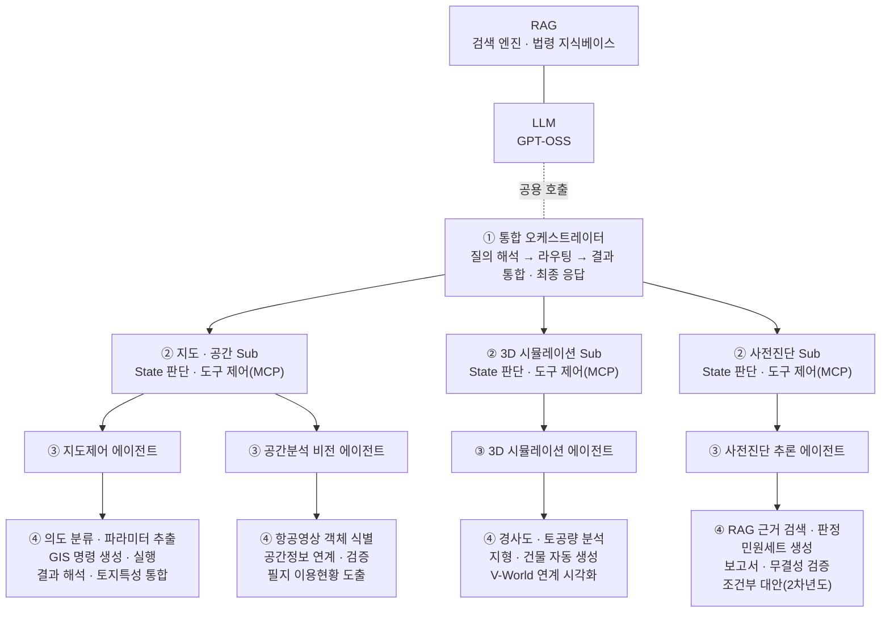
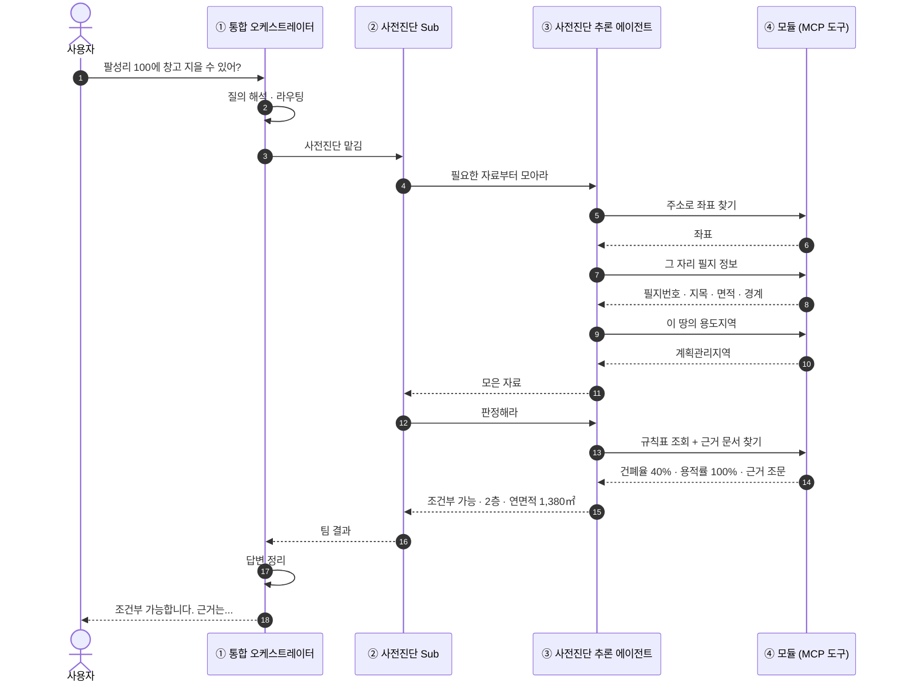
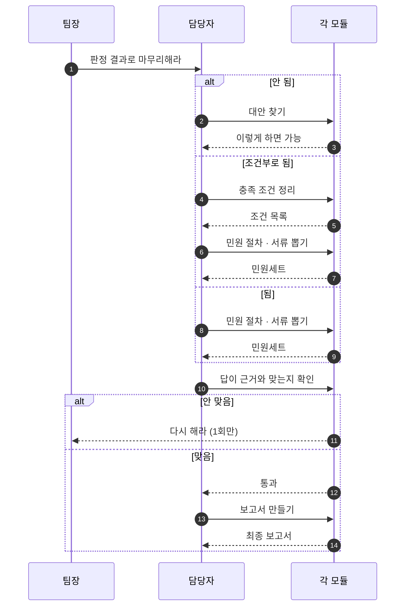
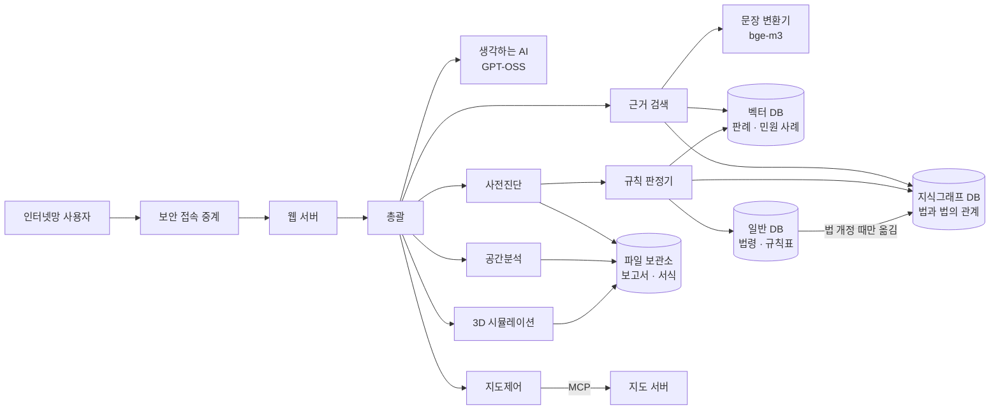
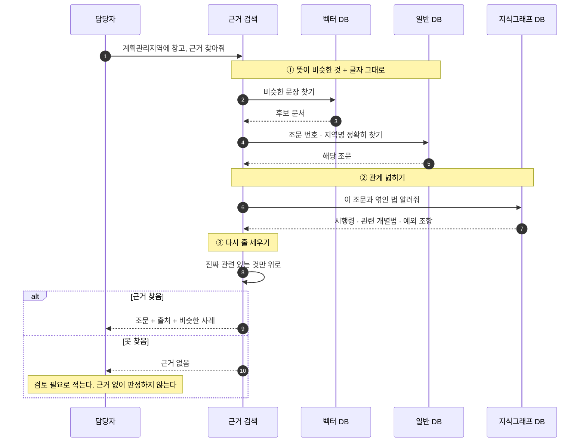

# 인허가 AI 에이전트 — 어떻게 움직이는가

**한 줄 요약** — 사용자가 물으면 → **통합 오케스트레이터**가 해당 **Sub**에 넘기고 →
**에이전트**가 **MCP 도구**로 자료를 조회하고 → 규칙으로 판정하고 →
통합 오케스트레이터가 결과를 합쳐 답한다.

> 이 문서는 **앞으로 만들 구조**다. 지금 코드는 아직 한 덩어리로 되어 있고, 그것을
> 네 개 층으로 나누려는 계획이다. **지금 있는 것과 없는 것**은 7장에 정리했다.

---

## 1. 전체 구조 — 네 개의 층

| | 계층 | 쉬운 말 | 하는 일 |
|---|---|---|---|
| **①** | **통합 오케스트레이터** | 총괄 | 질의 해석 → 라우팅 → 결과 통합 · 최종 응답 |
| **②** | **Sub 오케스트레이터** | 팀장 | State(상황) 판단 · 도구 제어(MCP) |
| **③** | **에이전트** | 담당자 | 실제로 실행한다. **MCP 도구를 부르는 유일한 층** |
| **④** | **모듈** | 기능 단위 | 조회 · 계산 · 검색을 한 가지씩 |

### 1.1 Sub 오케스트레이터 3개와 에이전트 4개

| Sub 오케스트레이터 | 에이전트 | 모듈 |
|---|---|---|
| **지도 · 공간 Sub** | **지도제어 에이전트** | 의도 분류 · 파라미터 추출 / GIS 명령 생성 · 실행 / 결과 해석 · 토지특성 통합 |
| | **공간분석 비전 에이전트** | 항공영상 객체 식별 / 공간정보 연계 · 검증 / 필지 이용현황 도출 |
| **3D 시뮬레이션 Sub** | **3D 시뮬레이션 에이전트** | 경사도 · 토공량 분석 / 지형 · 건물 자동 생성 / V-World 연계 시각화 |
| **사전진단 Sub** | **사전진단 추론 에이전트** | RAG 근거 검색 · 판정 / 민원세트 생성 / 보고서 · 무결성 검증 / 조건부 대안(2차년도) |



**LLM과 RAG는 공용이다.** Sub마다 따로 두지 않고 하나를 같이 쓴다.

### 1.2 오가는 것 — 요청과 반환

| 방향 | 무엇이 오가나 |
|---|---|
| **↓ 내려갈 때** | 요청 · **MCP 도구 호출** |
| **↑ 올라올 때** | 결과 반환(**Observation**) |
| **마지막** | 통합 오케스트레이터가 결과를 통합해 **최종 응답** 생성 |

층마다 오가는 것의 이름이 다르다.

| 구간 | 이름 |
|---|---|
| 모듈 → 에이전트 | **Observation**(도구가 돌려준 결과) |
| 에이전트 → Sub | **State**(지금까지 모은 상황) |
| Sub → 통합 | **Sub 결과** |
| 통합 → 사용자 | **최종 응답** |

### 1.3 ReAct 루프

에이전트는 한 번에 끝내지 않고 **필요한 것이 다 모일 때까지 돈다.**

```
Thought(실행계획) → Action(도구 호출) → Observation(결과 관찰) → 재판단 → 반복
```

| 단계 | 쉬운 말 |
|---|---|
| **Thought** | 다음에 무엇이 필요한지 **정한다** |
| **Action** | 그것을 주는 **도구를 부른다** |
| **Observation** | 도구가 준 **결과를 본다** |
| **재판단** | 충분한지 보고 **모자라면 다시 돈다** |

### 1.4 왜 층을 나누나

총괄이 전부 직접 하면 잘못됐을 때 **어디서 틀렸는지 못 찾는다.**
층을 나눠 두면 어느 단계에서 어긋났는지 짚을 수 있다.

**지켜야 할 규칙 세 가지**

1. **MCP 도구 호출은 에이전트만** 한다. 통합이나 Sub가 직접 부르면 추적이 끊긴다.
2. **에이전트끼리 서로 부르지 않는다.** 항상 Sub를 거친다. 서로 부르면 순환이 생겨 루프가 안 끝난다.
3. **도구가 실패해도 오류를 터뜨리지 않는다.** "왜 실패했는지"를 값으로 돌려준다. 터뜨리면 원인이 묻힌다.

---

## 2. 알아 둘 낱말

| 낱말 | 뜻 |
|---|---|
| **MCP** | 프로그램끼리 기능을 주고받는 **약속된 규격**. 콘센트 규격 같은 것 |
| **도구(tool)** | 그 규격으로 내놓은 **기능 하나**. 예: 주소를 주면 좌표를 돌려주는 기능 |
| **RAG** | 답을 지어내지 않고 **문서에서 근거를 찾아와** 붙이는 방식 |
| **벡터 검색** | **뜻이 비슷한** 문장을 찾는 것 |
| **키워드 검색** | **글자 그대로** 찾는 것. "제56조"처럼 정확해야 하는 것에 쓴다 |
| **지식그래프** | "이 법이 저 법을 덮는다" 같은 **관계를 점과 선으로** 저장해 둔 것 |
| **Rule Engine** | **규칙표대로 자동 판정**하는 프로그램 |
| **저촉** | 다른 법에 **걸리는 것** |
| **의제처리** | 인허가 하나를 받으면 **다른 인허가도 받은 것으로** 쳐주는 것 |
| **PNU** | 필지마다 붙은 **고유번호 19자리** |
| **폴리곤** | **면**. 점이 아니라 경계선으로 둘러싸인 땅 모양 |
| **판정 결과** | 가능 / 불허 / 조건부 가능 / **검토 필요** |
| **건축 가능 규모** | 건축면적 · 연면적 · 층수 |

**그림 읽는 법** — 위에서 아래로 시간이 흐른다. 세로줄은 담당자, 가로 화살표는 요청이다.
실선(`→`)은 요청, 점선(`-->`)은 결과다. `alt`는 갈림길, `loop`는 반복, `par`는 동시 진행이다.

---

## 3. 질문 하나가 처리되는 과정

예: *"팔성리 100에 창고 지을 수 있어?"*



**핵심** — 모듈(MCP 도구)로 가는 화살표는 **에이전트에게서만** 나온다.
통합 오케스트레이터나 Sub에서 나오면 규칙 위반이다.

---

## 4. 사전진단 팀이 하는 일

### 4.1 다섯 단계

| 단계 | 이름 | 하는 일 |
|---|---|---|
| 1 | 근거 기반 사전판단 | 자료를 모으고 규칙표로 **판정**한다 |
| 2 | 대안 생성 | 안 되면 **어떻게 하면 되는지** 찾는다 |
| 3 | 민원세트 생성 | 필요한 **민원 절차와 서류**를 뽑는다 |
| 4 | 판단결과 검증 | 답이 근거와 **맞는지 확인**한다 |
| 5 | 최종 산출 | **보고서**로 만든다 |

**4단계에서 걸리면 되돌아간다.** 단, 되돌리기는 **한 번까지만** 한다.
계속 되돌리면 끝나지 않는다.



### 4.2 순서가 중요하다

건축 허가만 보면 안 된다. **그 앞에 붙는 절차가 진짜 관문**이다.

```
① 땅을 나눠야 하나?  →  ② 지목을 바꿔야 하나?  →  ③ 개발행위 허가  →  ④ 건축 허가
   (토지분할)              전·답·과수원 → 농지전용
                           임야       → 산지전용
```

**② 는 지목에 따라 갈린다.** 전·답·과수원이면 **농지전용**(농지법), 임야면 **산지전용**(산지관리법)이
먼저다. 임야는 보전산지(임업용·공익용)면 전용 자체가 크게 제한되므로 여기서 막히는 경우가 많다.

세 가지를 지킨다.

- **앞에서 막히면 뒤는 안 본다.** 뒤 결과를 보여주면 "건축은 되는데"로 잘못 읽힌다.
- **땅을 나누면 면적이 바뀐다.** 규모 계산은 **나눈 뒤 면적**으로 한다.
- **확인 못 한 항목은 통과가 아니다.** "모름"이라고 분명히 적는다. 조용히 넘어가면 통과로 읽힌다.

### 4.3 법이 서로 부딪칠 때

한 땅에 여러 규제가 겹치는 건 **정상**이다. 겹침에는 세 종류가 있고 처리가 다르다.

| 종류 | 무엇 | 어떻게 |
|---|---|---|
| **땅이 걸쳐 있음** | 한 필지가 두 용도지역에 걸침 | **면적이 큰 쪽** 기준으로 본다 |
| **법끼리 부딪침** | 국토계획법은 되는데 다른 법이 막음 | **다른 법이 이긴다.** 협의 대상 |
| **규제가 겹쳐 쌓임** | 용도지역 위에 지구·구역이 얹힘 | 다 합쳐서 적용 |

**중요** — 법에 걸린다고 바로 "불허"로 적지 않는다. 대개 **협의하면 풀리는 조건**이다.
불허로 적으면 그 자리에서 포기한다. **"조건부 가능 + 어느 기관과 무엇을 협의"** 로 적는다.

### 4.4 조례와 고시

같은 용도지역이라도 **시·군마다 숫자가 다르다.** 그리고 규제는 **고시로 지정**된다.
이 둘을 빼면 판정이 틀린다.

**① 법은 상한만 정하고, 실제 숫자는 조례가 정한다**

건축법·국토계획법 시행령은 *"건폐율 40% 이하"* 처럼 **최대치**만 준다.
그 안에서 얼마로 할지는 **지자체 조례**가 정한다. 그래서 같은 계획관리지역이라도
음성군과 경산시가 다를 수 있다.

> 그래서 판정 전에 **관할 지자체부터 알아내야 한다.** 주소에서 시·군을 뽑아 그 지자체 조례를
> 찾고, 조례가 없으면 시행령 상한을 쓴다. 이때 **"조례값인지 시행령값인지"를 반드시 같이 적는다.**
> 안 적으면 나중에 왜 그 숫자가 나왔는지 알 수 없다.

**② 규제는 고시로 지정되고, 조회 결과에 고시번호가 붙어 온다**

용도지역·지구·구역은 지자체가 **고시**해서 정한다. 그래서 조회하면 이렇게 온다.

```
가축사육제한구역(2024-11-28)(경산시 고시 제2024-174호)
```

우리가 필요한 건 **`가축사육제한구역`** 이라는 이름뿐인데, 뒤에 날짜와 고시번호가 붙어 있다.
그냥 두면 규칙표와 안 맞는다. **잘라내야 한다.**

**③ 그런데 괄호가 이름의 일부인 경우도 있다**

```
시가지경관지구(일반)      ← 이건 자르면 안 된다. (일반)까지가 이름이다
```

그래서 **조회하는 쪽이 자를지 말지 정하지 않는다.** 자른 것과 안 자른 것 **둘 다 넘기고**,
규칙표가 순서대로 맞춰 본다. 조회 쪽에서 판단하면 위 두 경우 중 하나는 반드시 틀린다.

**④ 고시에는 날짜가 있다**

*"2024-11-28에 고시된 규제"* 라는 시점 정보다. 판정 근거에 **언제 고시된 것인지 함께 적는다.**
법이나 고시가 바뀐 뒤에 "그때는 왜 그렇게 판정했나"를 설명하려면 시점이 있어야 한다.

---

## 5. 지도 팀과 3D 팀

**지도 팀** — 담당자가 지도 명령을 만들어 **한 번에** 보낸다. 이동과 표시를 따로 보내지 않는다.
하나라도 잘못되면 **전부 취소**한다. 절반만 실행된 지도가 더 나쁘다.

**`op`(동작)와 `ops`(동작 목록)** — 코드와 인계 문서에 계속 나오는 말이라 뜻을 적어 둔다.

| 말 | 뜻 |
|---|---|
| **`op`(동작)** | 지도에 시키는 **일 하나**. "여기로 이동해라", "여기에 표시를 찍어라" |
| **`ops`(동작 목록)** | 그 동작을 **여러 개 묶은 것**. 한 번에 보내려고 목록으로 만든다 |

동작은 일곱 가지다.

| `op`(동작) | 뜻 |
|---|---|
| `flyTo` | **그 위치로 이동**한다 |
| `setZoom` | **확대 · 축소**한다 |
| `addMarker` | **표시를 찍는다** |
| `clearMarkers` | **표시를 모두 지운다** |
| `setBaseLayer` | **배경 지도를 바꾼다** (일반 · 위성 등) |
| `fitBounds` | **정해진 범위가 다 보이게** 맞춘다 |
| `reset` | **처음 상태로** 되돌린다 |

**왜 목록으로 묶어 보내나** — 판정이 끝나면 *이동 + 표시*를 같이 해야 한다.
따로 보내면 이동만 되고 표시가 빠지는 일이 생긴다. 묶어 보내면 **다 되거나 다 안 되거나** 둘 중 하나다.

**3D 팀** — 경사도와 흙 파는 양을 계산하고, 건물 모양을 세운다.

**같이 할 수 있는 일과 그렇지 않은 일**

| 조합 | 방식 | 왜 |
|---|---|---|
| 사전진단 **+** 지도 | **동시** | 서로 남의 결과가 필요 없다 |
| 사전진단 **→** 3D | **순서대로** | 3D는 **건축 가능 규모가 나와야** 건물을 세운다. 그 전엔 그릴 게 없다 |

동시에 하면 **느린 쪽 시간만** 걸리고, 순서대로 하면 **두 시간이 더해진다.**
그래서 가능하면 동시가 낫지만, 앞의 결과가 필요하면 방법이 없다.

---

## 6. 자료는 어디에 있나

서버 세 대를 쓴다. **APP**(사람 상대), **LLM**(생각하는 쪽), **DB**(자료 보관).

| 저장소 | 무엇을 담나 | 왜 필요한가 |
|---|---|---|
| **일반 DB** (PostgreSQL) | 법령 · **지자체 조례** · 규제 조건 · **규칙표**, 건폐율 같은 **기준 숫자**, 고시 정보 | 숫자 비교는 여기서만 정확하다 |
| **지식그래프 DB** (Fuseki) | **법과 법 사이의 관계** | "어느 법이 어느 법을 덮는가"는 관계라서 표로는 못 적는다 |
| **벡터 DB** (Milvus) | **판례 · 민원 사례 · 법령 조문** | "비슷한 경우 어떻게 판단했나"를 찾는다 |
| **파일 보관소** | **보고서** · 민원 서식 · 항공사진 · 3D 결과 | 문서와 그림을 둔다 |

**법령 조문이 두 곳에 있는 이유** — 중복이 아니라 **역할이 다르다.**

| | 일반 DB | 벡터 DB |
|---|---|---|
| 답하는 질문 | *"계획관리지역 건폐율 상한은?"* | *"비슷한 사례에서 어떻게 판단했나?"* |
| 찾는 방식 | 정확히 일치 | 뜻이 비슷한 것 |
| 없으면 | 판정 기준 숫자를 못 얻는다 | 근거와 사례가 사라진다 |

판례와 민원 사례는 **벡터 DB에만** 둔다. 서술이라 표로 정리가 안 된다.
반대로 기준 숫자는 **일반 DB에만** 둔다. 숫자 비교를 "비슷한 것 찾기"로 하면 틀린다.



**어느 서버에 있나** — 웹 서버 · 총괄 · 담당자 넷 · 근거 검색은 **APP 서버**,
생각하는 AI와 문장 변환기는 **LLM 서버**, 저장소 네 개는 **DB 서버**에 있다.

> `일반 DB → 지식그래프`는 **미리 만들어 두는 작업**이라 법이 바뀔 때만 한다.
> `지식그래프 · 벡터 → 규칙 판정기`는 **질문받을 때마다** 한다.

### 6.1 지식그래프에는 무엇이 들어 있나

법령·조례와 용도지역, 판단 규칙을 **하나로 합쳐 놓은 것**이다. 크게 세 덩어리다.

| 덩어리 | 무엇 | 아래에 딸린 것 |
|---|---|---|
| **법령** | 법률 · 시행령 · 시행규칙 | **항 · 호 · 목**(조문을 더 잘게 쪼갠 단위), **별표 · 부칙**(시설물별 행위기준) |
| **조문** | 법령을 이루는 개별 조항 | **조례**가 여기에 붙는다 |
| **공간** | 용도지역 · 지구 · 구역 | **보호 · 규제구역**, **건폐율 · 용적률**, **행위제한**(시설물 용도별로 무엇을 할 수 있나) |

덩어리끼리 잇는 **관계**가 이 그래프의 핵심이다.

| 관계 | 무엇을 잇나 | 어디에 쓰나 |
|---|---|---|
| **공간 ↔ 법령** | 이 용도지역에는 어느 법이 걸리는가 | 판정의 출발점 |
| **인용** | 이 조문이 어느 조문을 끌어다 쓰는가 | 근거를 넓힐 때 (참조 : 6.3 ②단계) |
| **의제** | 이것 하나 받으면 무엇까지 받은 것으로 쳐주나 | 민원 절차를 줄일 때 |
| **조건** | 언제 적용되고 언제 안 되나 | 규칙 판정기의 조건 판단 |

**무결성 검사(SHACL)** — 데이터가 정해진 모양을 지키는지 자동으로 검사하는 규칙이다.
예를 들어 *"조문에는 반드시 소속 법령이 있어야 한다"* 같은 것이다. 통과했다는 것은
**빠지거나 잘못 연결된 항목이 없다**는 뜻이다.

**왜 이게 중요한가** — 두 가지가 이 그래프 위에서 돈다.

- **규칙 판정기의 충돌 규칙** — "어느 법이 어느 법을 덮는가"는 관계라서 이 그래프가 없으면 판단이 안 된다.
- **근거 찾기의 관계 넓히기** — 조문 하나를 찾은 뒤 딸린 시행령·예외를 끌어오는 것이 인용 관계다.

그리고 판정 근거를 **조문 단위까지 되짚을 수 있다.** "이 판정은 어느 법 몇 조 때문인가"에
답할 수 있다는 뜻이다.

### 6.2 규칙 판정기(Rule Engine)

사람이 규칙을 적어 두면 기계가 그대로 적용한다. 규칙은 네 종류다.

| 종류 | 예 | 어디서 가져오나 |
|---|---|---|
| 숫자 규칙 | 건폐율 40% 넘으면 위반 | 일반 DB |
| 허용 규칙 | 계획관리지역 + 창고 → 조건부 | 일반 DB + 지식그래프 |
| **충돌 규칙** | 국토계획법은 되는데 다른 법이 막음 → 다른 법 우선 | **지식그래프** |
| 순서 규칙 | 전·답·과수원이면 **농지전용** 먼저, 임야면 **산지전용** 먼저 | 지식그래프 |

**세 가지를 지킨다.**

- **규칙이 없으면 "가능"이 아니라 "검토 필요"다.** 기본값을 가능으로 두면 빈틈이 그대로 잘못된 답이 된다.
- **사례는 근거일 뿐 판정이 아니다.** 판정은 규칙이 한다. 사례로 판정하면 같은 질문에 다른 답이 나온다.
- **판정에 규칙표 버전을 남긴다.** 안 남기면 법이 바뀐 뒤 예전 판정을 재현할 수 없다.

### 6.3 근거 찾기는 세 단계다



**왜 세 단계인가**

- **뜻으로만 찾으면** "제56조" 같은 정확한 번호를 놓친다 → 글자 그대로 찾기를 같이 한다.
- **조문 하나만 찾으면** 딸린 시행령과 예외를 놓친다 → 관계로 넓힌다.
- **넓히면 양이 많아진다** → 다시 줄 세워 위쪽만 쓴다.

---

## 7. 지금 있는 것과 없는 것

**이미 있다** — 새로 만드는 게 아니라 **감싸서 규격에 맞추면 되는 것들**이다.

| 하는 일 | 지금 코드 |
|---|---|
| 주소 → 좌표, 필지 조회 | `vworld.py` |
| 용도지역 조회 | `landuse.py` |
| 건폐율 · 용적률 | `zoning.py` |
| 건축 가능 규모 계산 | `massing.py` |
| 최소 대지면적 | `min_lot_area.py` |
| 도로에 접했는지 | `road_access.py` |
| 건물 띄우는 거리(이격) | `setback_rules.py` |
| 땅 나누기 검토 | `land_division.py` |
| 농지 · 산지 전용 | `land_conversion.py` |
| 재해 · 환경 · 문화재 겹침 | `regulatory_screen.py` |
| 경사도 · 표고 | `terrain.py` |
| 건축물대장 | `building_register.py` |
| **법 부딪침 판정** | `legal_conflicts.py` |
| **인허가 요건 · 선후 순서** | `permit_requirements.py` |
| 근거 문서 검색 | `ordinance_index.py` |
| 지도 명령 만들기 | `map_control.py` |

**아직 없다**

| 없는 것 | 설명 |
|---|---|
| **네 층 구조** | 지금은 한 덩어리다. 팀장 층이 없다 |
| **MCP 규격** | 위 기능들이 아직 규격으로 노출돼 있지 않다 |
| **지식그래프 연결** | 온톨로지는 구축돼 있으나(참조 : 6.1), 판정·근거검색이 아직 그것을 보고 있지 않다 |
| **벡터 DB** | 지금 근거 검색은 단순 방식이다. 판례 · 민원 사례가 없다 |
| **파일 보관소** | 보고서 · 서식을 둘 곳이 없다 |
| 민원 서류 만들기 · 검증 · 보고서 | 5단계 중 3~5단계 |
| 협의 절차 뽑기 | 법에 걸린 뒤 "어느 기관과 무엇을" 부분 |

---

## 8. 아직 정해야 할 것

| | 무엇 | 왜 중요한가 |
|---|---|---|
| 1 | **지식그래프를 판정에 연결하기** | 온톨로지는 구축됐다. 규칙 판정기와 근거 검색이 그것을 보게 만드는 일이 남았다 |
| 2 | **판례 · 민원 사례 자료** | 벡터 DB에 넣을 원본이 아직 없다 |
| 3 | **협의 기관 목록** | 의제 관계는 그래프에 있다. **어느 기관과 협의하는가**가 아직 없다 |
| 4 | **민원 서식 원본** | 서류를 만들려면 서식이 있어야 한다 |
| 5 | **AI 호출 횟수 상한** | 층이 늘면 호출이 크게 는다. 예전에 한도를 빠르게 소진한 적이 있다 |
| 6 | **보고서 보관 규칙** | 보관 기간 · 열람 권한 · 개인정보 포함 여부 |
| 7 | **지도 명령 종류 맞추기** | 화면이 쓰는 명령과 규격이 제공하는 명령이 서로 다르다 |
| 8 | **경사도 외 개발행위 기준** | 입목 축적 등 아직 조회할 방법이 없는 항목 |
| 9 | **조례를 몇 개 지자체까지 모을지** | 조례가 없는 지자체는 시행령 상한으로 답할 수밖에 없다. 어디까지 모을지 정해야 한다 |
| 10 | **고시 갱신을 언제 반영할지** | 고시는 수시로 바뀐다. 얼마나 자주 다시 받아올지, 바뀌면 예전 판정을 어떻게 다룰지 |

---

## 9. 함께 볼 문서

- `ARCHITECTURE.md` — 지금 구현된 구조
- `SYSTEM-SPEC.md` — 화면 · 통신 규격
- `LEGAL-ORDINANCE-INDEX.md` — 법령 · 조례 자료 다루는 원칙
