# MCP 에이전트 호출 시퀀스 — 통합 오케스트레이터 · Sub 오케스트레이터 · 에이전트 · 모듈

**모듈의 MCP tool 호출 ↔ 에이전트 ↔ Sub 오케스트레이터 ↔ 통합 오케스트레이터** 의 관계를
시퀀스 다이어그램으로 고정한 문서다.

> **이 문서의 성격 — 목표 구조(to-be)다.**
> 현행 구현은 [ARCHITECTURE.md](ARCHITECTURE.md) · [SYSTEM-SPEC.md](SYSTEM-SPEC.md) 이고, 그 두 문서의
> 시퀀스에는 MCP가 한 번도 등장하지 않는다. 오케스트레이터가 파이썬 함수를 직접 부르는
> 단일 계층 구조이기 때문이다. 현행과 이 문서의 차이는 [§9](#9-현행-구현-대비-차이-as-is--to-be)에 표로 정리했다.
>
> **근거** — 계층 이름과 모듈 구성은 제시된 구조도 2종을 참조했다. 다만 tool 이름·인자·반환은
> 그림이 아니라 **실제 코드와 인계한 MCP 서버 README**에서 가져왔다
> (`backend/app/orchestrator.py`, `backend/app/agents/*`, `backend/app/tools/vworld.py`,
> `map-mcp/README.md`, `mapinfo-mcp/README.md`). 아직 근거가 없는 부분은 **⬚ 미정**으로 표시했다.

---

## 1. 계층과 책임

| 계층 | 하는 일 | **하지 않는 일** | 상태 |
|---|---|---|---|
| **통합 오케스트레이터** | 질의 해석 · 유형 분류 · Sub 라우팅 · 결과 통합 · 충돌 조정 · 최종 응답 | **MCP tool 을 직접 부르지 않는다** | 세션 대화 이력, 직전 진단 |
| **Sub 오케스트레이터** | 도메인 안에서 State 판단 · 에이전트 호출 순서 · ReAct 루프 관장 | **MCP tool 을 직접 부르지 않는다** · 최종 문장을 쓰지 않는다 | 해당 질의 1건의 작업 State |
| **에이전트** | 모듈 실행 · **MCP tool 호출의 유일한 주체** · Observation 정규화 | 다른 에이전트를 직접 부르지 않는다 | 없음(무상태) |
| **모듈** | 단일 기능 단위. tool 인자 생성 / 응답 해석 / 결정적 계산 | LLM 을 부르지 않는다(추출 모듈 제외) | 없음 |
| **MCP 서버** | tool 실행. 외부 API·BE 와 통신 | 지도를 조작하지 않는다 — 명세만 만든다 | **없음**(map-mcp README §1) |

### 1.1 MCP tool 인벤토리 (현재 실재하는 것)

| 서버 | 포트 | tool | 상태 |
|---|---|---|---|
| **map** | `:7010` | `map_command` · `parcel_locate` · `parcel_basic` · `parcel_land_use` · `geocode` · `reverse_geocode` | 동작 |
| | | `parcel_buildings` | 계약만 있음, 미구현 |
| **mapinfo** | `:7011` | `land_info(address)` | 껍데기 — 채워지면 4콜이 1콜로 축약 |
| ⬚ **rag** | 미정 | `rag_search` 등 | **아직 MCP 서버가 아니다** — §10 ① |

전송은 둘 다 **streamable-http** 다(stdio 아님). 접속은 설정 한 줄(`MAP_MCP_URL`)로 바뀐다.

### 1.2 배치 구조와 저장소 계층

사업단 사무실 개발 서버(인덕원) **3대** 구성이다. 인터넷망 사용자는 Reverse Proxy(보안 접속 중계)를
거친다 — 국토부 시연·성능평가 실증 경로다.

| 서버 | OS | HW | 올라가는 것 |
|---|---|---|---|
| **APP** | Ubuntu 24.04.4 LTS | 8 Core · MEM 128GB(32×4) · NVMe 500GB | WEB/WAS · **통합 오케스트레이터** · RAG(근거검색) · 에이전트 4종(사전진단 · 지도제어 · 공간분석 · 3D시뮬레이션) |
| **LLM** | Ubuntu 24.04.4 LTS | 24 Core · MEM 128GB(32×4) · NVMe 2TB×2 | 추론 엔진 **GPT-OSS 120B · 20B** · 임베딩/리랭커 **bge-m3 / reranker** |
| **DB** | Rocky Linux 10.2 | 16 Core · MEM 256GB(32×8) · NVMe 2TB | RDB · Graph DB · Vector DB · 오브젝트 스토리지 |

**저장소 4종 — 무엇이 어디에 사는가**

| 저장소 | 제품 | 담는 것 | 누가 읽나 |
|---|---|---|---|
| **RDB** | PostgreSQL | **법령 · 규제조건 · 규칙(룰) 원천** — 판정 기준값(건폐율·용적률·최소분할면적), 세션·이력 | Rule Engine, 민원세트 생성 · **Graph DB 적재 원천** |
| **Graph DB** | **Fuseki** (RDF/SPARQL) | **인허가 관련 법령 간 연계정보** — 온톨로지 법령 지식그래프 3계층(법령/조문/적용대상) | **Rule Engine**, RAG Graph 확장, 저촉 판정(§4.4) |
| **Vector DB** | **Milvus** | **판례 · 민원 사례 · 법령 조문** 임베딩 청크 — 유사 사례를 검색해 근거로 제시 | **Rule Engine**, RAG Vector 검색 |
| **오브젝트 스토리지** | — | **결과 보고서**, 민원서식 원본, 항공영상·3D 산출물, 도면 | 보고서 생성 모듈(5단계), 공간분석·3D 에이전트 |

**연결** — 오케스트레이터 ↔ LLM(생성) · RAG ↔ LLM(임베딩) · APP ↔ DB(근거·공간정보)

#### 법령 조문이 RDB 와 Vector DB 에 **둘 다** 있는 이유

중복이 아니라 **역할 분담**이다. 하나만 두면 반대쪽 질의가 깨진다.

| | RDB (PostgreSQL) | Vector DB (Milvus) |
|---|---|---|
| 담는 형태 | **정형** — 조문 번호, 기준값, 적용 조건 | **청크 + 임베딩** — 조문 본문, 판례·민원 사례 |
| 답하는 질문 | *"계획관리지역 건폐율 상한은?"* | *"이와 비슷한 사례에서 어떻게 판단했나?"* |
| 검색 방식 | 정확일치 · 범위 비교 | 의미 유사도 |
| 없으면 | Rule Engine 이 판정 기준값을 못 얻는다 | 근거 제시와 유사사례가 사라진다 |

**판례·민원 사례는 Vector DB 전용**이다 — 정형화가 어렵고 기준값이 아니라 서술이므로 RDB 에 넣을 수 없다.
반대로 **판정 기준값은 RDB 전용**이다 — 숫자 비교를 벡터 유사도로 하면 틀린다.

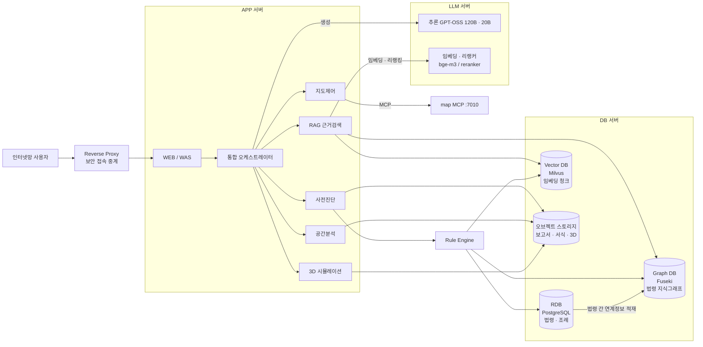

**두 방향을 구분한다** — `RDB → Graph DB` 는 **적재(build-time)** 이고,
`Graph DB → Rule Engine` · `Vector DB → Rule Engine` 은 **조회(run-time)** 다.
적재는 법령 개정 시에만 돌고, 조회는 질의마다 돈다.

> ⚠️ **저장소 접근도 R1 을 따른다.** DB 접근은 **모듈 계층에서만** 일어난다. Sub·통합
> 오케스트레이터가 직접 쿼리하기 시작하면 §2 의 계층 규약이 무너진다.

> ⚠️ **현행과의 차이** — 지금 법령·조례는 RDB 가 아니라 **`ordinances.json` 파일 + TF-IDF 인덱스**다.
> Graph DB·Vector DB·오브젝트 스토리지는 **연결 코드가 없다**(§10 ⑪).

### 1.3 현행 모듈 인벤토리 — MCP 화(化) 대상

**MCP 로 노출할 대상은 이미 `backend/app/tools/*` 에 함수로 존재한다.** 새로 만드는 것이 아니라
**감싸는 것**이다. 아래가 그 목록이며, `params`/`return` 을 그대로 MCP 툴 스키마로 고정하면 된다.

| MCP 도구(모듈) | 요청(params) | 반환(Observation) | 현재 코드 |
|---|---|---|---|
| `geocode` | 주소 | `{lon, lat}` | `tools/vworld.py` |
| `get_parcel` | lon, lat | `{pnu, jimok, area_m2, geometry}` | `tools/vworld.py` |
| `get_land_use` | geometry | `{zone, districts}` / `UNAVAILABLE` | `tools/landuse.py` |
| `get_zone_shares` | geometry | `zone_shares[{zone, area_m2, share_pct, geometry}]` | `tools/vworld.py` |
| `zoning.lookup` | zone, 용도 | `{bcr_max_pct, far_max_pct, 허용여부}` | `tools/zoning.py` |
| `min_lot_area` | zone | 최소 대지면적 | `tools/min_lot_area.py` |
| `massing.calc_massing` | area, bcr, far | `{building_area_m2, floors, height_m, gross_floor_area_m2}` | `tools/massing.py` |
| `site_constraints.apply` | geometry, massing, road_access | 유효 건축면적·연면적·층수 | `tools/site_constraints.py` |
| `road_access.assess` | geometry | 접도·배수·도로접촉선 | `tools/road_access.py` |
| `setback_rules.lookup` | 관할, 용도, zone, 연면적 | `{status, front_m, adjacent_m, source}` | `tools/setback_rules.py` |
| `land_division.assess` | diagnosis | `{status, methods[{method, buildable_area_m2}]}` | `tools/land_division.py` |
| `regulatory_screen` | geometry | 재해·환경·국가유산 중첩 | `tools/regulatory_screen.py` |
| `land_conversion` | jimok, zone | 농지·산지 전용 규제 | `tools/land_conversion.py` |
| `building_register.query` | pnu | 기존 건축물대장 | `tools/building_register.py` |
| `ordinance_index.search` (RAG) | 질의 | 근거 조문·별표 청크 | `tools/ordinance_index.py` |
| `district_plan.lookup` | 지구단위계획구역 | 원문 근거 | `tools/district_plan.py` |
| `build_map_commands` | diagnosis | 지도 명령 배열 | `agents/map_control.py` |
| `ogc.wfs` / `local_spatial` | bbox/geometry | 재해위험지구·생태자연도 등 | `tools/ogc.py`, `local_spatial.py` |
| `terrain.analyze_terrain` | parcel_geometry | 경사도 밴드·표고·토공 기초 | `tools/terrain.py` |
| **`legal_conflicts.evaluate`** | state | **법령 저촉 판정 (룰 파일 기반)** | `tools/legal_conflicts.py` |
| **`permit_requirements.build`** | state | **인허가 요건·근거·선후행 의존관계** | `tools/permit_requirements.py` |
| `facility_rules` | — | 시설 기준 | `tools/facility_rules.py` |
| `development_charge` / `conversion_charges` | — | 개발부담금 · 전용부담금 | `tools/development_charge.py`, `conversion_charges.py` |
| `land_ownership` | pnu | 소유 구분 | `tools/land_ownership.py` |
| `law_open` | 법령 질의 | 법령 원문 | `tools/law_open.py` |
| `jimok.classify` / `footprint` / `ordinance` | — | 지목 판정 · 배치 · 조례 | `tools/jimok.py`, `footprint.py`, `ordinance.py` |

> ⚠️ **이 문서가 "없다"고 적었던 것 중 일부는 이미 있다.** 특히 **`legal_conflicts.evaluate`(§4.4 저촉 판정)**와
> **`permit_requirements.build`(§4.2 민원세트 · §4.3 절차 체인)**가 그렇다. 후자는 `_link_dependencies` 로
> **선후행 관계까지 엮는다.** 따라서 이 문서의 §4.2~§4.4 는 **신규 설계가 아니라 기존 모듈의 MCP 노출과
> 계층 재배치**로 읽어야 한다.

**현행 호출 순서** — 사전진단이 실제로 도는 결정적 파이프라인이다. MCP 화 시 이 순서가
그대로 Action 열이 된다.

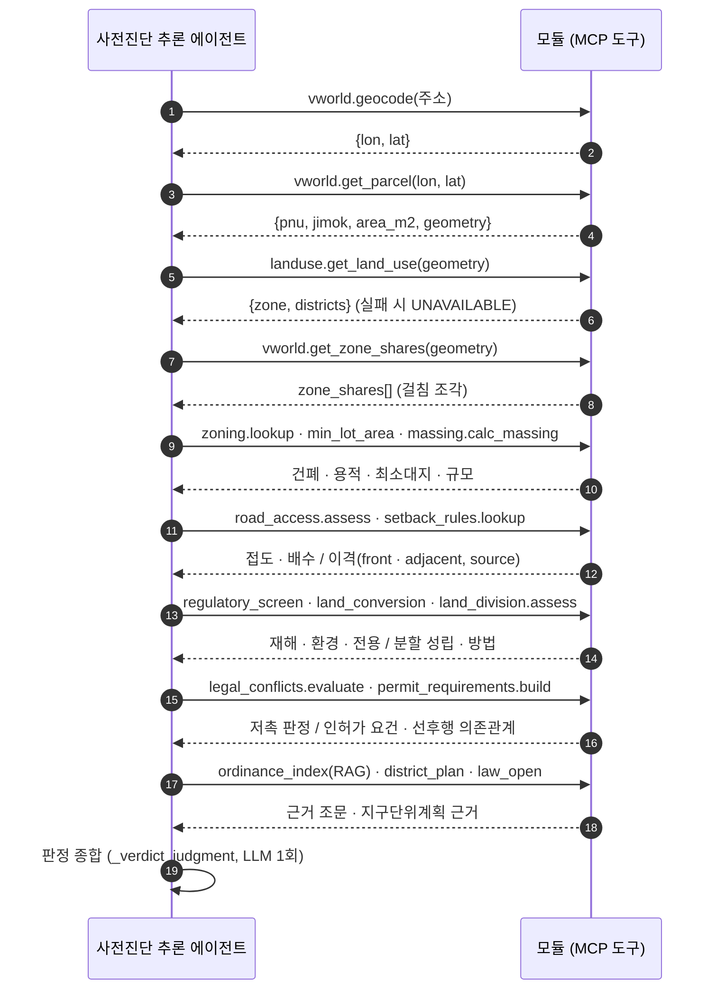

**수치의 단일 원본 원칙** — 판정 수치는 **도구/데이터에서만** 나온다. LLM·RAG 가 새로 만들지
않는다(→ `LEGAL-ORDINANCE-INDEX.md`). MCP 화 이후에도 이 원칙은 그대로다.

**계층 ↔ 현재 코드 매핑**

| 목표 계층 | 현재 코드 |
|---|---|
| 통합 오케스트레이터 | `orchestrator.py::Orchestrator` |
| 공용 LLM · RAG | `llm.py` · `tools/ordinance_index.py`(**TF-IDF RAG**) |
| 사전진단 Sub · 추론 에이전트 | `agents/prediagnosis.py::run_prediagnosis` + `_verdict_judgment`(LLM) |
| 지도·공간 Sub | `agents/map_control.py` + `tools/ogc.py` · `local_spatial.py` |
| 3D 시뮬레이션 Sub | `tools/massing.py` · `site_constraints.py` · `terrain.py` + 프런트 `mapBridge` |

> **핵심 차이는 하나다** — 현재는 **단일 프로세스 · 직접 호출**, 목표는 **MCP 위임**.
> 이 문서의 시퀀스는 "직접 호출"을 "`Action` 호출 → `Observation` 반환"으로 바꿔 표현한 것이다.

> ⬚ **RAG 는 이미 있으나 TF-IDF 다.** §1.2 가 전제한 Milvus + bge-m3 + Fuseki 3단(§4.5)과는
> 다른 물건이다. **교체이지 신규 구축이 아니다.**

---

## 2. 호출 규약 — 이 문서 전체의 전제

이 6개가 지켜지지 않으면 아래 시퀀스는 전부 의미가 없다.

| | 규약 | 왜 |
|---|---|---|
| **R1** | MCP tool 호출은 **에이전트 계층에서만** 일어난다 | 통합/Sub 가 직접 부르기 시작하면 어느 계층이 무엇을 호출했는지 추적이 끊긴다 |
| **R2** | 에이전트 간 **직접 호출 금지**. 항상 Sub 를 경유한다 | 에이전트끼리 부르면 순환이 생기고 ReAct 루프 종료 조건이 무너진다 |
| **R3** | tool 은 **예외를 올리지 않는다**. 실패도 `{"ok": false, "reason": "..."}` | map-mcp README §4 의 계약. 예외로 올리면 원인이 묻힌다 |
| **R4** | Observation 은 **에이전트가 정규화한 뒤** Sub 로 올린다 | 원문 그대로 올리면 BE 계약 함정(문자열 면적, EPSG:5186 등)이 상위로 샌다 |
| **R5** | 소유자 개인정보는 **어느 계층에서도** 컨텍스트에 싣지 않는다 | tool 응답이 그대로 LLM 컨텍스트로 들어간다 |
| **R6** | 결정적 절차는 **LLM 에게 다시 묻지 않는다** | 현행 `orchestrator.py:167-173` 의 판단을 계승 — 판단시켜도 결과는 항상 같고 호출만 는다 |

---

## 3. 대표 시퀀스 — 질의 1건의 4계층 왕복

가장 단순한 단일 Sub 경로다. 여기서 **누가 MCP tool 을 부르는지**만 먼저 고정한다.

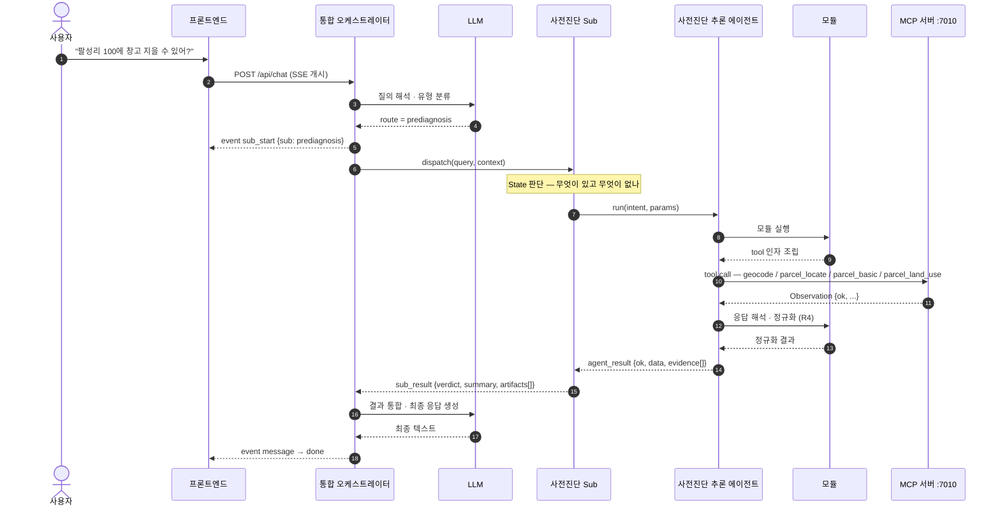

**핵심** — `AG->>MCP` 화살표는 **에이전트 계층에서만 나온다.** 통합/Sub 에서 MCP 로 가는 화살표가
그려지는 순간 R1 위반이다.

---

## 4. 사전진단 Sub — ReAct 루프와 tool 호출 상세

### 4.1 ReAct 1회전의 내부

Thought → Action(tool 호출) → Observation → 재판단. **재판단의 주체는 Sub 오케스트레이터**이고,
에이전트는 Action 을 실행할 뿐이다.

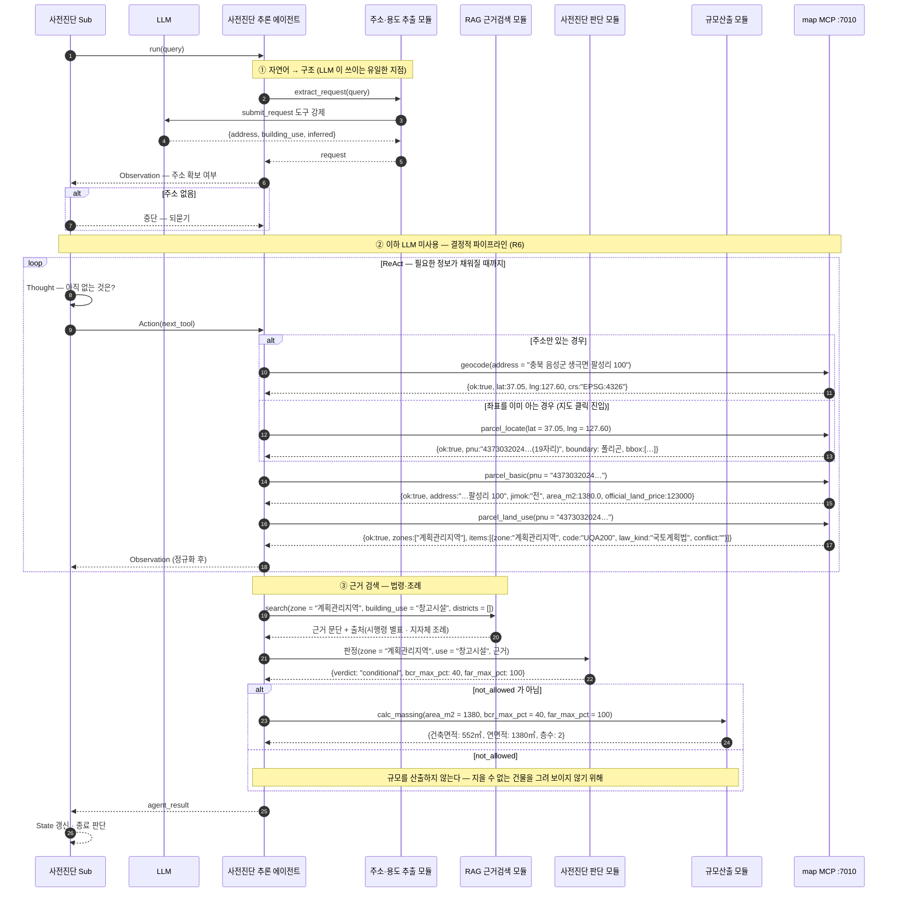

> **`land_info` 가 채워지면** 위 ②의 `geocode`+`parcel_locate`+`parcel_basic`+`parcel_land_use`
> **4콜이 `land_info(address)` 1콜로 줄고**, 좌표→PNU 구멍(map-mcp README §3①)이 함께 사라진다.
> 그때 바뀌는 것은 이 루프 안쪽뿐이고 Sub 이상 계층은 바뀌지 않는다.

### 4.2 판정 이후 분기 — 5단계 모듈 체인

사전진단 추론 에이전트의 처리 구조는 **5단계**다. 단계와 이 문서의 절 대응은 다음과 같다.

| 단계 | 이름 | 모듈 | 이 문서 |
|---|---|---|---|
| **1단계** | 근거 기반 사전판단 | 사전진단 판단 모듈 · RAG 근거 검색 모듈 | §4.1 |
| **2단계** | 대안 생성 | 조건부 대안 생성 모듈 | §4.2 |
| **3단계** | 민원세트 생성 | 민원 안내정보 생성 모듈 → 민원서류 생성 모듈 | §4.2 |
| **4단계** | 판단결과 검증 | 답변 무결성 검증 모듈 | §4.2 |
| **5단계** | 최종 산출 | 사전진단 결과 보고서 생성 모듈 | §4.2 |

**분기 판단은 Sub, 실행은 모듈**이며 **이 구간에는 MCP tool 호출이 없다.**
1단계만 tool 을 부르고(§4.1), 2~5단계는 1단계가 확보한 근거 위에서 돈다.

```mermaid
sequenceDiagram
    autonumber
    participant SO as 사전진단 Sub
    participant AG as 사전진단 추론 에이전트
    participant ALT as 조건부 대안생성 모듈
    participant CIV as 민원절차 안내정보 모듈
    participant DOC as 민원서류 생성 모듈
    participant VF as 답변 무결성 검증 모듈
    participant RPT as 결과 보고서 생성 모듈

    SO->>AG: finalize(verdict, 근거)

    alt verdict = not_allowed
        AG->>ALT: 조건부 대안 생성
        Note over ALT: 2차년도 범위
        ALT-->>AG: 대안 후보[]
    else verdict = conditional
        AG->>ALT: 충족 조건 도출
        ALT-->>AG: 조건 목록
        AG->>CIV: 민원절차 안내정보 생성
        CIV->>DOC: 서류 목록 · 서식
        DOC-->>AG: 민원세트
    else verdict = allowed
        AG->>CIV: 민원절차 안내정보 생성
        CIV->>DOC: 서류 목록 · 서식
        DOC-->>AG: 민원세트
    end

    AG->>VF: 답변 무결성 검증 (근거 대조)
    alt 검증 실패
        VF-->>SO: reject + 사유
        SO->>AG: 재판단 1회 (재시도 상한 1)
    else 통과
        VF-->>AG: pass
        AG->>RPT: 사전진단 결과 보고서 생성
        RPT-->>AG: 보고서
        AG-->>SO: agent_result {verdict, 민원세트, 보고서}
    end
```

⚠️ 검증 실패 시 **재시도 상한을 1회로 둔다.** 무결성 검증이 실패할 때마다 재판단을 돌리면
LLM 호출이 무한히 늘 수 있다. 상한 초과는 실패로 올리고 사유를 그대로 사용자에게 보인다.

#### 모듈 계약표 — 입력 · 처리 · 출력

기능 정의서 기준이다. **`활용` 열의 상당수가 이 리포에 존재하지 않는다** — 확인 결과
`온톨로지` · `Rule Engine` · `리랭킹` · `거버넌스` 는 코드 전체에 **0건**이다(§10 ⑪).

| 단계 | 모듈 | 입력 | 처리 | 출력 | 활용 |
|---|---|---|---|---|---|
| 1 | **사전진단 판단** | 사용자 질의 · 필지정보 · 개발행위 · 토지특성정보 · 규제조건 | 온톨로지 3계층 지식구조 기반 Rule Engine 판정, RAG 근거 참조, 지도제어·공간분석·3D 시뮬레이션 연계 결과 반영 | **가능 / 불허 / 조건부 가능 / 검토 필요** | 온톨로지 · Rule Engine · RAG · 무결성 검증 |
| 1 | **RAG 근거 검색** | 질의 키워드 · 행위유형 · 규제조건 | Vector 검색 + 키워드 검색 → Graph 확장 → **리랭킹** 수행, 필요 시 관련 조문·조건부 유사사례 조회 | 근거 조문 · 관련 기준 · 유사사례 | RAG · 온톨로지 · 외부 연계 |
| 2 | **조건부 대안 생성** | 판정결과 · 위반조건 · 보완 필요사항 | 공통 기반 LLM 으로 대안 생성, 규제조건 재검토·재정렬, 3D 시뮬레이션 연계 결과 참조해 보완 조건 도출 | 보완 조건 · 대체 기준 · 추가 확인 사항 | LLM · RAG · 외부 연계 · 무결성 검증 |
| 3 | **민원세트 생성** | 행위유형 · 판정결과 · 관계기관 협의 필요 여부 | 인허가 매핑 규칙으로 절차 도출, 신청 대상 민원·**선후행 절차**·관계기관 협의 필요 여부를 함께 구성 | 민원 목록 · **선후행 절차** · **관계기관** | Rule Engine · 생성 |
| 3 | **민원 안내정보 생성** | 민원 목록 · 제출서류 · 처리기준 | 민원별 절차·서류·근거를 결합해 신청 절차·제출서류·처리 기준 안내문 생성 | 신청 절차 · 제출서류 · 처리 기준 안내 | 생성 · RAG |
| 4 | **답변 무결성 검증** | 생성 답변 · 판정결과 · 근거 조문 | 근거 일치성 검증, **과잉/과소 판단 검토**, 조건 충돌 여부 확인 | 검증 통과 · 재검토 · **재생성 요청** | 무결성 검증 · RAG · Rule Engine |
| 5 | **결과 보고서 생성** | 판정결과 · 근거 · 대안 · 민원정보 · 검증결과 | 보고서 템플릿에 결과 반영, 공간분석·3D 시각화 자료가 있으면 부가자료로 포함 | **사전진단 결과 보고서** | 생성 · 무결성 검증 · 운영 거버넌스 |

**표에서 읽어야 할 3가지**

| | |
|---|---|
| **판정은 4값이다** | `가능` · `불허` · `조건부 가능` · **`검토 필요`**. 현행 코드는 `allowed`/`conditional`/`not_allowed`/`unknown` 이라 값은 맞지만, `검토 필요`(=`unknown`)를 **정상 출력으로 다루는 경로가 없다**. 지금은 주소 미검출 때만 나온다 |
| **RAG 는 3단 파이프라인이다** | Vector + 키워드 → **Graph 확장** → **리랭킹**. 단순 벡터 검색이 아니다. §4.1 에서 `RG` 를 단일 모듈로 그렸으나 실제로는 이 3단이 안에 들어간다 |
| **검증은 재생성을 요청한다** | 출력이 `재생성 요청` 이다. 즉 4단계는 판정이 아니라 **루프의 되돌림 지점**이다. 위 시퀀스의 재시도 상한 1회가 이 되돌림에 걸린다 |

### 4.3 인허가 절차 체인 — 토지분할 → 개발행위허가 → 건축허가

> ✅ **체인도 이미 일부 있다** — `tools/permit_requirements.py::build(state)` 가 인허가 요건을 뽑고
> `_link_dependencies()` 로 **선후행 관계를 엮으며** `_attach_legal_refs()` 로 근거를 붙인다.
> 이 절은 그 산출물을 절차 관점에서 편 것이다.

> ⚠️ **새로운 것은 "체인"이지 개별 판정이 아니다.** 각 단계의 모듈은 이미 있다 —
> `land_division.assess`(분할), `land_conversion`(농지·산지 전용), `road_access.assess`(접도),
> `terrain`(경사·표고), `min_lot_area`(최소 대지면적), `regulatory_screen`(재해·환경 중첩).
> **없는 것은 이들을 선후행 관계로 엮어 "무엇이 먼저인가"를 판정하는 층이다.**
> ARCHITECTURE.md `§10` 이 *"개발행위허가 기준 미반영"* 이라 적은 것도 개별 조회가 아니라 이 체인이다.

현행 판정은 **"용도지역 × 건축물 용도 → 허용 여부 + 규모"** 라는 한 컷이다. 실무의 관문은 그
앞에 붙는 선행 절차이고, 이것이 조건부 판정의 실제 내용이 된다.

```mermaid
sequenceDiagram
    autonumber
    participant SO as 사전진단 Sub
    participant AG as 사전진단 추론 에이전트
    participant MCP as map MCP :7010
    participant JM as 지목판정 모듈
    participant DV as 토지분할 검토 모듈
    participant DA as 개발행위 검토 모듈
    participant BP as 건축허가 검토 모듈
    participant RG as RAG 근거검색 모듈

    SO->>AG: run(절차 체인 판정)

    AG->>MCP: parcel_basic(pnu)
    MCP-->>AG: {area_m2, jimok, address}
    AG->>MCP: parcel_land_use(pnu)
    MCP-->>AG: {zones[], items[]}

    Note over AG,DV: ① 토지분할 — 필요한가
    AG->>DV: 분할 필요성(요청 규모, 필지 면적, 공유지분 여부)
    DV->>RG: 최소분할면적 기준 조회
    Note over DV,RG: 지자체 조례 · 국토계획법 시행령
    RG-->>DV: 기준값
    alt 분할 필요
        DV-->>AG: {필요, 분할 후 예상 면적, 잔여지 요건}
        Note over AG: 이후 단계는 분할 후 면적으로 판정한다
    else 분할 불요
        DV-->>AG: {불요}
    end

    Note over AG,JM: ② 전용허가 — 지목이 관문인가
    AG->>JM: classify(jimok)
    alt 농지 전·답·과수원
        JM-->>AG: {농지전용허가(또는 협의), 농업진흥지역 확인 필요}
    else 임야
        JM-->>AG: {산지전용허가, 보전산지 구분 확인 필요}
    else 대지 등
        JM-->>AG: {선행 절차 없음}
    end

    Note over AG,DA: ③ 개발행위허가 — 비도시지역의 실질적 관문
    AG->>DA: 개발행위 기준 검토
    DA->>MCP: parcel_locate(lat, lng)
    MCP-->>AG: {boundary}
    Note over DA,MCP: 진입도로 폭 · 경사도 · 표고 · 입목축적 — 조회 tool 없음, §10 ③⑦
    DA->>RG: 지자체 개발행위허가 기준 조회
    RG-->>DA: 기준 조항
    DA-->>AG: {통과 / 조건부 / 불가, 미확인 항목[]}

    Note over AG,BP: ④ 건축허가 — 현행 구현이 담당하는 구간
    AG->>BP: 용도 허용 여부 · 건폐율 · 용적률 · 규모
    BP-->>AG: {verdict, massing}

    AG-->>SO: chain_result {단계별 판정, 선행 절차 순서, 미확인 항목[]}
```

**설계 판단 3가지**

| | |
|---|---|
| **체인은 앞에서 끊는다** | ①에서 분할 불가면 ②③④를 돌리지 않는다. 뒤 단계 결과를 보여주면 "건축은 가능한데"로 읽혀 오해를 만든다 |
| **면적은 분할 후 값으로 흐른다** | ①이 분할을 요구하면 ④의 규모 산출 입력이 원 필지 면적이 아니라 **분할 후 면적**이다. 현행 `calc_massing(area_m2=...)` 에 그대로 들어가는 값이 바뀐다 |
| **미확인은 통과가 아니다** | 경사도·입목축적을 조회할 tool 이 없다. 값이 없으면 `unknown` 으로 **명시해 올린다**. 조용히 건너뛰면 통과로 읽힌다 |

이 체인의 산출물이 곧 §4.2 의 입력이다 — **선행 절차 목록이 그대로 민원세트·민원절차 안내의 내용**이 된다.
현행처럼 `verdict` 만 있고 절차가 없으면 §4.2 의 민원 모듈들은 채울 내용이 없다.

### 4.4 법령 저촉과 관계기관 협의

> **판정 주체는 Rule Engine 의 충돌 룰(§4.6 ③)이다.** 이 절은 그 룰이 무엇을 입력으로 받고
> 무엇을 내는지를 절차 관점에서 편 것이며, 별도 로직이 아니다.

> ✅ **이미 구현되어 있다** — `tools/legal_conflicts.py::evaluate(state)` 가 **룰 파일 기반으로**
> 저촉을 판정한다. 즉 §4.6 의 "충돌 룰"은 신규가 아니라 **이 모듈이 그 자리**다.
> 남은 것은 (a) MCP 툴로 노출, (b) 룰 원천을 파일에서 **Graph DB 로 옮기는 것**, (c) 협의 절차 도출 연결.

> **근거는 이미 tool 응답 안에 있다.** `parcel_land_use` 는 항목마다 `conflict`(`저촉`·`접합`·`""`)와
> `law_kind`(`국토계획법` / `개별법`)를 준다. 코드에도 필지가 두 용도지역에 걸치는 경우를
> `zone_shares` · `straddling` 으로 처리하는 로직이 있다(`prediagnosis.py:257-269`).
> **없는 것은 그 다음이다 — 충돌을 판정하고 협의 절차로 연결하는 단계.**

한 필지에 용도지역·지구·구역이 여러 개 겹치는 것이 정상이다. 겹침은 세 가지 다른 문제를 만들고,
**각각 처리가 다르다.**

| 유형 | 무엇 | 처리 |
|---|---|---|
| **① 지역 걸침** | 한 필지가 둘 이상 용도지역에 걸침 | 국토계획법 제84조 — 면적 최대 부분 기준. **점 조회로는 답이 달라진다** |
| **② 법 간 저촉** | 국토계획법상 허용인데 개별법이 제한 (`law_kind: 개별법`, `conflict: 저촉`) | **개별법이 이긴다.** 협의 대상 |
| **③ 지구·구역 중첩** | 용도지역 위에 지구·구역이 얹힘 | 중첩 규제 누적 적용 |

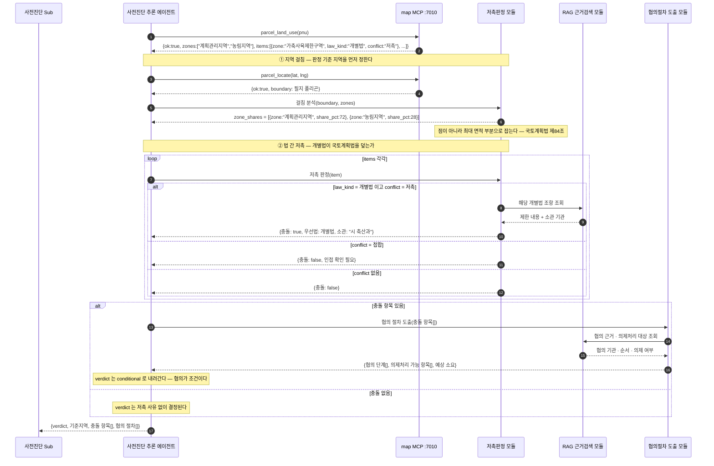

**설계 판단 3가지**

| | |
|---|---|
| **저촉을 불허로 접지 않는다** | 저촉은 대개 **협의로 풀리는 조건**이지 종결이 아니다. `not_allowed` 로 내리면 실무자가 포기한다. `conditional` + 협의 절차가 맞다 |
| **기준 지역을 먼저 정한다** | ②를 ① 앞에 두면 어느 지역 기준으로 저촉을 볼지가 정해지지 않는다. **순서가 결과를 바꾼다** |
| **소관 기관까지 낸다** | "저촉됩니다"만으로는 다음 행동이 없다. 어느 기관과 무엇을 협의하는지가 §4.2 민원절차 안내의 내용이 된다 |

이 절의 산출물 `협의 절차[]` 는 §4.3 절차 체인의 각 단계에 붙는다 — **개발행위허가 단계의
관계기관 협의가 대표적**이며, 의제처리 대상이면 별건 신청이 아니라 한 건으로 묶인다.

> ⬚ **미정** — 의제처리 대상 목록과 협의 기관 매핑의 출처가 없다. `ordinances.json` 에는
> 건폐율·용적률만 있다. §10 ⑩ 참조.

### 4.5 RAG 근거 검색 3단 — Vector · Graph · 리랭킹

§4.1 에서 `RG` 를 단일 모듈로 그렸지만, 실제로는 **저장소 3개와 LLM 서버를 오가는 3단 파이프라인**이다.
이 절이 그 안쪽이다.

**결과를 받는 쪽이 둘이다** — 에이전트(답변 근거)와 **Rule Engine**(§4.6 ③ 유사 사례 보강).
후자의 경우 사례는 근거로만 쓰이고 **판정을 바꾸지 않는다.**

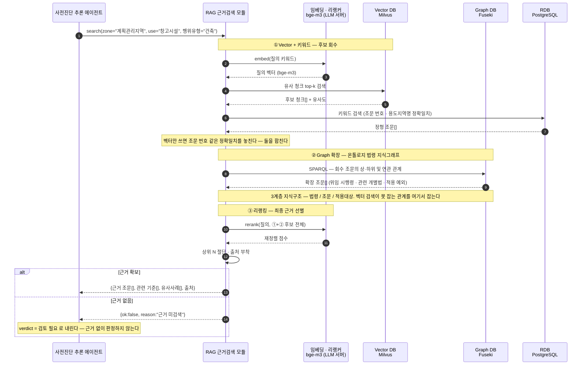

**설계 판단 3가지**

| | |
|---|---|
| **Vector 단독은 안 쓴다** | `제56조` 같은 조문 번호, `계획관리지역` 같은 고유명은 임베딩 유사도로 어긋난다. **키워드(RDB) 검색을 반드시 병행**한다 |
| **Graph 확장이 이 구조의 핵심** | 조문 하나를 찾아도 위임 시행령·개별법·예외 조항이 딸려 와야 판정이 선다. 벡터 검색은 이 **관계**를 못 잡는다. Fuseki 가 있는 이유다 |
| **근거 없으면 판정하지 않는다** | 근거 미검색은 `불허` 가 아니라 **`검토 필요`** 다. RAG 실패를 판정으로 바꾸면 그것이 곧 환각이다 |

> ⬚ **미정** — 청크 단위(조 / 항 / 호), top-k 값, 리랭킹 후 절단 기준 N, 온톨로지 3계층의
> 실제 스키마. 넷 다 검색 품질을 좌우하는데 정해진 값이 없다. §10 ⑫

### 4.6 Rule Engine — 룰셋과 법적충돌 규칙

**Rule Engine 은 판정 모듈의 부품이 아니라 그 위에 있다.** Graph DB(법령 간 연계정보)와
Vector DB(판례·민원 사례) **양쪽에서 입력을 받아** 룰셋을 적용하고 판정을 낸다.
§4.4 의 저촉 판정도 별도 로직이 아니라 **이 룰셋의 한 갈래**다.

#### 룰셋의 층위

| 층 | 무엇 | 원천 | 예 |
|---|---|---|---|
| **① 기준값 룰** | 숫자 비교 | RDB | 건폐율 40% 초과 → 위반 |
| **② 허용 룰** | 용도지역 × 행위유형 | RDB + Graph | 계획관리지역 × 창고시설 → 조건부 |
| **③ 충돌 룰** | **법령 간 저촉** | **Graph** | 국토계획법 허용 × 개별법 제한 → **개별법 우선, 협의 대상** |
| **④ 절차 룰** | 선후행 관계 | Graph | 지목 전·답 → 농지전용 선행 → 개발행위 → 건축 |

**③ 충돌 룰이 Graph DB 를 요구하는 이유** — "어느 법이 어느 법을 덮는가"는 **법령 간 관계**다.
조문을 아무리 많이 모아도 관계가 없으면 우선순위를 판정할 수 없다. RDB 의 행 하나로는 표현이 안 된다.

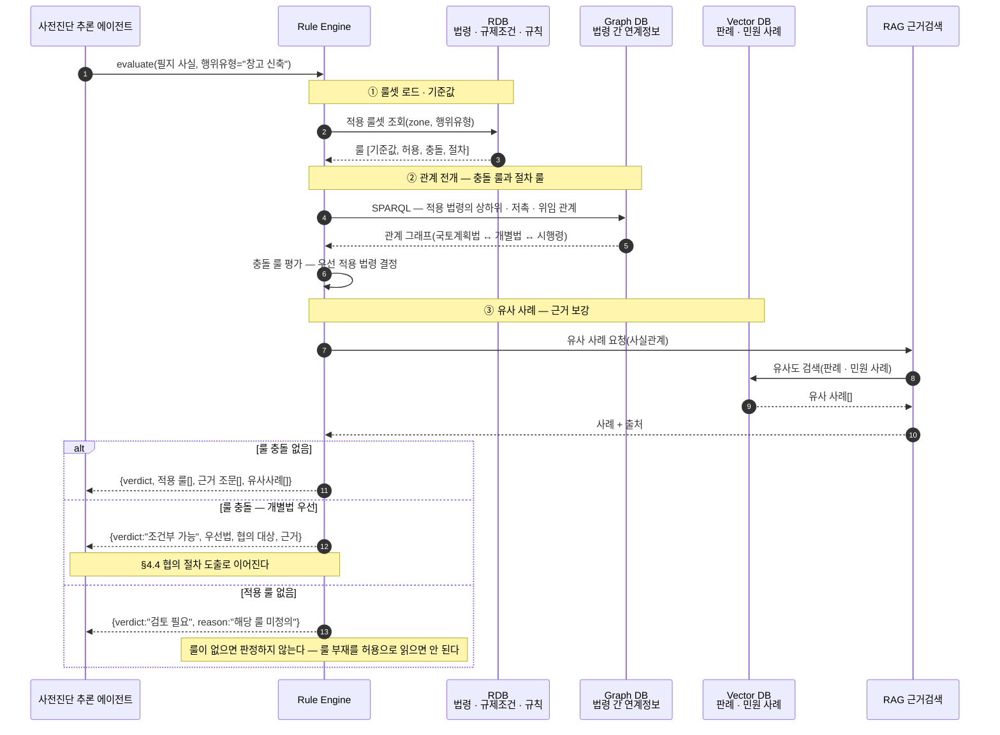

**설계 판단 3가지**

| | |
|---|---|
| **룰 부재 ≠ 허용** | 정의된 룰이 없으면 `검토 필요` 다. 기본값을 `가능` 으로 두면 룰셋의 빈틈이 그대로 오판이 된다 |
| **사례는 근거이지 판정이 아니다** | Vector DB 의 유사 사례는 **판정을 바꾸지 않는다.** 판정은 ①②③ 룰이 하고, 사례는 그 판정에 붙는 설명이다. 사례로 판정하면 재현이 안 된다 |
| **룰셋은 버전을 가진다** | 법령이 개정되면 룰셋과 Graph 적재가 함께 바뀐다. **판정 결과에 적용 룰셋 버전을 남긴다** — 남기지 않으면 과거 판정을 재현할 수 없다 |

> ⬚ **미정** — 룰 표현 형식(DSL / 의사결정표 / SPARQL 규칙), 룰셋 버전 관리 방식,
> 룰 충돌이 **3개 이상** 겹칠 때의 우선순위 결정 규칙. §10 ⑭

---

## 5. 지도·공간 Sub

에이전트 2개(지도제어 · 공간분석 비전)를 한 Sub 가 관장한다.

### 5.1 지도제어 에이전트 — `map_command` 한 발로 배열을 던진다

**`ops` 란** — `map_command` 가 받는 유일한 인자다. **지도 조작 명령(operation)의 배열**이며,
한 번의 호출에 여러 동작을 담는다. op 종류는 7개다(map-mcp README §2).

| op | 인자 | 기본값 |
|---|---|---|
| `flyTo` | `lat` · `lng` · `zoom` · `duration` | zoom 16 · duration 1.2 |
| `setZoom` | `level`(1~19) **또는** `delta`(±n) | delta 1 |
| `addMarker` | `lat` · `lng` · `label` · `focus` | focus false |
| `clearMarkers` | — | |
| `setBaseLayer` | `style` — Base·white·midnight·Satellite·Hybrid | |
| `fitBounds` | `south` · `west` · `north` · `east` | |
| `reset` | — | `clearMarkers` 를 함께 낸다 |

```json
ops = [ {"op":"flyTo",     "lat":35.77, "lng":128.81, "zoom":18, "duration":1.2},
        {"op":"addMarker", "lat":35.77, "lng":128.81, "label":"조건부 가능", "focus":false} ]
   → actions = [ {"type":"map.flyTo", …}, {"type":"map.addMarker", …} ]
```

`ops`(요청)와 `actions`(응답)는 다른 것이다. **`ops` 는 에이전트가 만든 요청**이고,
**`actions` 는 서버가 검증해 돌려준 실행 명세**이며 이것을 실행하는 주체는 프론트 디스패처다.

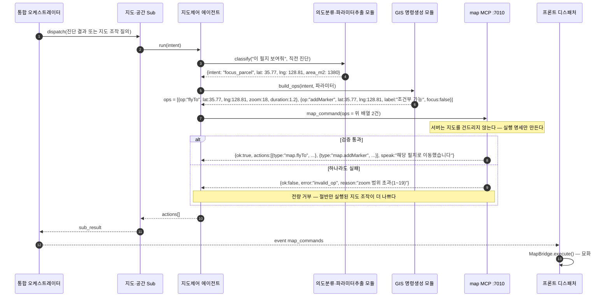

**배열로 받는 이유** — 판정 후 이동+마커를 한 번에 던진다. 실측상 실제 지도 조작의 대부분이
이 경로다(map-mcp README §2).

> ⚠️ **어휘 불일치 — 미해결.** `map_command` 의 op 는 `flyTo`·`addMarker`·`setZoom`·
> `clearMarkers`·`setBaseLayer`·`fitBounds`·`reset` 7개인데, 현행 프론트가 실행하는 명령은
> `clear_mass`·`fly_to`·`highlight_parcel`·`show_zone_pieces`·`extrude_mass`·`show_panel` 이다
> (`agents/map_control.py:146-260`). **필지 강조·매스·패널에 해당하는 op 가 MCP 쪽에 없다.**
> §10 ② 참조.

### 5.2 공간분석 비전 에이전트

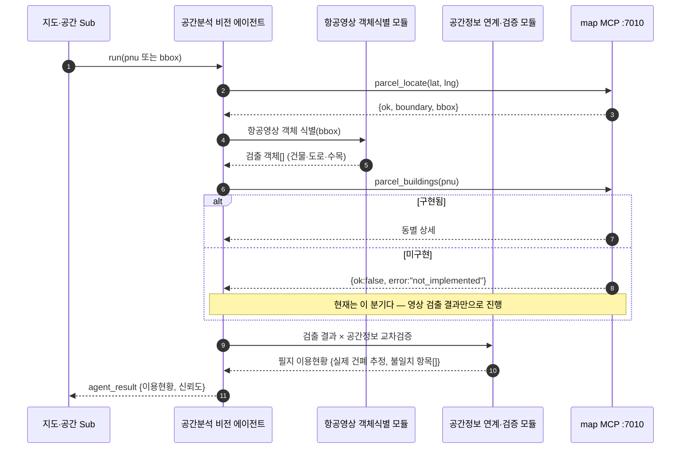

`parcel_buildings` 는 계약만 있고 구현이 없다. **채워져도 기존 동작은 바뀌지 않는다**(map-mcp README §3②).

---

## 6. 3D 시뮬레이션 Sub

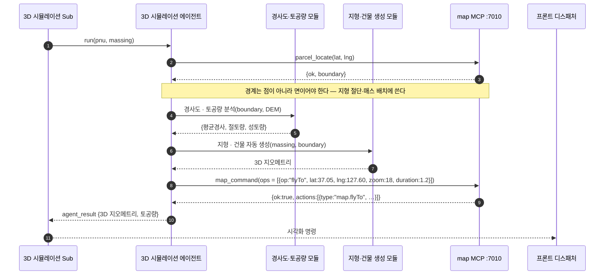

> ⬚ **DEM(수치표고) 조회 경로가 아직 tool 로 없다.** 현재 MCP 8개 tool 중 표고를 주는 것이 없다. §10 ③.

---

## 7. 복합 질의 — 두 Sub 병렬 라우팅과 결과 통합

`"이 필지에 공장 지을 수 있고, 지금 뭐가 들어서 있어?"` 처럼 두 도메인이 걸리는 경우다.
**충돌 조정이 통합 오케스트레이터의 고유 책임**임을 보이는 시퀀스다.

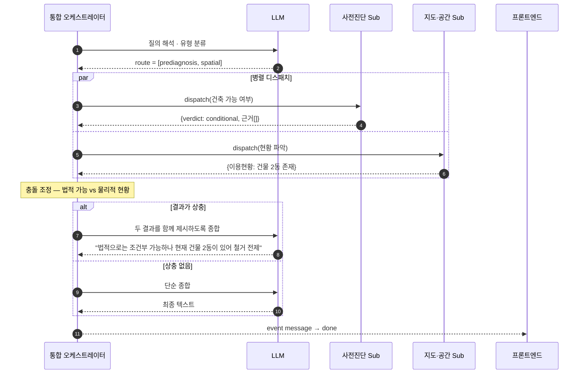

**병렬로 던지는 판단 기준** — 두 Sub 가 서로의 출력을 입력으로 쓰지 않을 때만 `par` 다.
3D 시뮬레이션은 사전진단의 `massing` 을 입력으로 받으므로 **항상 순차**다.

---

## 8. 실패 처리 — tool 실패가 어디까지 올라가나

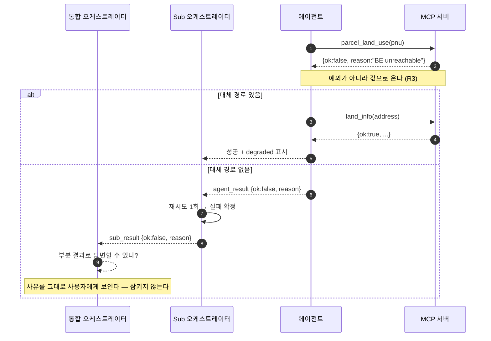

**계층별 재시도 상한** — 에이전트 0회(대체 경로만), Sub 1회, 통합 0회.
계층마다 재시도를 두면 최악의 경우 호출이 곱해진다.

---

## 9. 현행 구현 대비 차이 (as-is → to-be)

| | **현행** (ARCHITECTURE.md 기준) | **이 문서** |
|---|---|---|
| 계층 | 오케스트레이터 1개 (`Orchestrator` 클래스) | 통합 + Sub 3개 |
| 도구 | LLM 노출 3개 — `prediagnose` · `render_on_map` · `restudy_massing` (**in-process 함수**) | MCP tool 8개 + 내부 모듈 |
| 공간정보 | `tools/vworld.py` 가 VWorld OpenAPI **직접 호출** | 에이전트 → map MCP `:7010` |
| 지도 | `build_map_commands()` in-process | `map_command` tool |
| ReAct | **없음** — 결정적 파이프라인, "LLM 을 의도적으로 건너뛴다" | Sub 계층에 루프 존재 |
| LLM 호출 | 질의당 3회 (도구선택 · 추출 · 답변) | ⬚ 미측정 — §10 ④ |
| 에이전트 | 2개 (`prediagnosis` · `map_control`) | 4개 (+공간분석 비전, +3D 시뮬레이션) |
| 민원세트 · 보고서 | 요건·의존관계는 `permit_requirements.build` 로 **있음**. 서류 생성·무결성 검증·보고서는 없음 | §4.2 |
| 인허가 절차 체인 | 단계별 모듈(`land_division`·`land_conversion`·`road_access`·`terrain`)과 선후행 연결(`_link_dependencies`)이 **있음**. Sub 계층 분리는 없음 | §4.3 |
| 법령 저촉 · 협의 | `legal_conflicts.evaluate` 로 저촉 판정 **있음**(룰 파일). **협의 절차 도출은 없음** | §4.4 |
| 저장소 | `ordinances.json` 파일 1개 + 프로세스 메모리 세션 | RDB · Graph · Vector · 오브젝트 4종 (§1.2) |
| 배치 | 단일 프로세스 — 프론트 `:5173` · 백엔드 `:8000` | APP · LLM · DB **서버 3대** + Reverse Proxy (§1.2) |
| LLM | 외부 API (Anthropic / OpenAI 호환) | **온프레미스 GPT-OSS 120B·20B** + bge-m3 |

**현행에서 그대로 가져온 설계 판단 2가지** — 이 문서에서도 유지한다.

1. **LLM 은 사람 말을 구조로 바꾸는 데만 쓴다.** 판정·계산·묘화는 결정적 코드가 한다.
   초기 구현은 LLM 호출이 질의당 9회였고 무료 티어 한도를 질의 두어 건으로 소진했다.
2. **불허 필지에는 매스를 그리지 않는다.** 그리면 가능한 것처럼 읽힌다.

---

## 10. 미결정 — 채워야 확정되는 것

| | 항목 | 내용 |
|---|---|---|
| **①** | **RAG 가 MCP 인가** | 구조도에는 통합 오케스트레이터 옆 RAG 와 사전진단 안 RAG 근거검색 모듈이 **둘 다** 있다. 같은 것인지, MCP tool 로 노출할지 in-process 로 둘지 미정. §4.1 은 in-process 모듈로 그렸다 |
| **②** | **map_command op 어휘** | 프론트가 쓰는 `highlight_parcel`·`extrude_mass`·`show_panel`·`show_zone_pieces` 에 대응하는 op 가 MCP 쪽에 없다. op 추가는 자유지만(README §5) **정의와 실행이 모두 인계처에 있게 되므로 어휘 주도권도 그쪽**이다 — 협의 필요 |
| **③** | **DEM 조회 tool** | 3D 시뮬레이션의 경사도·토공량에 표고가 필요한데 현재 tool 8개 중 없다 |
| **④** | **LLM 호출 횟수 예산** | Sub 3계층 + ReAct 루프면 질의당 호출이 현행 3회에서 크게 는다. **상한을 먼저 정하고 설계해야 한다** — 초기 9회로 한도를 태운 전례가 있다 |
| **⑤** | **Sub 간 상태 공유** | 사전진단의 `massing` 을 3D Sub 가 받는 경로. 통합 오케스트레이터 경유로 그렸으나 페이로드 크기(경계 폴리곤 수천 점) 문제가 남는다. 현행은 `compact()` 로 축약해 해결 중 |
| **⑥** | **인증** | MCP 서버에 **접근 통제가 없다.** 사내망 전제이며 신뢰 경계가 아니다. Sub 계층이 늘면 호출 주체 식별이 필요해진다 |
| **⑦** | **개발행위 판정 입력 — 일부만 있다** | `road_access.assess`(접도)·`terrain`(경사·표고)은 **있다**. **`입목축적`은 없다.** 이 넷을 개발행위 통과 여부로 종합 판정하는 룰(§4.6 ②)이 미정 |
| **⑧** | **분할 판정의 기준값 출처** | `land_division.assess`·`min_lot_area` 모듈은 **있다.** 다만 최소 대지면적이 지자체 조례별로 갈리는 부분의 데이터 출처가 미정 |
| **⑨** | **민원서식 원본** | §4.2 의 민원서류 생성 모듈이 채울 서식(HWP/PDF)의 출처·보관 위치가 미정. 리포에 `민원`·`서류` 관련 자산이 **0건**이다 |
| **⑩** | **협의 기관 · 의제처리 매핑** | §4.4 가 요구하는 "이 개별법 저촉 → 어느 기관과 협의 → 의제처리 대상인가" 표가 없다. `conflict`·`law_kind` 는 tool 이 주지만 **그 다음이 비어 있다** |
| **⑪** | **지식·추론 기반이 없다** | **온톨로지 3계층 · Graph 검색 · 리랭킹 · 운영 거버넌스** 가 코드에 **0건**이다. 다만 Rule Engine 은 `legal_conflicts.evaluate` · `permit_requirements.build` 형태로 **룰 파일 기반 구현이 이미 있다** — 남은 것은 룰 원천을 Graph DB 로 옮기는 것이다. RAG 는 `ordinance_index.py` 로 **있으나 TF-IDF** 이므로 §4.5(Milvus + Fuseki + bge-m3 3단)는 **교체 작업**이다. 인프라(§1.2)는 정해졌으나 연결 코드가 없고, 현행 판정은 `zoning.lookup` 표 조회이지 추론 엔진이 아니다. **이게 없으면 1·2·4단계가 성립하지 않는다** — 나머지 미결정 항목보다 크다 |
| **⑫** | **RAG 튜닝 파라미터 미정** | 청크 단위(조/항/호) · top-k · 리랭킹 절단 N · **온톨로지 3계층 스키마**. 넷 다 검색 품질을 좌우하는데 정해진 값이 없다(§4.5) |
| **⑭** | **룰셋 표현과 버전 관리** | 룰 표현 형식(DSL / 의사결정표 / SPARQL 규칙), 룰셋 버전 관리, **충돌 룰이 3개 이상 겹칠 때의 우선순위**. §4.6 |
| **⑮** | **RDB → Graph DB 적재 파이프라인** | 법령 간 연계정보를 무엇으로 어떻게 적재하는지 미정. 법령 개정 시 **재적재 주기와 룰셋 동기화**가 함께 걸린다 |
| **⑬** | **오브젝트 스토리지 운영 정책** | 보고서·3D 산출물의 **보관 기간 · 접근 권한 · 개인정보 포함 여부**가 미정. 사전진단 보고서에는 필지·소유 관련 정보가 실릴 수 있고, R5(개인정보 배제)는 LLM 컨텍스트 기준이라 **저장 단계는 덮지 못한다** |

---

## 11. 참조

- [ARCHITECTURE.md](ARCHITECTURE.md) — 현행 구현 (`§3` 질의 1건 경로, `§4` 백엔드)
- [SYSTEM-SPEC.md](SYSTEM-SPEC.md) — 현행 HTTP/SSE 명세 (`§4.2` 이벤트 표)
- `map-mcp/README.md` — tool 7개 계약표, BE 계약 함정 7가지
- `mapinfo-mcp/README.md` — `land_info` 단일 tool 계약
