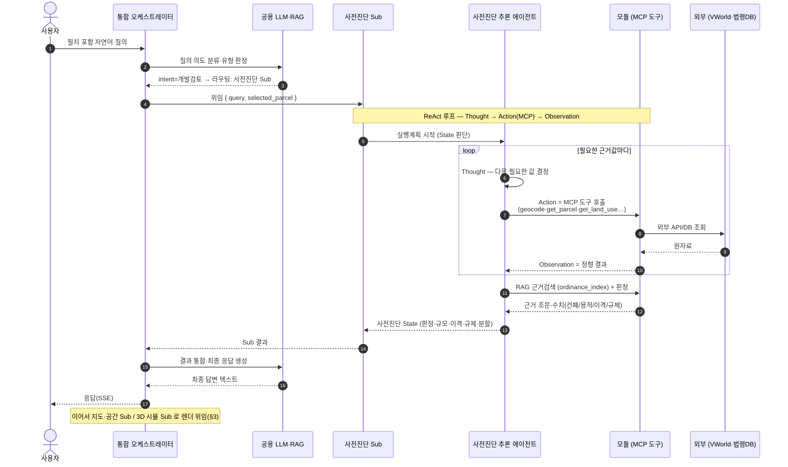
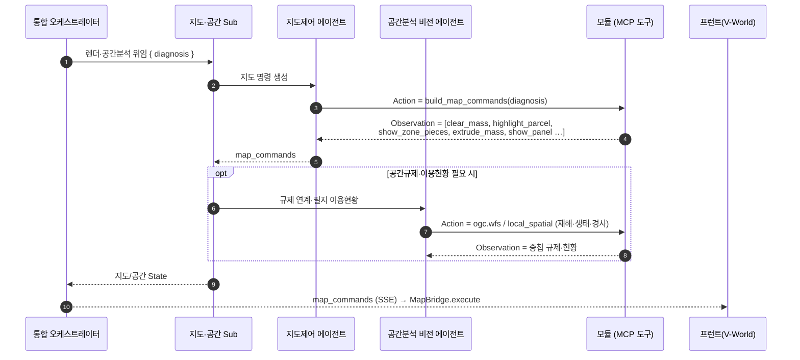
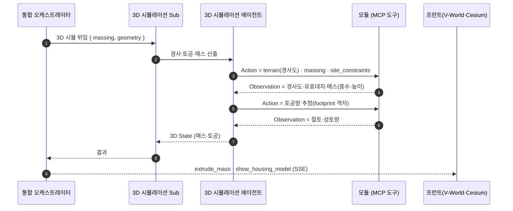
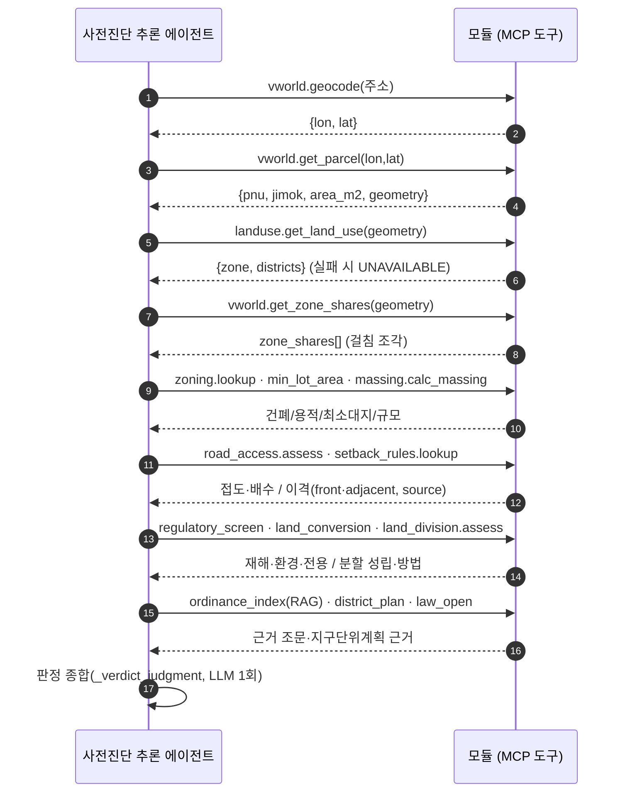

# MCP 기반 4계층 에이전트 — 호출 시퀀스 (향후 목표 구조)

> **성격**: 이 문서는 **향후 목표 구조**다. 현재 구현은 단일 오케스트레이터가
> 인프로세스로 도구를 직접 호출한다(→ `ARCHITECTURE.md`, `SYSTEM-SPEC.md §3.1`).
> 여기서는 그 구조를 **통합 오케스트레이터 ↔ Sub 오케스트레이터 ↔ 에이전트 ↔
> 모듈(MCP 도구)** 4계층으로 재배치했을 때의 **호출·반환(요청/Observation) 관계**를
> 시퀀스로 정의한다. 첨부해 주신 그림은 **참조용**이며 그대로 옮기지 않았고, 이
> 저장소의 실제 모듈(`backend/app/tools/*`, `agents/*`, `orchestrator.py`)에 매핑했다.

---

## 1. 계층 ↔ 현재 코드 매핑

| 미래 계층 | 역할 | 현재 코드(근거) |
|---|---|---|
| **통합 오케스트레이터** | 질의 해석 → 의도 분류·라우팅 → 결과 통합·최종 응답 | `orchestrator.py::Orchestrator` |
| **공용 LLM · RAG** | 도구/라우팅 판단, 근거 검색, 최종 답변 | `llm.py`(LLM), `tools/ordinance_index.py`(TF-IDF RAG) |
| **Sub 오케스트레이터 (사전진단)** | State 판단 · MCP 도구 제어 | `agents/prediagnosis.py::run_prediagnosis` |
| ├ **사전진단 추론 에이전트** | ReAct 판정·근거·대안 | prediagnosis + `_verdict_judgment`(LLM) |
| ├ **모듈(MCP 도구)** | 조회·계산·검색(결정적) | `tools/*` (아래 §5) |
| **Sub 오케스트레이터 (지도·공간)** | 지도 명령·공간분석 State | `agents/map_control.py` + `tools/ogc.py`·`local_spatial.py` |
| ├ **지도제어 에이전트** | 지도 명령 생성 | `map_control.build_map_commands` 등 |
| ├ **공간분석 비전 에이전트** | 공간규제 연계·필지 이용현황(향후 항공영상 객체식별) | `tools/ogc.py`(WFS/WMS), `local_spatial.py`, `terrain.py` |
| **Sub 오케스트레이터 (3D 시뮬레이션)** | 지형·매스·토공 State | `tools/massing.py`·`site_constraints.py`·`terrain.py` + 프런트 `mapBridge` |
| └ **3D 시뮬레이션 에이전트** | 경사·토공·매스·V-World 시각화 | 위 모듈 + Cesium 렌더 |

> 핵심 차이: **현재 = 단일 프로세스·직접 호출**, **미래 = MCP 위임**. 아래 시퀀스는
> "직접 호출"을 "MCP `Action` 호출 → `Observation` 반환"으로 바꿔 표현한 것이다.

---

## 2. 전체 시퀀스 — 질의 1건 (개발 검토 목적)

예: *"충북 음성 두성리 100에 공장 지을 수 있어?"*

**요지**: `모듈(MCP) → 에이전트`는 **Action/Observation**(요청·반환), `에이전트 → Sub`는
**State**, `Sub → 통합 오케스트레이터`는 **Sub 결과**, `통합`은 그것들을 **통합해 최종 응답**.

---

## 3. Sub 오케스트레이터별 상세 시퀀스

### 3.1 지도·공간 Sub (지도제어 + 공간분석 비전)

### 3.2 3D 시뮬레이션 Sub

### 3.3 사전진단 Sub — 모듈 상세 (ReAct 내부)

사전진단 추론 에이전트가 실제로 호출하는 MCP 도구 순서(결정적 파이프라인):

---

## 4. ReAct 루프 · MCP 메시지 규약

- **Thought**: 에이전트가 State에서 "다음에 필요한 값"을 정한다(LLM 또는 결정적 규칙).
- **Action**: 그 값을 주는 **MCP 도구를 호출**한다 — `tool_name(params)`.
- **Observation**: 도구가 **정형 결과(JSON)**를 돌려준다. 수치는 도구/데이터에서만 나오며
  LLM·RAG가 새로 만들지 않는다(→ `LEGAL-ORDINANCE-INDEX.md`).
- 루프는 필요한 근거가 다 모이면 종료하고, 에이전트가 **State**를 Sub에 올린다.
- **경계**: `모듈→에이전트`=Action/Observation, `에이전트→Sub`=State,
  `Sub→통합`=Sub결과, `통합→사용자`=통합 응답(SSE: `tool_start·diagnosis·map_commands·message·done`).

---

## 5. 모듈(MCP 도구) 목록과 요청/반환

| MCP 도구(모듈) | 요청(params) | 반환(Observation) | 현재 코드 |
|---|---|---|---|
| `geocode` | 주소 | `{lon, lat}` | `tools/vworld.py` |
| `get_parcel` | lon, lat | `{pnu, jimok, area_m2, geometry}` | `tools/vworld.py` |
| `get_land_use` | geometry | `{zone, districts}` / `UNAVAILABLE` | `tools/landuse.py` |
| `get_zone_shares` | geometry | `zone_shares[{zone, area_m2, share_pct, geometry}]` | `tools/vworld.py` |
| `zoning.lookup` | zone, 용도 | `{bcr_max_pct, far_max_pct, 허용여부}` | `tools/zoning.py` |
| `min_lot_area` | zone | 최소 대지면적 | `tools/min_lot_area.py` |
| `massing.calc_massing` | area, bcr, far | `{building_area_m2, floors, height_m, gross_floor_area_m2}` | `tools/massing.py` |
| `site_constraints.apply` | geometry, massing, road_access | 유효 건축면적·연면적·층수 | `tools/site_constraints.py` |
| `road_access.assess` | geometry | 접도·배수·도로접촉선 | `tools/road_access.py` |
| `setback_rules.lookup` | 관할, 용도, zone, 연면적 | `{status, front_m, adjacent_m, source}` | `tools/setback_rules.py` |
| `land_division.assess` | diagnosis | `{status, methods[{method, buildable_area_m2}]}` | `tools/land_division.py` |
| `regulatory_screen` | geometry | 재해·환경·국가유산 중첩 | `tools/regulatory_screen.py` |
| `land_conversion` | jimok, zone | 농지·산지 전용 규제 | `tools/land_conversion.py` |
| `building_register.query` | pnu | 기존 건축물대장 | `tools/building_register.py` |
| `ordinance_index.search` (RAG) | 질의 | 근거 조문·별표 청크 | `tools/ordinance_index.py` |
| `district_plan.lookup` | 지구단위계획구역 | 원문 근거 | `tools/district_plan.py` |
| `build_map_commands` | diagnosis | 지도 명령 배열 | `agents/map_control.py` |
| `ogc.wfs / local_spatial` | bbox/geometry | 재해위험지구·생태자연도 등 | `tools/ogc.py`, `local_spatial.py` |
| `terrain` | geometry | 경사도·표고·토공 기초 | `tools/terrain.py` |

> **주의**: 위 반환 스키마는 현재 코드 기준 요약이다. MCP 화(化) 시 각 도구를 별도
> MCP 서버 툴로 노출하고, 위 params/return을 **툴 스키마**로 고정하면 된다. 판정 수치의
> 단일 원본 원칙(하드코딩·LLM 생성 금지)은 그대로 유지한다.
