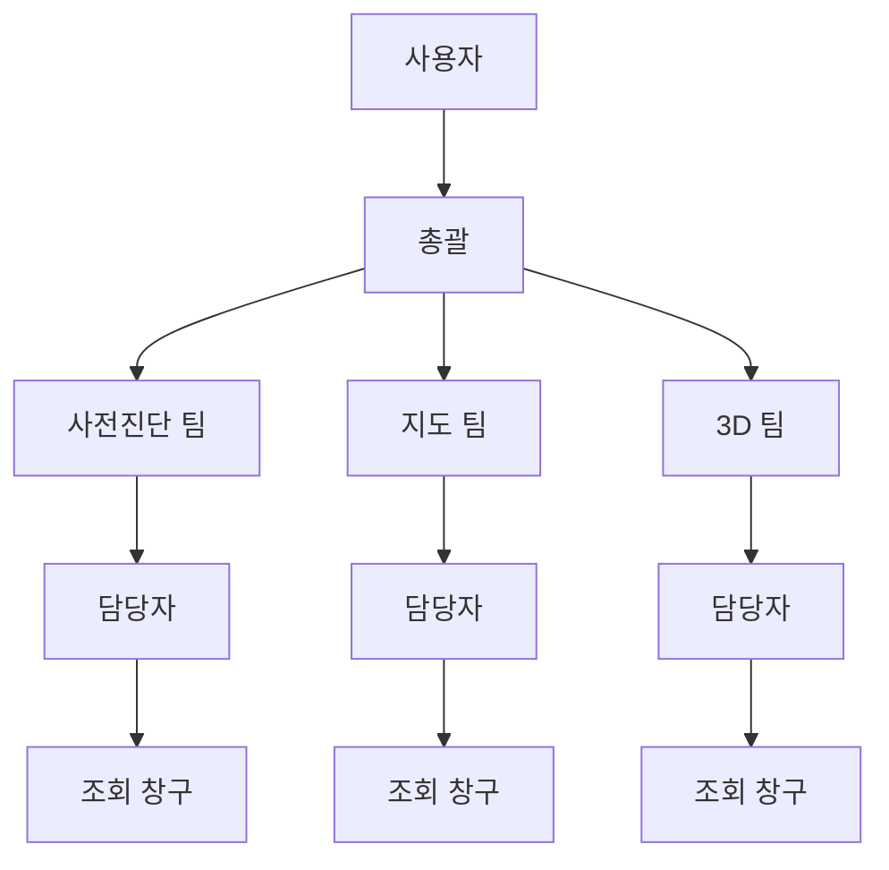
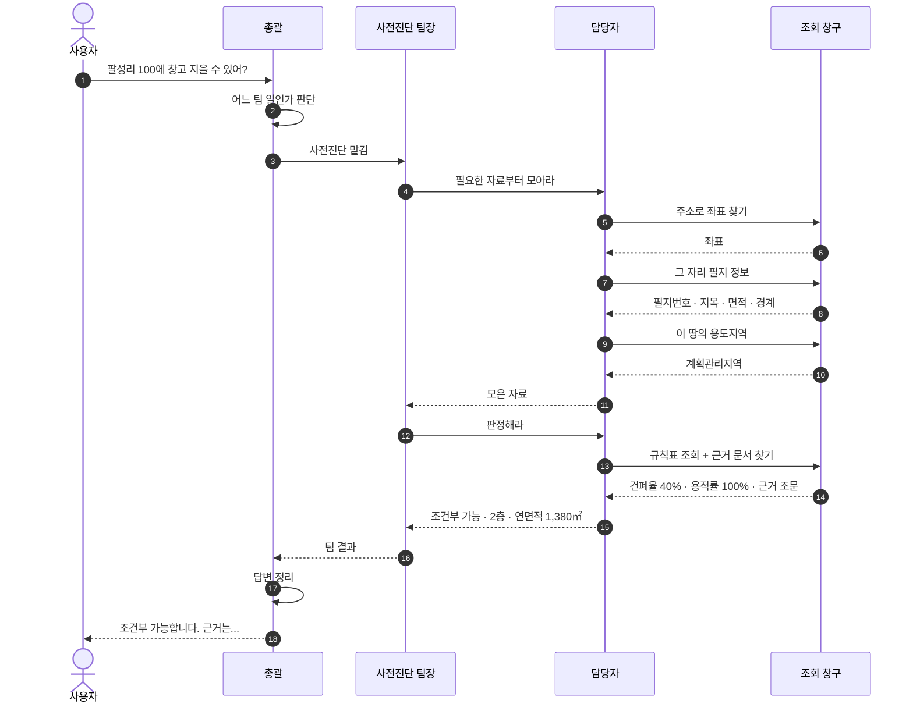
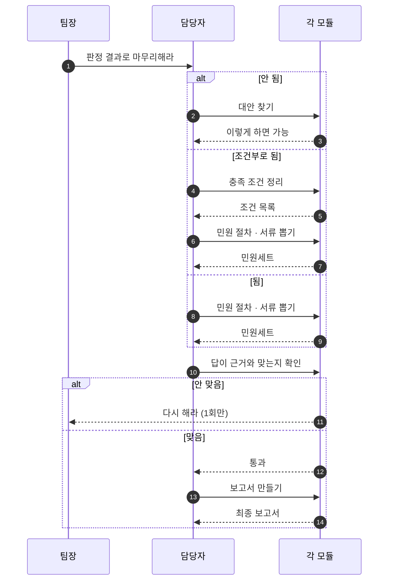
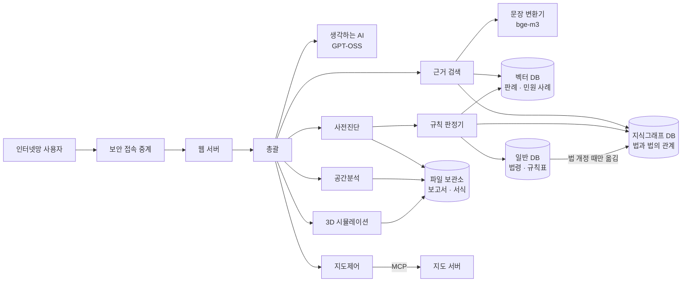
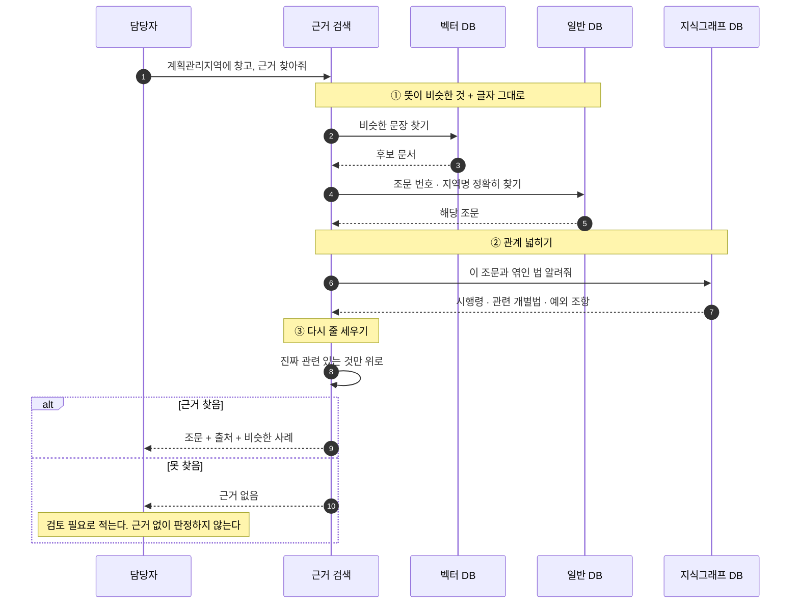

# 인허가 AI 에이전트 — 어떻게 움직이는가

**한 줄 요약** — 사용자가 물으면 → 총괄이 담당 팀에 넘기고 → 담당자가 필요한 자료를 조회하고
→ 규칙표로 판정하고 → 총괄이 답을 정리해 돌려준다.

> 이 문서는 **앞으로 만들 구조**다. 지금 코드는 아직 한 덩어리로 되어 있고, 그것을
> 네 개 층으로 나누려는 계획이다. **지금 있는 것과 없는 것**은 7장에 정리했다.

---

## 1. 조직처럼 생각하면 쉽다

이 시스템은 **회사 조직과 같은 모양**이다.

| 이름 | 쉬운 말 | 하는 일 |
|---|---|---|
| 통합 오케스트레이터 | **총괄** | 질문을 듣고 어느 팀 일인지 정한다. 팀들이 올린 답을 합쳐 최종 답변을 쓴다 |
| Sub 오케스트레이터 | **팀장** | 자기 팀 안에서 누가 무엇을 먼저 할지 정한다 |
| 에이전트 | **담당 직원** | 실제로 일한다. **바깥에 자료를 요청하는 건 이 사람뿐** |
| 모듈 | **조회 창구 · 계산기** | 한 가지만 한다. 면적 계산, 필지 조회처럼 |



**왜 나누나** — 총괄이 전부 직접 하면 잘못됐을 때 **어디서 틀렸는지 못 찾는다.**
층을 나눠 두면 어느 단계에서 어긋났는지 짚을 수 있다.

**지켜야 할 규칙 세 가지**

1. 자료 조회는 **담당자만** 한다. 총괄이나 팀장이 직접 조회하면 추적이 끊긴다.
2. 담당자끼리 **서로 부르지 않는다.** 항상 팀장을 거친다.
3. 조회가 실패해도 **오류를 터뜨리지 않는다.** "왜 실패했는지"를 답으로 돌려준다.

---

## 2. 알아 둘 낱말

| 낱말 | 뜻 |
|---|---|
| **MCP** | 프로그램끼리 기능을 주고받는 **약속된 규격**. 콘센트 규격 같은 것 |
| **도구(tool)** | 그 규격으로 내놓은 **기능 하나**. 예: 주소를 주면 좌표를 돌려주는 기능 |
| **RAG** | 답을 지어내지 않고 **문서에서 근거를 찾아와** 붙이는 방식 |
| **벡터 검색** | **뜻이 비슷한** 문장을 찾는 것 |
| **키워드 검색** | **글자 그대로** 찾는 것. "제56조"처럼 정확해야 하는 것에 쓴다 |
| **지식그래프** | "이 법이 저 법을 덮는다" 같은 **관계를 점과 선으로** 저장해 둔 것 |
| **Rule Engine** | **규칙표대로 자동 판정**하는 프로그램 |
| **저촉** | 다른 법에 **걸리는 것** |
| **의제처리** | 인허가 하나를 받으면 **다른 인허가도 받은 것으로** 쳐주는 것 |
| **PNU** | 필지마다 붙은 **고유번호 19자리** |
| **폴리곤** | **면**. 점이 아니라 경계선으로 둘러싸인 땅 모양 |
| **판정 결과** | 가능 / 불허 / 조건부 가능 / **검토 필요** |
| **건축 가능 규모** | 건축면적 · 연면적 · 층수 |

**그림 읽는 법** — 위에서 아래로 시간이 흐른다. 세로줄은 담당자, 가로 화살표는 요청이다.
실선(`→`)은 요청, 점선(`-->`)은 결과다. `alt`는 갈림길, `loop`는 반복, `par`는 동시 진행이다.

---

## 3. 질문 하나가 처리되는 과정

예: *"팔성리 100에 창고 지을 수 있어?"*



**핵심** — 조회 창구를 부르는 화살표는 **담당자에게서만** 나온다.
총괄이나 팀장에게서 나오면 규칙 위반이다.

---

## 4. 사전진단 팀이 하는 일

### 4.1 다섯 단계

| 단계 | 이름 | 하는 일 |
|---|---|---|
| 1 | 근거 기반 사전판단 | 자료를 모으고 규칙표로 **판정**한다 |
| 2 | 대안 생성 | 안 되면 **어떻게 하면 되는지** 찾는다 |
| 3 | 민원세트 생성 | 필요한 **민원 절차와 서류**를 뽑는다 |
| 4 | 판단결과 검증 | 답이 근거와 **맞는지 확인**한다 |
| 5 | 최종 산출 | **보고서**로 만든다 |

**4단계에서 걸리면 되돌아간다.** 단, 되돌리기는 **한 번까지만** 한다.
계속 되돌리면 끝나지 않는다.



### 4.2 순서가 중요하다

건축 허가만 보면 안 된다. **그 앞에 붙는 절차가 진짜 관문**이다.

```
① 땅을 나눠야 하나?  →  ② 지목을 바꿔야 하나?  →  ③ 개발행위 허가  →  ④ 건축 허가
   (토지분할)              (농지·산지 전용)
```

세 가지를 지킨다.

- **앞에서 막히면 뒤는 안 본다.** 뒤 결과를 보여주면 "건축은 되는데"로 잘못 읽힌다.
- **땅을 나누면 면적이 바뀐다.** 규모 계산은 **나눈 뒤 면적**으로 한다.
- **확인 못 한 항목은 통과가 아니다.** "모름"이라고 분명히 적는다. 조용히 넘어가면 통과로 읽힌다.

### 4.3 법이 서로 부딪칠 때

한 땅에 여러 규제가 겹치는 건 **정상**이다. 겹침에는 세 종류가 있고 처리가 다르다.

| 종류 | 무엇 | 어떻게 |
|---|---|---|
| **땅이 걸쳐 있음** | 한 필지가 두 용도지역에 걸침 | **면적이 큰 쪽** 기준으로 본다 |
| **법끼리 부딪침** | 국토계획법은 되는데 다른 법이 막음 | **다른 법이 이긴다.** 협의 대상 |
| **규제가 겹쳐 쌓임** | 용도지역 위에 지구·구역이 얹힘 | 다 합쳐서 적용 |

**중요** — 법에 걸린다고 바로 "불허"로 적지 않는다. 대개 **협의하면 풀리는 조건**이다.
불허로 적으면 그 자리에서 포기한다. **"조건부 가능 + 어느 기관과 무엇을 협의"** 로 적는다.

---

## 5. 지도 팀과 3D 팀

**지도 팀** — 담당자가 지도 명령을 만들어 한 번에 보낸다. 이동과 표시를 따로 보내지 않는다.
하나라도 잘못되면 **전부 취소**한다. 절반만 실행된 지도가 더 나쁘다.

**3D 팀** — 경사도와 흙 파는 양을 계산하고, 건물 모양을 세운다.

**같이 할 수 있는 일과 그렇지 않은 일**

| 조합 | 방식 | 왜 |
|---|---|---|
| 사전진단 **+** 지도 | **동시** | 서로 남의 결과가 필요 없다 |
| 사전진단 **→** 3D | **순서대로** | 3D는 **건축 가능 규모가 나와야** 건물을 세운다. 그 전엔 그릴 게 없다 |

동시에 하면 **느린 쪽 시간만** 걸리고, 순서대로 하면 **두 시간이 더해진다.**
그래서 가능하면 동시가 낫지만, 앞의 결과가 필요하면 방법이 없다.

---

## 6. 자료는 어디에 있나

서버 세 대를 쓴다. **APP**(사람 상대), **LLM**(생각하는 쪽), **DB**(자료 보관).

| 저장소 | 무엇을 담나 | 왜 필요한가 |
|---|---|---|
| **일반 DB** (PostgreSQL) | 법령 · 규제 조건 · **규칙표**, 건폐율 같은 **기준 숫자** | 숫자 비교는 여기서만 정확하다 |
| **지식그래프 DB** (Fuseki) | **법과 법 사이의 관계** | "어느 법이 어느 법을 덮는가"는 관계라서 표로는 못 적는다 |
| **벡터 DB** (Milvus) | **판례 · 민원 사례 · 법령 조문** | "비슷한 경우 어떻게 판단했나"를 찾는다 |
| **파일 보관소** | **보고서** · 민원 서식 · 항공사진 · 3D 결과 | 문서와 그림을 둔다 |

**법령 조문이 두 곳에 있는 이유** — 중복이 아니라 **역할이 다르다.**

| | 일반 DB | 벡터 DB |
|---|---|---|
| 답하는 질문 | *"계획관리지역 건폐율 상한은?"* | *"비슷한 사례에서 어떻게 판단했나?"* |
| 찾는 방식 | 정확히 일치 | 뜻이 비슷한 것 |
| 없으면 | 판정 기준 숫자를 못 얻는다 | 근거와 사례가 사라진다 |

판례와 민원 사례는 **벡터 DB에만** 둔다. 서술이라 표로 정리가 안 된다.
반대로 기준 숫자는 **일반 DB에만** 둔다. 숫자 비교를 "비슷한 것 찾기"로 하면 틀린다.



**어느 서버에 있나** — 웹 서버 · 총괄 · 담당자 넷 · 근거 검색은 **APP 서버**,
생각하는 AI와 문장 변환기는 **LLM 서버**, 저장소 네 개는 **DB 서버**에 있다.

> `일반 DB → 지식그래프`는 **미리 만들어 두는 작업**이라 법이 바뀔 때만 한다.
> `지식그래프 · 벡터 → 규칙 판정기`는 **질문받을 때마다** 한다.

### 6.1 규칙 판정기(Rule Engine)

사람이 규칙을 적어 두면 기계가 그대로 적용한다. 규칙은 네 종류다.

| 종류 | 예 | 어디서 가져오나 |
|---|---|---|
| 숫자 규칙 | 건폐율 40% 넘으면 위반 | 일반 DB |
| 허용 규칙 | 계획관리지역 + 창고 → 조건부 | 일반 DB + 지식그래프 |
| **충돌 규칙** | 국토계획법은 되는데 다른 법이 막음 → 다른 법 우선 | **지식그래프** |
| 순서 규칙 | 전·답이면 농지전용 먼저 | 지식그래프 |

**세 가지를 지킨다.**

- **규칙이 없으면 "가능"이 아니라 "검토 필요"다.** 기본값을 가능으로 두면 빈틈이 그대로 잘못된 답이 된다.
- **사례는 근거일 뿐 판정이 아니다.** 판정은 규칙이 한다. 사례로 판정하면 같은 질문에 다른 답이 나온다.
- **판정에 규칙표 버전을 남긴다.** 안 남기면 법이 바뀐 뒤 예전 판정을 재현할 수 없다.

### 6.2 근거 찾기는 세 단계다



**왜 세 단계인가**

- **뜻으로만 찾으면** "제56조" 같은 정확한 번호를 놓친다 → 글자 그대로 찾기를 같이 한다.
- **조문 하나만 찾으면** 딸린 시행령과 예외를 놓친다 → 관계로 넓힌다.
- **넓히면 양이 많아진다** → 다시 줄 세워 위쪽만 쓴다.

---

## 7. 지금 있는 것과 없는 것

**이미 있다** — 새로 만드는 게 아니라 **감싸서 규격에 맞추면 되는 것들**이다.

| 하는 일 | 지금 코드 |
|---|---|
| 주소 → 좌표, 필지 조회 | `vworld.py` |
| 용도지역 조회 | `landuse.py` |
| 건폐율 · 용적률 | `zoning.py` |
| 건축 가능 규모 계산 | `massing.py` |
| 최소 대지면적 | `min_lot_area.py` |
| 도로에 접했는지 | `road_access.py` |
| 건물 띄우는 거리(이격) | `setback_rules.py` |
| 땅 나누기 검토 | `land_division.py` |
| 농지 · 산지 전용 | `land_conversion.py` |
| 재해 · 환경 · 문화재 겹침 | `regulatory_screen.py` |
| 경사도 · 표고 | `terrain.py` |
| 건축물대장 | `building_register.py` |
| **법 부딪침 판정** | `legal_conflicts.py` |
| **인허가 요건 · 선후 순서** | `permit_requirements.py` |
| 근거 문서 검색 | `ordinance_index.py` |
| 지도 명령 만들기 | `map_control.py` |

**아직 없다**

| 없는 것 | 설명 |
|---|---|
| **네 층 구조** | 지금은 한 덩어리다. 팀장 층이 없다 |
| **MCP 규격** | 위 기능들이 아직 규격으로 노출돼 있지 않다 |
| **지식그래프 DB** | 법과 법의 관계가 저장돼 있지 않다 |
| **벡터 DB** | 지금 근거 검색은 단순 방식이다. 판례 · 민원 사례가 없다 |
| **파일 보관소** | 보고서 · 서식을 둘 곳이 없다 |
| 민원 서류 만들기 · 검증 · 보고서 | 5단계 중 3~5단계 |
| 협의 절차 뽑기 | 법에 걸린 뒤 "어느 기관과 무엇을" 부분 |

---

## 8. 아직 정해야 할 것

| | 무엇 | 왜 중요한가 |
|---|---|---|
| 1 | **지식그래프에 무엇을 어떻게 넣을지** | 이게 없으면 법 부딪침 판정이 표 조회 수준에 머문다 |
| 2 | **판례 · 민원 사례 자료** | 벡터 DB에 넣을 원본이 아직 없다 |
| 3 | **협의 기관 · 의제처리 목록** | "걸립니다"만으로는 다음 행동이 없다 |
| 4 | **민원 서식 원본** | 서류를 만들려면 서식이 있어야 한다 |
| 5 | **AI 호출 횟수 상한** | 층이 늘면 호출이 크게 는다. 예전에 한도를 빠르게 소진한 적이 있다 |
| 6 | **보고서 보관 규칙** | 보관 기간 · 열람 권한 · 개인정보 포함 여부 |
| 7 | **지도 명령 종류 맞추기** | 화면이 쓰는 명령과 규격이 제공하는 명령이 서로 다르다 |
| 8 | **경사도 외 개발행위 기준** | 입목 축적 등 아직 조회할 방법이 없는 항목 |

---

## 9. 함께 볼 문서

- `ARCHITECTURE.md` — 지금 구현된 구조
- `SYSTEM-SPEC.md` — 화면 · 통신 규격
- `LEGAL-ORDINANCE-INDEX.md` — 법령 · 조례 자료 다루는 원칙
