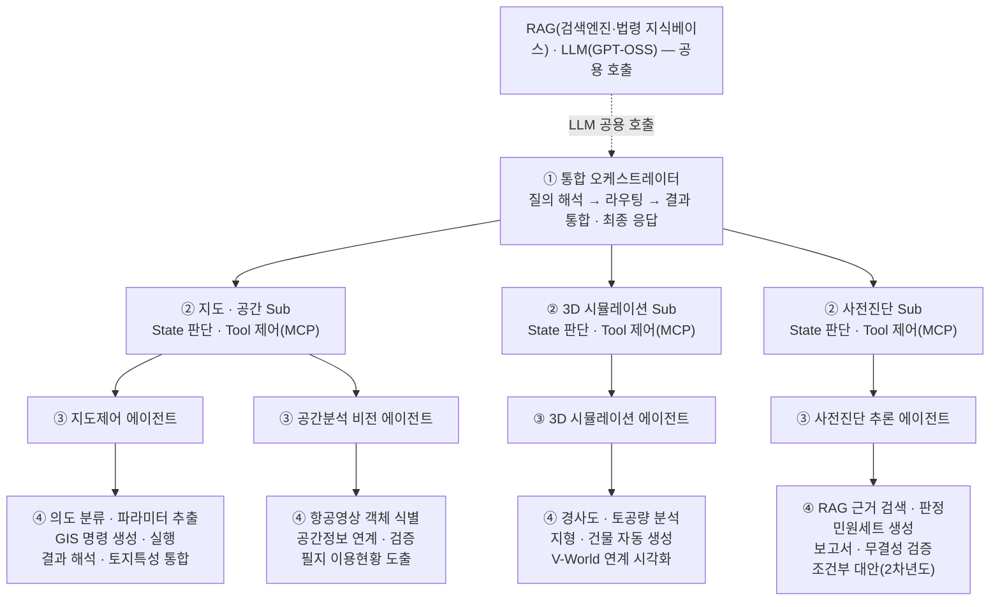
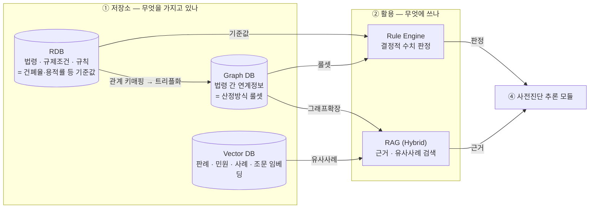
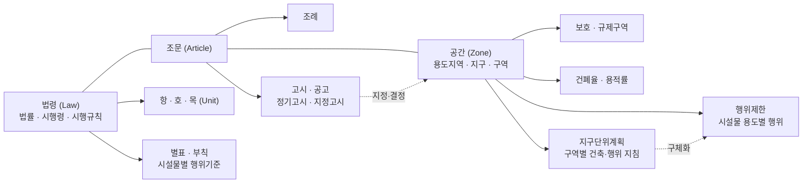
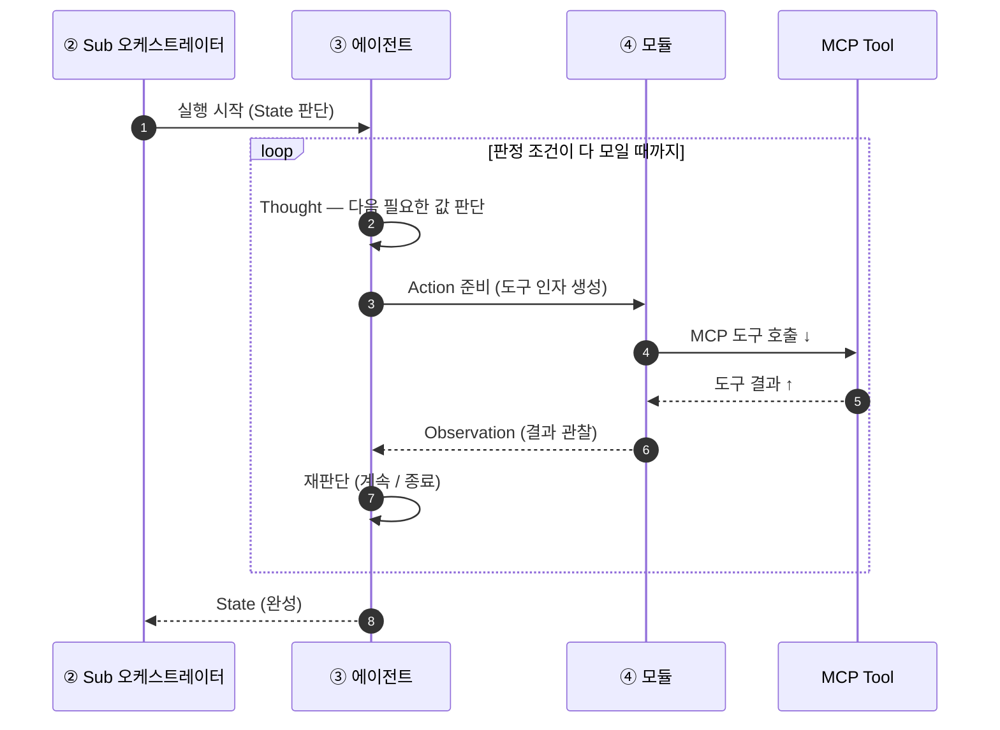
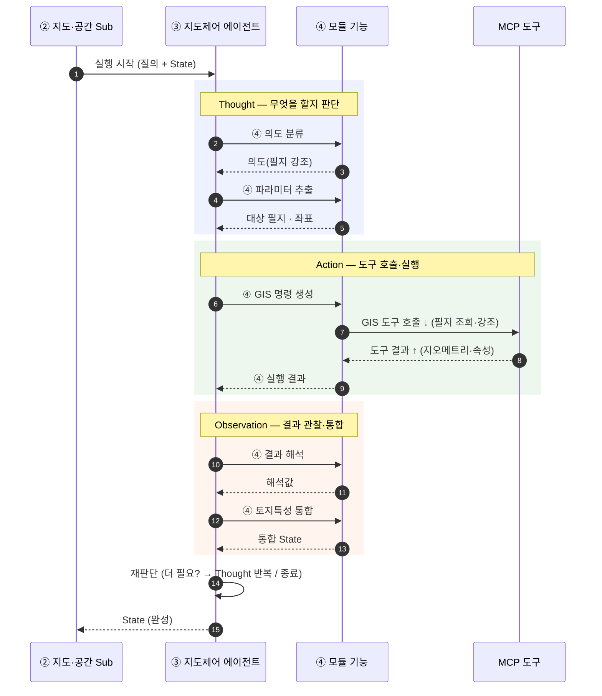
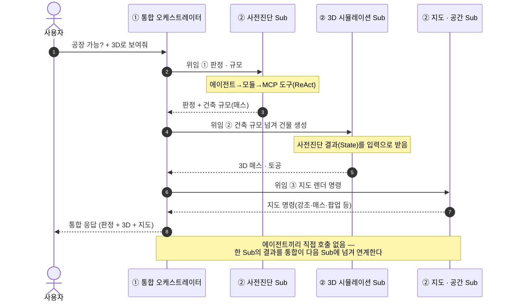

# MCP 4계층 에이전트 구조 — 관계·호출 시퀀스 (간단본)

> **4계층 멀티 AI 에이전트 구조와 분기 로직을 결정적으로 정의하여 응답 일관성을 확보하고,
> Sub 오케스트레이터의 ReAct 루프·MCP 기반 도구 위임으로 컨소시엄 3사 병행 개발·기능
> 확장 대응력 확보.**

이 문서는 **통합 오케스트레이터 ↔ Sub 오케스트레이터 ↔ 에이전트 ↔ 모듈** 사이에서
**MCP 도구를 어떻게 호출(요청)하고 결과를 어떻게 돌려받는지(Observation)**, 그리고
**ReAct 루프가 어떻게 도는지**를 간단히 설명한다. (상세본: `MCP-AGENT-SEQUENCE.md`)

---

## 1. 4계층 구조

- **① 통합 오케스트레이터** — 질의를 해석·유형 분류하고, 어느 Sub로 보낼지 **라우팅**하고,
  Sub들의 결과를 **통합해 최종 응답**을 만든다. **RAG·LLM은 공용**으로 함께 호출한다.
- **② Sub 오케스트레이터(3개)** — 도메인 안에서 **State 판단**과 **에이전트 호출 순서·ReAct
  루프**를 관장한다. **MCP 도구를 직접 부르지 않는다.**
- **③ 에이전트(4개)** — 모듈을 실행하고 **MCP 도구 호출의 유일한 주체**다. 결과를 정규화한다.
- **④ 모듈** — 단일 기능 단위(도구 인자 생성 / 응답 해석 / 결정적 계산).

### 1.1 DB 연계 — 무엇을 저장하고 · 무엇을 가져와 · 무엇에 활용하나

DB는 **저장소(무엇을 가지고 있나) → 조회(무엇을 꺼내나) → 활용(어느 모듈이 어떻게 쓰나)** 로
이어진다. **DB를 직접 읽는 주체는 사전진단 추론 에이전트/모듈**이며, Rule Engine·RAG를 통해
값을 가져와 판정과 근거 제시에 활용한다.

| DB | 저장(무엇을) | 가져오기(무엇을) | 활용(어디에) |
|---|---|---|---|
| **RDB** | 법령·규제조건·규칙 = **판정 기준값** | 건폐율·용적률 등 기준값 | Rule Engine의 **수치 판정**, Graph DB 트리플화의 원천 |
| **Graph DB** | RDB 법령정보를 **관계 키매핑해 트리플(RDF)로 구조화**한 **법령 간 연계정보 = 룰셋** | 산정방식 룰셋 · 그래프 확장 | Rule Engine의 **판정 규칙**, RAG의 **근거 확장** |
| **Vector DB** | 판례·민원·사례·조문 **임베딩** | 유사사례 · 관련 조문 | RAG의 **근거·유사사례 제시** |

- **가져오는 것** — Rule Engine은 RDB의 **기준값**과 Graph DB의 **룰셋**을 가져오고, RAG는 Graph DB
  **그래프 확장** + Vector DB **유사사례**를 함께 가져온다(**Hybrid RAG**).
- **활용하는 곳** — 가져온 값은 모두 **④ 사전진단 추론 모듈**로 모여, Rule Engine 결과는 **판정**에,
  RAG 결과는 **근거·민원세트**에 활용된다.
- 즉 `RDB→Graph→Vector` 직렬이 아니라, **RDB는 트리플화의 원천**이고 **조회는 Graph·Vector 양쪽**에서
  일어나며, 최종 활용 주체는 **사전진단 추론 모듈** 하나로 수렴한다.

### 1.2 온톨로지 구조 설계 (Graph DB에 들어가는 지식 체계)

> **법령·조례와 지역지구·판단 규칙을 단일 온톨로지로 통합하고 무결성 강제 규칙을 정의하여,
> 인허가 판정의 법적 근거 추적성과 룰엔진·RAG 검색에 직결되는 지식 체계 확보.**

- **법령(Law)** — 법률·시행령·시행규칙 → **항·호·목(Unit)**, **별표·부칙**(시설물별 행위기준)
- **조문(Article)** — 법령과 공간을 잇는 중간 계층 → **조례**, **고시·공고**(정기고시·지정고시)로 확장
- **공간(Zone)** — 용도지역·지구·구역 → **보호·규제구역**, **건폐율·용적률**, **행위제한**(시설물 용도별 행위), **지구단위계획**(구역별 건축·행위 지침)
- **고시·공고 / 지구단위계획** — 고시·공고는 용도지역·지구·구역의 **지정·변경(정기고시 포함)** 에
  효력을 부여하고, 지구단위계획은 특정 **구역의 행위제한·건축기준을 구체화**한다.
- **무결성 강제 규칙**으로 이 지식 체계의 일관성을 검사해, **판정의 법적 근거 추적성**과
  **Rule Engine·RAG 검색**이 이 온톨로지에 직결되게 한다.

---

## 2. 오르내리는 것 — 요청(↓) / 결과 반환(↑)

- **내려갈 때(↓) = 요청 · MCP 도구 호출** : 통합 → Sub → 에이전트 → 모듈 → **MCP 서버(도구 실행)**
- **올라올 때(↑) = 결과 반환(Observation)** : 모듈 → 에이전트 → Sub → 통합
- 마지막에 **통합 오케스트레이터가 결과를 통합해 최종 응답을 생성**한다.

| 구간 | 오가는 것 |
|---|---|
| 모듈 ↔ MCP 서버 | **도구 호출 · 도구 결과** |
| 모듈 → 에이전트 | **Observation**(도구가 돌려준 결과) |
| 에이전트 → Sub | **State**(지금까지 모은 상황) |
| Sub → 통합 | **Sub 결과** |
| 통합 → 사용자 | **최종 응답** |

> **핵심 규칙:** MCP 도구를 직접 부르는 계층은 **에이전트뿐**이다. 통합·Sub는 판단·라우팅만
> 하고 도구를 직접 부르지 않는다 — 그래서 분기 로직이 한 곳에 모여 **응답 일관성**이 유지된다.

---

## 3. ReAct 루프 — 에이전트 안에서 도는 방식

에이전트는 한 번에 끝내지 않고, **판정에 필요한 규제조건·기준값이 다 모일 때까지**(= 더 호출할
도구가 없을 때까지) **Thought → Action → Observation** 을 반복한다. 도구 한 번 호출로는 필요한
값 중 일부만 오기 때문이다.

예 — *"이 필지에 공장 지을 수 있나?"* 판정에 필요한 것: 용도지역 → 그 지역의 건폐율·용적률
기준값 → 이격(대지 안의 공지) 규칙 → 공장의 허용·제한 여부(행위제한) → **규제 지역·지구**
(재해위험지구 등) 저촉 여부. 이 값들을 한 번에 하나씩 모아, 다 채워지면 판정한다.

| 단계 | 하는 일 |
|---|---|
| **Thought**(실행계획) | 지금 State에서 **다음에 필요한 값**이 무엇인지 판단 |
| **Action**(도구 호출) | 그 값을 주는 **MCP 도구를 호출** |
| **Observation**(결과 관찰) | 도구가 돌려준 **정형 결과**를 받아 State에 반영 |
| **재판단 반복** | 더 필요하면 다시 Thought로, 다 모이면 State를 Sub에 올림 |

**ReAct 구조 — Sub ↔ 에이전트 ↔ 모듈 ↔ Tool**

> Sub는 **루프를 관장**만 하고, **도구를 직접 부르는 건 에이전트**다(모듈 경유). 모듈은
> **MCP Tool을 호출**하고 결과를 Observation으로 되돌린다.

### 3.1 ④ 기능들이 ReAct로 연계·호출되는 순서 (예: 지도제어 에이전트)

④ 박스 안의 기능들은 한꺼번에 도는 게 아니라 **Thought → Action → Observation 단계에 나눠
순차 호출·반환**된다. 아래는 *"이 필지 강조해줘"* 질의에서 지도제어 에이전트의 기능들이
연계되는 순서다.

**나머지 에이전트도 같은 루프**를 돌며, 자기 ④ 기능이 아래처럼 ReAct 단계에 배치된다.

| 에이전트 | Thought (판단) | Action (도구 호출·실행) | Observation (관찰·통합) |
|---|---|---|---|
| **지도제어** | 의도 분류 · 파라미터 추출 | GIS 명령 생성 · 실행 | 결과 해석 · 토지특성 통합 |
| **공간분석 비전** | 분석 대상 판단 | 항공영상 객체 식별 | 공간정보 연계·검증 · 필지 이용현황 도출 |
| **3D 시뮬레이션** | 경사도 · 토공량 분석 | 지형 · 건물 자동 생성 | V-World 연계 시각화 |
| **사전진단 추론** | 규제조건·조문 판단 | RAG 근거 검색 · 판정 | 민원세트 생성 · 보고서·무결성 검증 |

> 즉 ④ 기능은 **한 ReAct 사이클의 부분 단계**로 호출된다 — 판단 계열은 Thought, 도구 계열은
> Action, 해석·통합 계열은 Observation. 값이 부족하면 같은 순서를 다시 돈다.

---

## 4. MCP 도구 호출 관계 시퀀스

질의 1건이 4계층을 한 번 왕복하며 MCP 도구를 호출하는 관계다.

> 복합 질의(예: 지도 표시 + 사전진단)는 통합 오케스트레이터가 **여러 Sub에 병렬로 위임**하고,
> 각 Sub의 결과(State)를 모아 **충돌을 조정한 뒤 최종 응답**을 만든다.

---

## 5. 계층 간 연계 — Sub ↔ 통합, 에이전트 간

에이전트는 **서로 직접 호출하지 않는다.** 한 Sub(에이전트)가 도구를 호출해 만든 결과를
**통합 오케스트레이터가 받아 다음 Sub의 입력으로 넘겨** 연계한다. 즉 **연계의 매개는 항상
통합 오케스트레이터**이고, 각 Sub는 자기 도메인의 MCP 도구만 부른다.

예: *"이 필지에 공장 지을 수 있어? 3D로 보여줘"* — 사전진단 → 3D 시뮬 → 지도 렌더로 이어짐

| 연계 | 어떻게 |
|---|---|
| **Sub ↔ 통합 오케스트레이터** | 통합이 각 Sub에 **위임(요청)** 하고 **Sub 결과(State)** 를 돌려받아 모은다 |
| **에이전트 간 (다른 Sub)** | **직접 호출 금지.** 통합이 앞 Sub의 결과를 **다음 Sub의 입력**으로 넘겨 이어준다 |
| **에이전트 ↔ 모듈 ↔ MCP Tool** | 각 Sub 안에서 ReAct 루프로 도구 호출·Observation (§3·§4) |

> 이렇게 **연계의 주도권을 통합 오케스트레이터에 모으면**, 분기·순서·충돌 조정이 한 곳에서
> 결정돼 **응답 일관성**이 유지되고, 각 Sub(도메인)는 독립적으로 병행 개발·확장할 수 있다.
