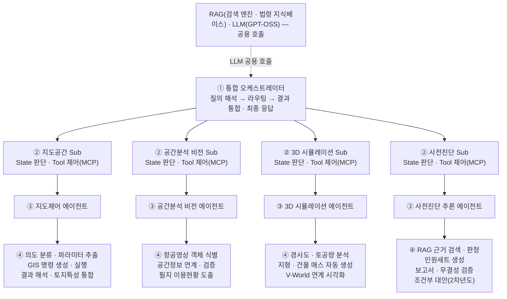
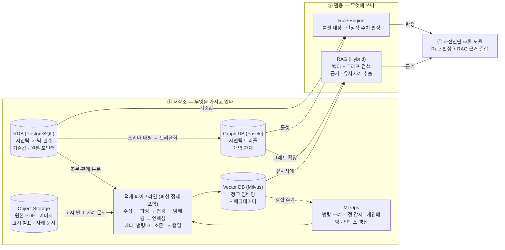
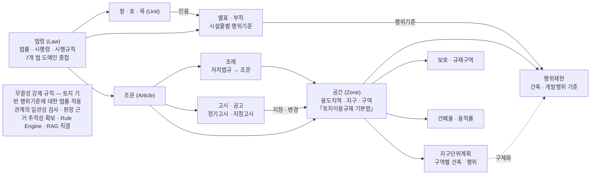
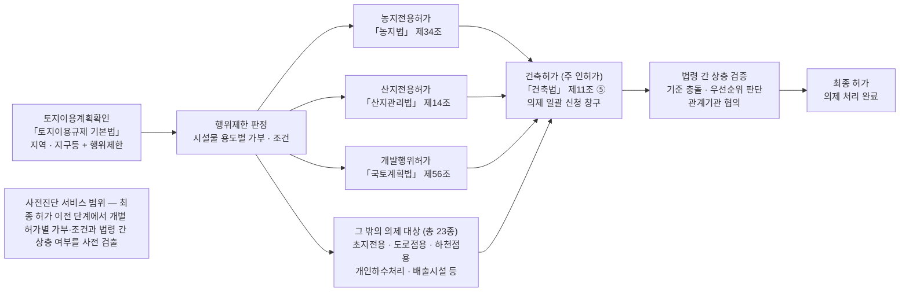
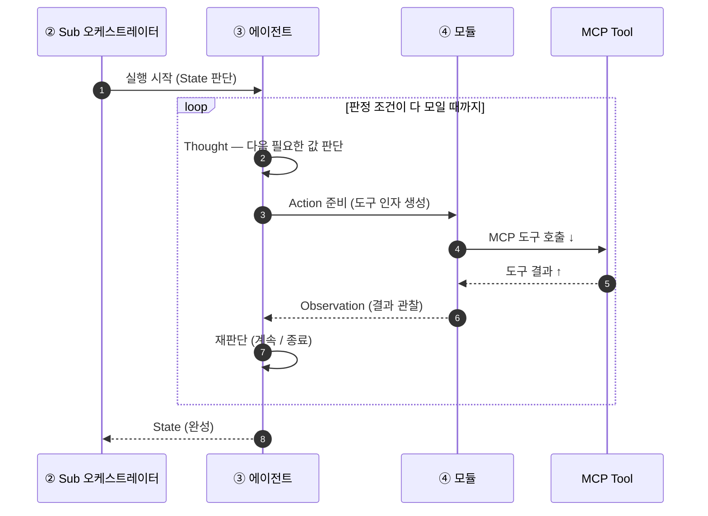
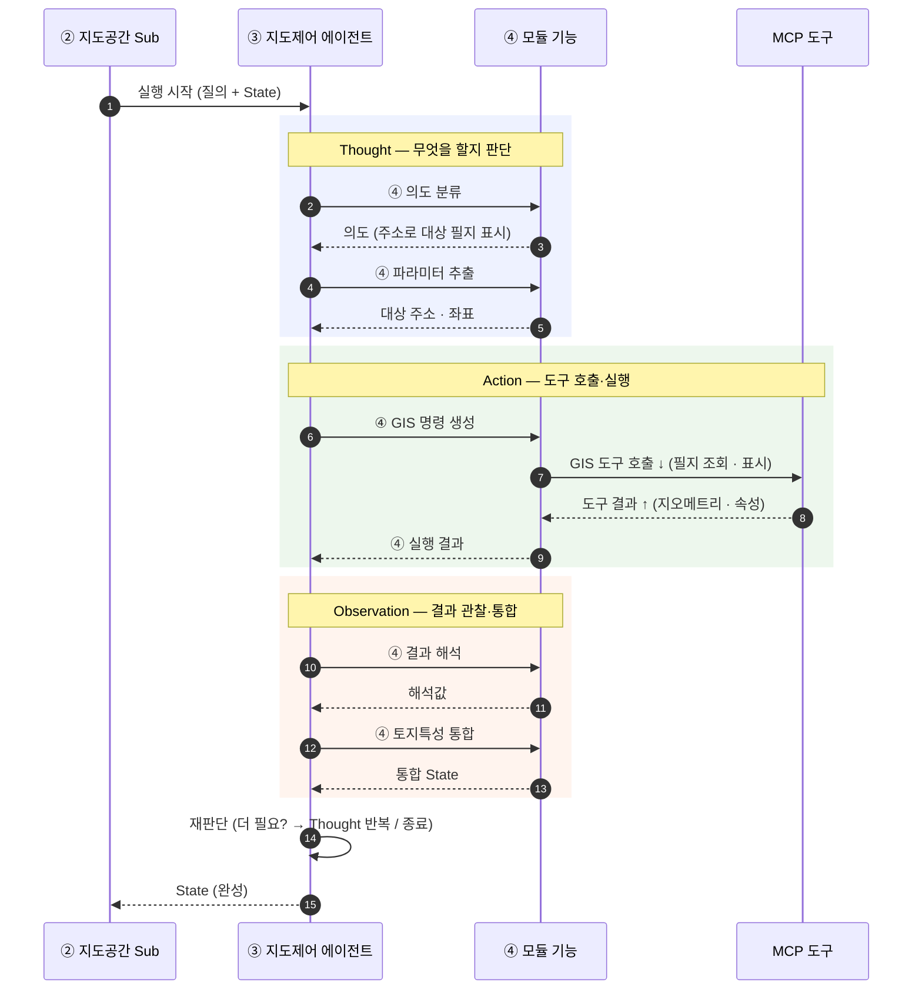
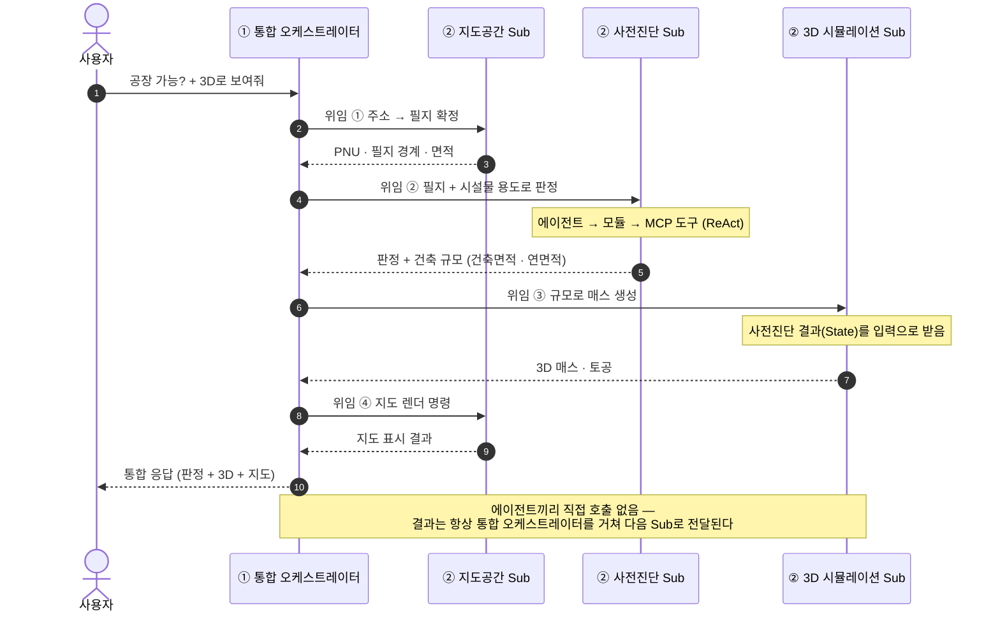
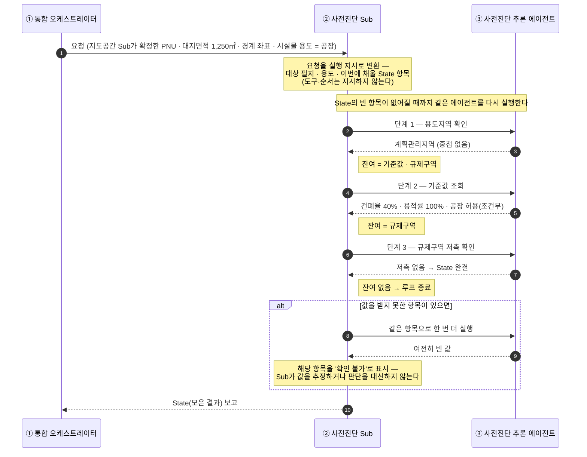
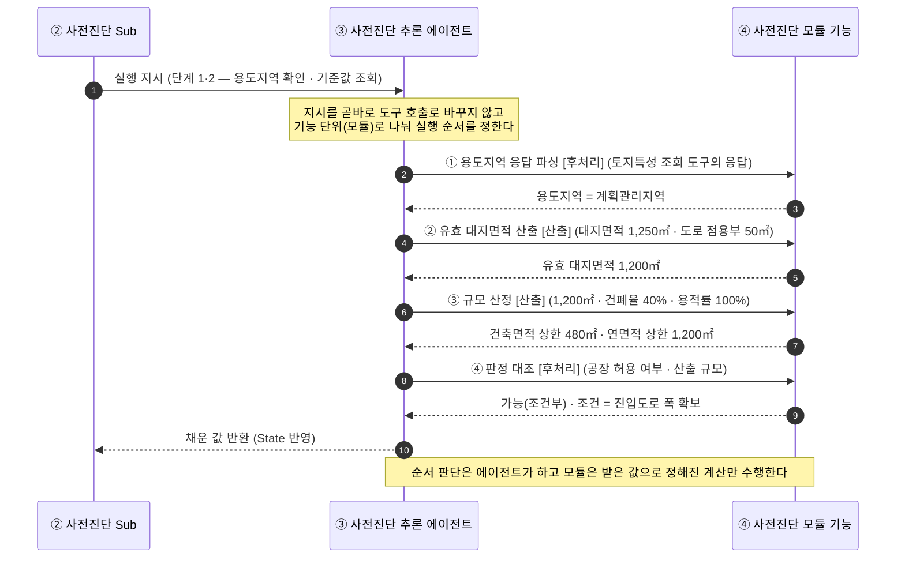
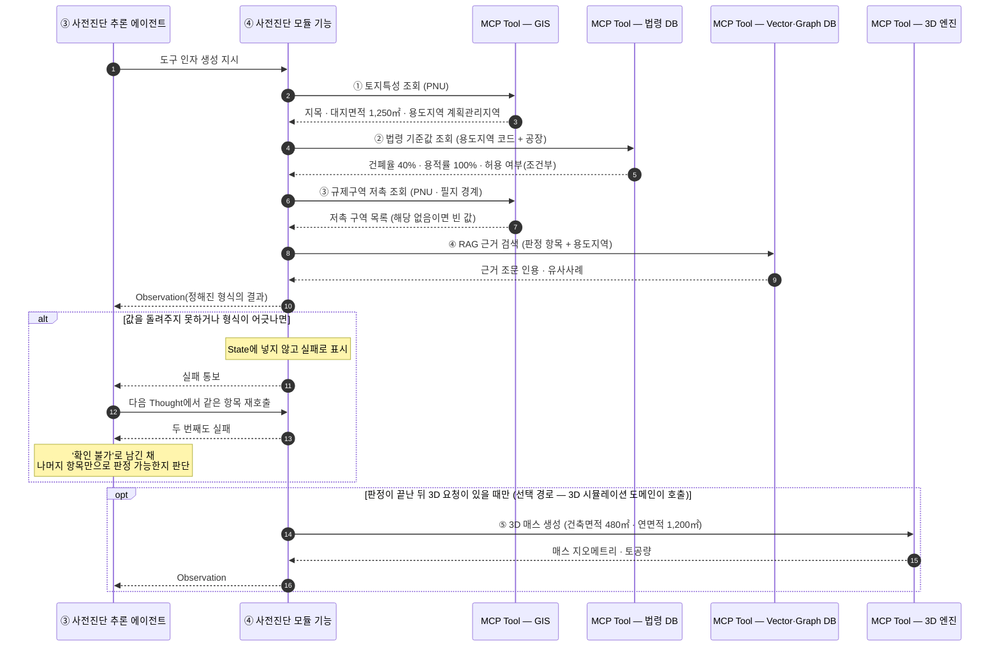

# MCP 4계층 에이전트 구조 — 관계·호출 시퀀스

> **4계층 멀티 AI 에이전트 구조와 분기 로직을 결정적으로 정의하여 응답 일관성을 확보하고,
> Sub 오케스트레이터의 ReAct 루프·MCP 기반 도구 위임으로 컨소시엄 3사 병행 개발·기능
> 확장 대응력을 확보한다.**

이 문서는 통합 오케스트레이터 ↔ Sub 오케스트레이터 ↔ 에이전트 ↔ 모듈 사이에서 MCP
도구(Tool)를 어떻게 호출(요청)하고 결과를 어떻게 돌려받는지(Observation), 그리고 ReAct 루프가
어떻게 동작하는지를 간략히 설명한다. (상세본: `MCP-AGENT-SEQUENCE.md`)

---

## 1. 4계층 구조

- **① 통합 오케스트레이터** — 사용자 질문이 무엇을 요구하는지 파악한다. 지도만 보여 달라는
  것인지, 인허가 가능 여부까지 묻는 것인지, 3D로도 보고 싶다는 것인지에 따라 어느 Sub
  오케스트레이터로 보낼지 정한다. 여러 곳에 보낸 경우 돌아온 결과가 서로 어긋나면 조정하고,
  판단에 필요한 정보가 빠져 있으면 사용자에게 되묻는다. 마지막에 결과를 하나로 합쳐 최종
  답변을 만든다.
- **② Sub 오케스트레이터** — 지도공간, 공간분석 비전, 3D 시뮬레이션, 사전진단 네 분야를
  하나씩 맡는다. 통합 오케스트레이터에게 요청을 받으면 자기 분야의 에이전트를 실행하고,
  에이전트가 돌려준 값을 하나의 작업 기록(State)에 모아 둔다. 예를 들어 사전진단 Sub는
  용도지역, 건폐율·용적률 기준값, 규제구역 저촉 여부를 차례로 채워 간다. 아직 비어 있는
  항목이 있으면 에이전트를 한 번 더 호출하고, 다 채워지면 그 기록을 통합 오케스트레이터에
  올린다. **실행 순서만 정할 뿐 MCP 도구(Tool)를 직접 호출하지는 않는다.**
- **③ 에이전트** — 지도제어, 공간분석 비전, 3D 시뮬레이션, 사전진단 추론. 실제 일을 하는
  계층이며, 각 에이전트는 같은 이름의 Sub 오케스트레이터가 관장한다. 예를 들어 지도제어
  에이전트는 지도를 옮기고 필지를 선택하며, 사전진단 추론 에이전트는 법령 기준과 대조해 가능
  여부를 판정한다. 일을 하려면 외부 시스템의 기능(MCP 도구)을 호출해야 하며, **이 도구를
  호출할 수 있는 계층은 에이전트뿐이다.** 도구가 돌려준 결과는 정해진 형식으로 정리해 Sub에
  올린다.
- **④ 모듈** — 에이전트의 작업을 기능 단위로 나눈 것이다. 도구에 넘길 입력값을 만들고(주소를
  필지 번호(PNU)로 변환하는 등), 도구가 돌려준 응답에서 필요한 값을 추출하며, 건폐율·용적률
  같은 수치를 정해진 계산식으로 산출한다. 모듈은 판단을 하지 않고 정해진 기능만 수행한다.
  따라서 같은 값을 넣으면 언제나 같은 값이 나온다.

### 1.1 DB 연계 — 무엇을 저장하고 · 무엇을 가져와 · 무엇에 활용하나

DB는 저장소와 활용 두 축으로 나뉜다. 저장소에는 RDB, Graph DB, Object Storage, Vector DB가
있다. 원문 문서는 수집 → 파싱 → 청킹 → 임베딩 → 인덱싱 순서로 처리되어 Vector DB에 적재되고,
법령·조례가 개정되면 MLOps가 이를 감지해 다시 임베딩하고 색인을 갱신한다. 활용 쪽에서는 Rule
Engine이 기준값을 대조해 수치를 판정하고, RAG가 벡터·그래프 검색으로 근거와 유사사례를 찾는다.
두 결과는 사전진단 추론 모듈에서 합쳐져 최종 판단이 된다.

| DB | 저장(무엇을) | 가져오기(무엇을) | 활용(어디에) |
|---|---|---|---|
| **RDB (PostgreSQL)** | 법령·조례 원문과 규제 기준값 | 건폐율·용적률 등 판정 기준값 | Rule Engine의 **수치 판정**, Graph DB 트리플화의 원천 |
| **Graph DB (Fuseki)** | 법령 간 연계관계를 **트리플(RDF)로 구조화한 룰셋** | 산정 방식 룰셋, 연관 조문으로의 그래프 확장 | Rule Engine의 **판정 규칙**, RAG의 **근거 확장** |
| **Object Storage** | 고시 별표·사례 문서 등 원본 PDF·이미지 | 조문·판례 원문, 첨부 도면 | RAG 근거의 **원문 확인**, 청킹·임베딩의 입력 |
| **Vector DB (Milvus)** | 판례·민원·사례·조문을 **청크 단위로 임베딩** | 유사사례와 관련 조문 | RAG의 **근거·유사사례 제시** |

- **가져오는 것** — Rule Engine은 RDB의 기준값과 Graph DB의 룰셋을 가져온다. RAG는 Graph DB의
  연관 조문과 Vector DB의 유사사례를 함께 검색하고(**Hybrid RAG**), 근거 원문이 필요하면 Object
  Storage의 문서를 찾아 붙인다.
- **활용하는 곳** — 가져온 값은 모두 **④ 사전진단 추론 모듈**로 모인다. Rule Engine 결과는 가능
  여부 판정에, RAG 결과는 근거 제시와 민원세트 작성에 쓰인다.
- **저장소들의 관계** — RDB의 법령정보가 Graph DB 트리플의 원천이 되고, 원문 문서는 Object
  Storage에 보관되면서 청킹·임베딩을 거쳐 Vector DB에 색인된다. 조회는 Graph DB와 Vector DB
  양쪽에서 일어나지만, 최종 판단은 사전진단 추론 모듈 한 곳으로 모인다.

### 1.2 온톨로지 구조 설계 (Graph DB에 들어가는 지식 체계)

법령·조례·고시와 용도지역·지구, 행위 판단 규칙을 하나의 온톨로지로 묶고 무결성 강제 규칙을
함께 정의한다. 이 지식 체계는 두 갈래로 쓰인다. 하나는 법령에서 시작해 용도지역·지구·구역의
지정을 거쳐 행위 규제로 이어지는 판정 경로이고, 다른 하나는 그 판정 결과가 23종의 의제 인허가와
건축허가로 이어지는 처리 흐름이다. 두 경로 모두 판정의 법적 근거를 조문까지 되짚을 수 있게 하며,
그대로 Rule Engine의 판정 규칙과 RAG 검색의 기준이 된다.

#### 1.2.1 법령 → 공간 → 행위 규제 지식 체계

7개 법 도메인이 중첩된 법령(법률·시행령·시행규칙)에서 출발해 조문을 거쳐 조례와 고시·공고로
확장되고, 이들이 모두 「토지이용규제 기본법」에 따른 공간(용도지역·지구·구역)의 지정으로 모인다.
지정된 공간에서 다시 행위제한(건축·개발행위 기준), 보호·규제구역, 건폐율·용적률, 지구단위계획이
도출된다. 다만 별표·부칙의 시설물별 행위기준은 공간을 거치지 않고 곧바로 행위제한으로 이어진다.
아래 그림의 네 열 — **법령 체계 · 자치법규·고시 · 공간 지정 · 행위 규제** — 이 이 순서에 해당한다.

- **법령 체계** — 법령(Law)인 법률·시행령·시행규칙은 7개 법 도메인이 중첩되며, 항·호·목(Unit)과
  별표·부칙, 조문(Article)으로 갈라진다. 항·호·목은 별표·부칙을 인용하고, 별표·부칙의 시설물별
  행위기준은 공간을 거치지 않고 곧바로 행위제한으로 이어진다.
- **자치법규·고시** — 조문(Article)이 법령과 공간을 잇는 중간 계층이며, 여기서 조례(자치법규)와
  고시·공고(정기고시·지정고시)로 확장된다.
- **공간 지정** — 조문·조례·고시·공고가 모두 공간(Zone), 즉 「토지이용규제 기본법」에 따른
  용도지역·지구·구역의 지정으로 수렴한다. 고시·공고는 그 지정·변경(정기고시 포함)에 효력을
  부여한다.
- **행위 규제** — 공간(Zone)에서 행위제한(건축·개발행위 기준), 보호·규제구역, 건폐율·용적률,
  지구단위계획(구역별 건축·행위)이 도출된다. 지구단위계획은 해당 구역의 행위제한을 구체화하므로,
  행위제한에는 공간(Zone)·별표·부칙·지구단위계획 세 갈래가 함께 모인다.
- **무결성 강제 규칙** — 토지 기반 행위기준에 법률이 적용되는 관계가 어긋나지 않는지 검사한다.
  이를 통해 판정 근거의 추적성을 확보하고, Rule Engine과 RAG가 이 온톨로지에 직결되도록 한다.

#### 1.2.2 인허가 의제 처리 — 사전진단 서비스의 범위

토지이용계획확인으로 지역·지구등과 행위제한을 확인하고, 시설물 용도별 가부·조건을 판정한 결과가
개별 인허가로 이어진다. 의제 대상은 농지전용허가(「농지법」 제34조), 산지전용허가(「산지관리법」
제14조), 개발행위허가(「국토계획법」 제56조)를 비롯해 초지전용·도로점용·하천점용·개인하수처리·
배출시설 등 모두 23종이며, 이들은 건축허가(「건축법」 제11조 ⑤)를 주 인허가로 삼아 일괄
신청된다. 이때 법령 간 기준이 충돌하면 우선순위를 판단하고 관계기관과 협의를 거쳐 최종 허가로
처분된다. 사전진단 서비스는 최종 허가 이전 단계에서 개별 허가별 가부·조건과 법령 간 상충 여부를
미리 검출하는 범위를 담당한다.

- **토지이용규제 확인** — 「토지이용규제 기본법」에 따른 토지이용계획확인으로 지역·지구등과
  행위제한을 확인하고, 여기서 나온 시설물 용도별 가부·조건이 인허가 검토의 출발점이 된다.
- **의제 대상 인허가** — 농지전용허가(「농지법」 제34조), 산지전용허가(「산지관리법」 제14조),
  개발행위허가(「국토계획법」 제56조)가 대표 대상이다. 이 밖에 초지전용·도로점용·하천점용·
  개인하수처리·배출시설 등을 포함해 의제 대상은 모두 23종이며, 필지 조건에 따라 해당되는 것만
  검토된다.
- **주 인허가** — 건축허가(「건축법」 제11조 ⑤)가 의제 일괄 신청 창구가 되어, 개별 허가를 따로
  접수하지 않고 한 번에 신청한다.
- **법령 간 상충 검증** — 허가별 기준이 충돌하면 우선순위를 판단하고 관계기관 협의를 거친다. 이
  단계를 지나야 최종 허가로 처분된다.
- **사전진단 서비스 범위** — 최종 허가 이전 단계에서 개별 허가별 가부·조건과 법령 간 상충 여부를
  미리 검출하는 데까지가 이 서비스의 범위다.

---

## 2. MCP 도구 호출 경로와 결과 반환

- **내려갈 때(↓) = 요청 · MCP 도구(Tool) 호출** : 통합 → Sub → 에이전트 → 모듈 → MCP 서버(도구 실행)
- **올라올 때(↑) = 결과 반환(Observation)** : 모듈 → 에이전트 → Sub → 통합
- 마지막에 **통합 오케스트레이터가 결과를 통합해 최종 응답을 생성**한다.

여기서 MCP 서버는 별도의 물리 서버가 아니라, 기존 시스템(GIS, 법령 DB, 3D 엔진 등)의 기능을 MCP
규격의 도구로 노출하는 소프트웨어 인터페이스를 뜻한다. 에이전트는 시스템마다 다른 접속 방식을 알
필요 없이 이 규격을 통해 기능을 호출한다.

| 구분 | 구간 | 전달 내용 |
|---|---|---|
| **요청(내려감)** | 통합 → Sub | 질의 유형과 대상 필지 |
| **요청(내려감)** | Sub → 에이전트 | 실행 지시 |
| **요청(내려감)** | 에이전트 → 모듈 → MCP 서버 | 도구 호출 |
| **반환(올라옴)** | MCP 서버 → 모듈 → 에이전트 | 도구가 돌려준 결과(Observation) |
| **반환(올라옴)** | 에이전트 → Sub | 작업 기록(State) |
| **반환(올라옴)** | Sub → 통합 | Sub 결과 |
| **반환(올라옴)** | 통합 → 사용자 | 최종 응답 |

> **핵심 규칙:** MCP 도구를 직접 호출하는 계층은 **에이전트뿐**이다. 통합·Sub는 판단·라우팅만
> 수행하고 도구를 직접 호출하지 않는다 — 그래서 분기 로직이 한 곳에 모여 **응답 일관성**이
> 유지된다. 지도 표시만 요구하는 질의는 사전진단 경로를 타지 않고, 3D 시뮬레이션은 진단 결과가
> 도출된 뒤 필요한 경우에만 연결되는 선택 경로다.

### 2.1 LLM·RAG 공용 호출 — 도구 호출과 무엇이 다른가

통합 오케스트레이터와 각 Sub는 MCP 도구와 별개로 RAG 검색 엔진·법령 지식베이스와
LLM(GPT-OSS)을 공용으로 호출한다. 이 호출은 계층을 따라 내려가는 요청(↓)이 아니라, 모든 계층이
같은 자원을 옆에서 참조하는 공용 경로다 — 그래서 2장의 '에이전트만 도구를 호출한다'는 규칙과
충돌하지 않는다.

1차년도 오케스트레이터 모델은 동일 시나리오 정량 비교를 거쳐 **gpt-oss-120b**로 확정했다.
단일의도 30건 판단 정확도 100%, 평균 지연 1.23초, 다중의도 에피소드 지연 7.1초, 정상 종료율
100%로 속도·일관성·토큰 효율 모두 우위였다.

다만 프롬프트와 모델 호출은 **어댑터 계층**으로 분리해 설계·구현했다. 어댑터 구조란
오케스트레이터가 항상 동일한 형식으로만 모델을 호출하고, 모델마다 다른 프롬프트 템플릿·API
규격·도구 호출 방식은 중간의 어댑터가 변환해 흡수하는 방식이다. 따라서 독자 파운데이션 모델로
전환·교체하더라도 해당 어댑터만 교체하면 되고, 4계층 호출 구조와 ReAct 루프는 그대로 유지된다.

---

## 3. ReAct 루프 — 에이전트 내부의 동작 방식

에이전트는 한 번에 답을 내지 않는다. 도구(Tool)를 한 번 호출하면 필요한 값의 일부만 반환되기
때문이다. 그래서 판정에 필요한 규제조건과 기준값이 모두 채워질 때까지 **Thought(판단) →
Action(도구 호출) → Observation(결과 확인)** 을 반복하며, 더 호출할 도구가 없으면 그 시점에서
루프를 종료한다.

예를 들어 *"이 필지에 공장을 지을 수 있나?"* 를 판정하려면 용도지역, 그 지역의 건폐율·용적률
기준값, 이격(대지 안의 공지) 규칙, 공장의 허용·제한 여부, 재해위험지구 등 규제 지역·지구 저촉
여부가 필요하다. 이 값들을 한 번에 하나씩 모으고, 모두 채워지면 판정한다.

| 단계 | 수행 내용 |
|---|---|
| **Thought (실행계획)** | 에이전트가 현재 State를 확인해 다음에 필요한 값이 무엇인지 판단한다. |
| **Action (도구 호출)** | 에이전트가 해당 값을 제공하는 MCP 도구를 호출한다. |
| **Observation (결과 관찰)** | 에이전트가 도구의 정형 결과를 받아 State에 반영한다. |
| **재판단 반복** | 필요한 값이 남아 있으면 다시 Thought 단계로 돌아가고, 모두 채워지면 State를 Sub에 전달한다. |

**ReAct 구조 — Sub ↔ 에이전트 ↔ 모듈 ↔ Tool**

> Sub는 루프를 관장할 뿐이며, 도구(Tool)를 직접 호출하는 주체는 에이전트다. 에이전트는 모듈을
> 경유해 MCP Tool을 호출하고, 모듈은 그 결과를 Observation으로 되돌린다.

### 3.1 ④ 모듈 — 기능이 ReAct로 연계·호출되는 순서 (예: 지도제어 에이전트)

④ 모듈의 기능들은 한꺼번에 실행되는 것이 아니라 **Thought(판단) → Action(도구 호출) →
Observation(결과 확인)** 단계에 나눠 순차 호출·반환된다. 아래는 *"이 주소에 어떤 건축물을 지을 수
있나?"* 질의에서 지도제어 에이전트의 기능들이 연계되는 순서다. 이 질의는 먼저 주소로 대상 필지를
찾아 지도에 표시하는 데서 시작하고, 그 결과가 사전진단 추론으로 넘어간다.

나머지 에이전트도 동일한 루프를 수행하며, 자기 ④ 모듈 기능이 아래와 같이 ReAct 단계에 배치된다.

| 에이전트 | Thought (판단) | Action (도구 호출·실행) | Observation (관찰·통합) |
|---|---|---|---|
| **지도제어** | 의도 분류 · 파라미터 추출 | GIS 명령 생성 · 실행 | 결과 해석 · 토지특성 통합 |
| **공간분석 비전** | 분석 대상 판단 | 항공영상 객체 식별 | 공간정보 연계·검증 · 필지 이용현황 도출 |
| **3D 시뮬레이션** | 경사도 · 토공량 분석 | 지형 · 건물 매스(세부 없이 부피만 표현한 모델) 자동 생성 | V-World 연계 시각화 |
| **사전진단 추론** | 규제조건·조문 판단 | RAG 근거 검색 · 판정 | 민원세트 생성 · 보고서·무결성 검증 · 조건부 대안(2차년도) |

> 즉 ④ 모듈 기능은 **한 ReAct 사이클의 부분 단계**로 호출된다 — 판단 계열은 Thought, 도구 계열은
> Action, 해석·통합 계열은 Observation. 값이 부족하면 같은 순서를 다시 반복한다.

---

## 4. MCP 도구 호출 관계 시퀀스

질의 1건이 4계층을 한 번 왕복하며 MCP 도구(Tool)를 호출하는 관계다. 순서는 대상 필지 식별 →
토지특성·규제조건 수집 → 항공영상 현황 판독 → 법령·조례 근거 검색 → 판정 → 근거 정합성 검증 →
(조건부·부적합이면) 대안 생성(2차사업) → 보고서 생성으로 이어지고, 3D 시뮬레이션은 필요한
경우에만 추가된다. 각 단계의 산출물은 다음 단계의 입력이 되며, 순서를 정하는 것은
오케스트레이터, 도구(Tool)를 실제로 호출하는 주체는 에이전트다.

> 복합 질의(예: 지도 표시 + 사전진단)는 통합 오케스트레이터가 **여러 Sub에 병렬로 위임**하고, 각
> Sub의 결과(State)를 모아 **충돌을 조정한 뒤 최종 응답**을 만든다.

---

## 5. 계층 간 연계 구조

### 5.1 통합 오케스트레이터 ↔ Sub — 위임과 결과 취합

에이전트는 서로를 직접 호출하지 않는다. 한 Sub가 도구(Tool)를 호출해 만든 결과를 통합
오케스트레이터가 받아 다음 Sub의 입력으로 전달한다. **연계의 매개는 항상 통합
오케스트레이터**이며, 각 Sub는 자기 도메인(지도공간 · 공간분석 비전 · 3D 시뮬레이션 ·
사전진단)의 MCP 도구만 호출한다.

예를 들어 *"○○시 △△구 □□로 123에 공장을 지을 수 있어? 3D로도 보여줘"* 와 같이 주소와 시설물
용도가 함께 제시된 질의는 아래 순서로 처리된다. 각 단계의 결과는 통합 오케스트레이터를 거쳐 다음
Sub로 전달된다.

| 단계 | 구분 | 담당 | 수행 내용 |
|---|---|---|---|
| 1 | 대상 필지 확정 | 지도공간 Sub | 주소(지번·도로명)를 지오코딩(주소를 좌표·필지로 변환)해 필지 번호(PNU, 필지 고유번호)를 확정하고, 필지 경계·면적을 통합 오케스트레이터에 반환 |
| 2 | 용도지역 확인 | 사전진단 Sub | 확정된 필지와 시설물 용도를 받아 용도지역을 확인하고, 중첩된 경우 구역별로 나누어 각각의 기준 적용 |
| 3 | 유효 대지면적 산출 | 사전진단 Sub | 도로 점용부 등 건축에 쓸 수 없는 부분을 제외한 면적 산출 |
| 4 | 규모 산정·판정 | 사전진단 Sub | 건폐율·용적률을 적용해 건축면적·연면적 상한을 계산하고, 허용 여부와 건축 규모를 반환 |
| 5 | 3D 매스(부피 모델) 생성 | 3D 시뮬레이션 Sub | 전달받은 건축 규모로 필지 위에 건물 매스(창·마감 없이 부피만 표현한 건물 모델)와 토공(지형 절·성토)을 생성해 반환 |
| 6 | 지도 렌더(화면 출력) | 지도공간 Sub | 필지 경계·규제 레이어(용도지역·규제구역 등 겹쳐 그리는 정보층)와 3D 매스를 지도 화면에 그리고 대상 위치로 이동·확대한 뒤 표시 결과를 반환 |
| 7 | 최종 응답 | 통합 오케스트레이터 | 판정·3D·지도 결과를 하나로 합쳐 사용자에게 제시 |

| 연계 | 연계 방식 |
|---|---|
| **Sub ↔ 통합 오케스트레이터** | 통합 오케스트레이터가 각 Sub에 작업을 위임하고, 각 Sub가 반환한 결과(State)를 취합한다. |
| **Sub ↔ 에이전트** | 에이전트는 자신을 관장하는 Sub의 호출로만 실행되며, 다른 에이전트를 직접 호출하지 않는다. 다른 도메인의 결과가 필요한 경우 통합 오케스트레이터가 앞선 Sub의 결과를 다음 Sub의 입력으로 전달한다. |
| **에이전트 ↔ 모듈 ↔ MCP Tool** | 각 Sub 내부에서 ReAct 루프를 통해 도구를 호출하고 그 결과(Observation)를 반환한다. (3장 · 4장) |

어느 Sub에 보낼지, 어떤 순서로 실행할지, 돌아온 결과가 서로 어긋나면 어느 쪽을 따를지를 모두 통합
오케스트레이터 한 곳에서 정한다. 그래서 같은 질의에는 항상 같은 방식으로 답할 수 있고, 각 Sub는
자기 분야(지도공간 · 공간분석 비전 · 3D 시뮬레이션 · 사전진단)만 맡으면 되므로 다른 분야와 따로
개발하고 확장할 수 있다.

### 5.2 Sub ↔ 에이전트 ↔ 모듈 ↔ MCP Tool — 도메인 안에서의 실행 경로

1장부터 4장까지가 각 계층이 무엇을 맡는지를 개념으로 설명했다면, 5.2는 질의 하나가 도메인 안에서
어떤 기능을 실제로 실행해 어떤 값을 뽑아내는지를 예시로 따라간다. 예시 질의는 5.1과 같은 *"○○시
△△구 □□로 123에 공장을 지을 수 있어?"* 이며, 담당 도메인은 **사전진단**, 실행 주체는 **② 사전진단
Sub와 ③ 사전진단 추론 에이전트**다.

주소를 필지로 바꾸는 일은 이 도메인에서 하지 않는다. 5.1의 1단계에서 **지도공간 Sub**가 지오코딩으로
이미 PNU를 확정했으므로, 사전진단 도메인은 그 결과(PNU · 대지면적 · 경계 좌표)를 통합
오케스트레이터에게 입력으로 받아 시작한다. 아래 수치는 설명을 위한 예시값이다.

#### 5.2.1 Sub ↔ 에이전트 — 실행 지시(채울 항목 지정)와 State 반환

**실행 지시**란 사전진단 Sub가 사전진단 추론 에이전트를 한 번 실행할 때 넘기는 작업 명세다. 대상
필지(PNU), 시설물 용도(공장), 그리고 **이번에 채워야 할 State 항목**이 담긴다. 어떤 도구를 어떤
순서로 쓸지는 지시에 없다 — 그것은 에이전트가 정한다(5.2.2). 에이전트가 값을 채워 돌려주면 Sub는
State에 반영하고, 비어 있는 항목이 남아 있으면 같은 에이전트를 다시 실행한다. 사전진단 도메인에서
이 반복은 아래와 같이 세 번 일어난다.

| 단계 | Sub가 지시한 항목 | 담당 | 에이전트가 채워 반환한 값 | State 잔여 |
|---|---|---|---|---|
| — | (입력) 확정 필지 | 지도공간 Sub의 5.1 1단계 결과 | PNU 4113510300102340001 · 대지면적 1,250㎡ · 경계 좌표 | 용도지역 · 기준값 · 규제구역 |
| 1 | 용도지역 확인 | 사전진단 추론 에이전트 | 계획관리지역 (중첩 없음) | 기준값 · 규제구역 |
| 2 | 기준값 조회 | 사전진단 추론 에이전트 | 건폐율 40% · 용적률 100% · 공장 허용(조건부) | 규제구역 |
| 3 | 규제구역 저촉 확인 | 사전진단 추론 에이전트 | 저촉 없음 → State 완결 | 없음 (루프 종료) |

State가 다 채워지면 Sub는 더 실행하지 않고 그 기록을 통합 오케스트레이터에 올린다. 2단계에서
기준값을 받지 못하면 같은 항목으로 한 번 더 실행하고, 그래도 비어 있으면 해당 항목을 '확인
불가'로 표시해 올린다 — Sub가 값을 추정하거나 판단을 대신하지는 않는다.

#### 5.2.2 에이전트 ↔ 모듈 — 사전진단 추론 에이전트의 기능 단위 분해

사전진단 추론 에이전트는 지시 하나를 곧바로 도구 호출로 바꾸지 않고, 기능 단위인 모듈로 나눠
실행한다. 모듈은 도구에 넣을 입력을 만들거나(전처리), 도구가 돌려준 응답에서 필요한 값만
뽑거나(후처리), 뽑은 값으로 정해진 식을 계산한다(산출). 위 1·2단계(용도지역 확인 · 기준값
조회)에서 이 에이전트가 실행하는 모듈은 네 개이며, 모두 1장 계층도의 **④ 사전진단 모듈군**에
속한다.

| 순서 | 모듈 기능 | 구분 | 입력 | 출력 |
|---|---|---|---|---|
| 1 | 용도지역 응답 파싱 | 후처리 | 토지특성 조회 도구의 응답 | 용도지역 = 계획관리지역 |
| 2 | 유효 대지면적 산출 | 산출 | 대지면적 1,250㎡, 도로 점용부 50㎡ | 유효 대지면적 1,200㎡ |
| 3 | 규모 산정 | 산출 | 유효 대지면적 1,200㎡ · 건폐율 40% · 용적률 100% | 건축면적 상한 480㎡ · 연면적 상한 1,200㎡ |
| 4 | 판정 대조 | 후처리 | 공장 허용 여부 · 산출 규모 | 가능(조건부) · 조건 = 진입도로 폭 확보 |

모듈은 스스로 무엇을 할지 정하지 않는다. '유효 대지면적을 먼저 구하고 그 다음 규모를 산정한다'는
순서 판단은 에이전트가 하고, 모듈은 받은 값으로 정해진 계산만 수행한다. 그래서 같은 입력에는
언제나 같은 출력이 나오고, 판정 결과를 사후에 그대로 재현할 수 있다.

#### 5.2.3 모듈 ↔ MCP Tool — 도구 호출과 결과 반환(Observation)

사전진단 모듈이 만든 입력은 MCP Tool 호출로 나간다. 도구는 GIS·법령 DB·3D 엔진 같은 기존
시스템의 기능이며, 호출 결과는 정해진 형식(Observation)으로 돌아온다. 주소를 필지로 바꾸는
지오코딩 도구는 지도공간 도메인에서 이미 호출을 끝냈으므로 여기에는 나오지 않는다. 위 예시 질의
한 건에서 사전진단 도메인이 호출하는 도구는 다섯 개다.

| 순서 | MCP Tool | 제공 시스템 | 호출한 모듈 | 요청 입력 | 반환 결과(Observation) |
|---|---|---|---|---|---|
| 1 | 토지특성 조회 | GIS | 용도지역 응답 파싱 | PNU | 지목 · 대지면적 1,250㎡ · 용도지역 계획관리지역 |
| 2 | 법령 기준값 조회 | 법령 DB | 판정 대조 | 용도지역 코드 + 시설물 용도(공장) | 건폐율 40% · 용적률 100% · 허용 여부(조건부) |
| 3 | 규제구역 저촉 조회 | GIS | 판정 대조 | PNU · 필지 경계 | 저촉 구역 목록 (해당 없음이면 빈 값) |
| 4 | RAG 근거 검색 | Vector·Graph DB | 판정 대조 | 판정 항목 + 용도지역 | 근거 조문 인용 · 유사사례 |
| 5 | 3D 매스 생성 (선택) | 3D 엔진 | 3D 시뮬레이션 에이전트의 모듈 | 건축면적 480㎡ · 연면적 1,200㎡ | 매스 지오메트리 · 토공량 |

도구가 값을 돌려주지 못하거나 형식이 어긋나면 모듈은 그 값을 State에 넣지 않고 실패로 표시한다.
에이전트는 그 항목을 다음 Thought에서 다시 호출 대상으로 잡고, 두 번째도 실패하면 '확인 불가'로
남긴 채 나머지 항목만으로 판정 가능한지 판단한다. 3D 매스 생성 도구는 판정이 끝난 뒤 3D 요청이
있을 때만 호출되는 선택 경로다.

정리하면 질의 한 건은 사전진단 도메인 안에서 **사전진단 Sub의 세 차례 실행 지시 → 사전진단 추론
에이전트의 네 개 모듈 기능 → 다섯 개 MCP Tool 호출**을 거쳐 "계획관리지역 · 건축면적 480㎡ ·
연면적 1,200㎡ · 조건부 가능"이라는 결과로 정리된다(3D 매스 생성은 요청이 있을 때만). 다른
도메인도 주고받는 값만 다를 뿐 같은 구조로 동작하므로, 도구나 모듈을 새로 추가해도 5.1의 연계
방식은 그대로 두고 해당 도메인 안에서만 손보면 된다.
