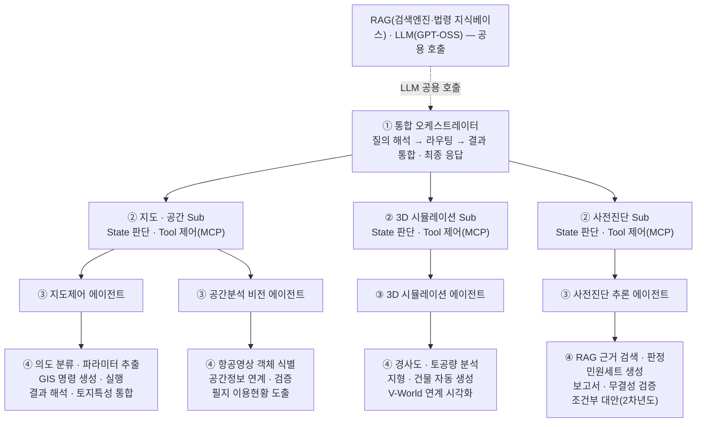
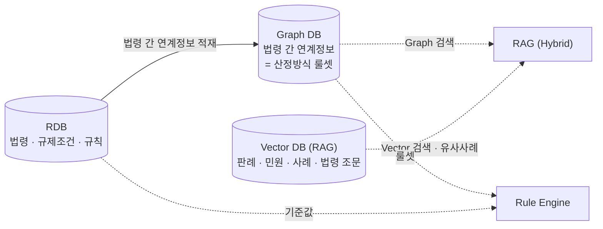
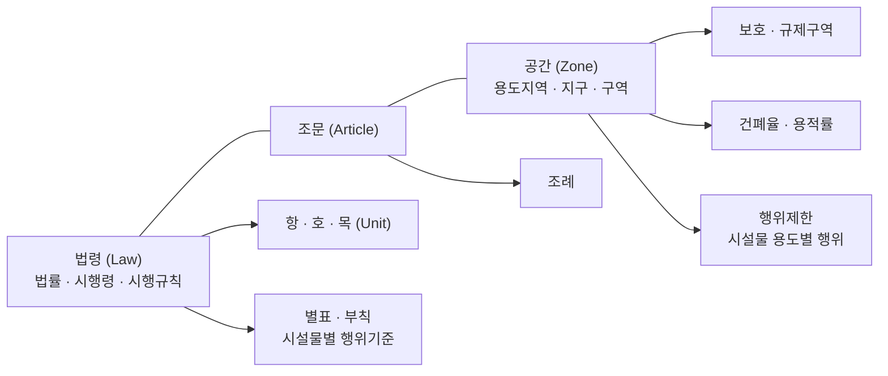
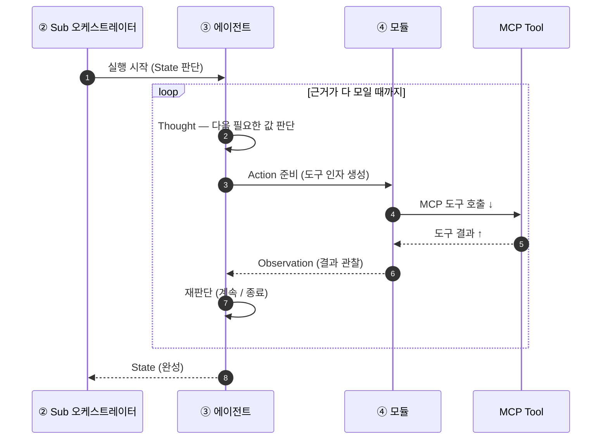
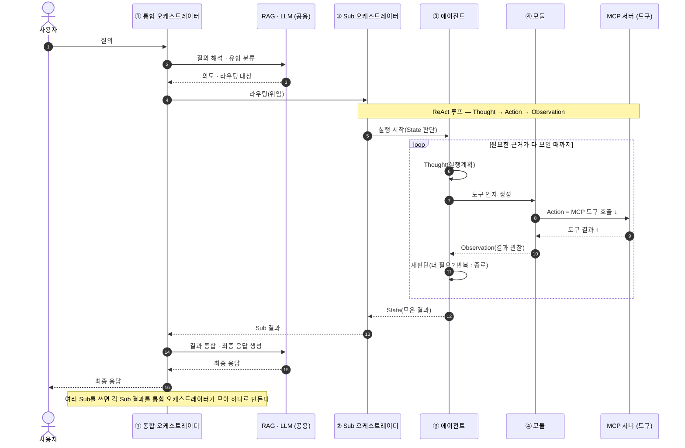

# MCP 4계층 에이전트 구조 — 관계·호출 시퀀스 (간단본)

> **4계층 멀티 AI 에이전트 구조와 분기 로직을 결정적으로 정의하여 응답 일관성을 확보하고,
> Sub 오케스트레이터의 ReAct 루프·MCP 기반 도구 위임으로 컨소시엄 3사 병행 개발·기능
> 확장 대응력 확보.**

이 문서는 **통합 오케스트레이터 ↔ Sub 오케스트레이터 ↔ 에이전트 ↔ 모듈** 사이에서
**MCP 도구를 어떻게 호출(요청)하고 결과를 어떻게 돌려받는지(Observation)**, 그리고
**ReAct 루프가 어떻게 도는지**를 간단히 설명한다. (상세본: `MCP-AGENT-SEQUENCE.md`)

---

## 1. 4계층 구조

- **① 통합 오케스트레이터** — 질의를 해석·유형 분류하고, 어느 Sub로 보낼지 **라우팅**하고,
  Sub들의 결과를 **통합해 최종 응답**을 만든다. **RAG·LLM은 공용**으로 함께 호출한다.
- **② Sub 오케스트레이터(3개)** — 도메인 안에서 **State 판단**과 **에이전트 호출 순서·ReAct
  루프**를 관장한다. **MCP 도구를 직접 부르지 않는다.**
- **③ 에이전트(4개)** — 모듈을 실행하고 **MCP 도구 호출의 유일한 주체**다. 결과를 정규화한다.
- **④ 모듈** — 단일 기능 단위(도구 인자 생성 / 응답 해석 / 결정적 계산).

### 1.1 DB 관계 — RDB · Graph DB · Vector DB

- **RDB** — 법령·규제조건·규칙(건폐율·용적률 등 **판정 기준값**). Graph DB 적재의 원천.
- **Graph DB** — RDB에서 적재한 **법령 간 연계정보**로 **산정방식 룰셋(규칙)**을 구성한다. Rule
  Engine과 RAG(Graph 검색)가 읽는다.
- **Vector DB(RAG)** — 판례·민원·사례·법령 조문 임베딩. **법령 검색 + 유사사례 검색 → 근거 제시**.
- **Hybrid RAG** — RAG는 **Graph DB와 Vector DB를 함께 조회**한다(그래프 확장 + 벡터 유사검색).
  즉 `RDB→Graph→Vector` 직렬이 아니라, RDB는 적재 원천이고 조회는 Graph·Vector 양쪽에서 일어난다.

### 1.2 온톨로지 구조 설계 (Graph DB에 들어가는 지식 체계)

> **법령·조례와 지역지구·판단 규칙을 단일 온톨로지로 통합하고 무결성 강제 규칙을 정의하여,
> 인허가 판정의 법적 근거 추적성과 룰엔진·RAG 검색에 직결되는 지식 체계 확보.**

- **법령(Law)** — 법률·시행령·시행규칙 → **항·호·목(Unit)**, **별표·부칙**(시설물별 행위기준)
- **조문(Article)** — 법령과 공간을 잇는 중간 계층 → **조례**로 확장
- **공간(Zone)** — 용도지역·지구·구역 → **보호·규제구역**, **건폐율·용적률**, **행위제한**(시설물 용도별 행위)
- **무결성 강제 규칙**으로 이 지식 체계의 일관성을 검사해, **판정의 법적 근거 추적성**과
  **Rule Engine·RAG 검색**이 이 온톨로지에 직결되게 한다.

---

## 2. 오르내리는 것 — 요청(↓) / 결과 반환(↑)

- **내려갈 때(↓)** = `요청 · MCP 도구 호출` : 통합 → Sub → 에이전트 → 모듈 → **MCP 서버(도구 실행)**
- **올라올 때(↑)** = `결과 반환(Observation)` : 모듈 → 에이전트 → Sub → 통합
- 마지막에 **통합 오케스트레이터가 결과를 통합해 최종 응답을 생성**한다.

| 구간 | 오가는 것 |
|---|---|
| 모듈 ↔ MCP 서버 | **도구 호출 · 도구 결과** |
| 모듈 → 에이전트 | **Observation**(도구가 돌려준 결과) |
| 에이전트 → Sub | **State**(지금까지 모은 상황) |
| Sub → 통합 | **Sub 결과** |
| 통합 → 사용자 | **최종 응답** |

> **핵심 규칙:** MCP 도구를 직접 부르는 계층은 **에이전트뿐**이다. 통합·Sub는 판단·라우팅만
> 하고 도구를 직접 부르지 않는다 — 그래서 분기 로직이 한 곳에 모여 **응답 일관성**이 유지된다.

---

## 3. ReAct 루프 — 에이전트 안에서 도는 방식

에이전트는 한 번에 끝내지 않고, 필요한 근거가 다 모일 때까지 **Thought → Action → Observation**
을 반복한다.

| 단계 | 하는 일 |
|---|---|
| **Thought**(실행계획) | 지금 State에서 **다음에 필요한 값**이 무엇인지 판단 |
| **Action**(도구 호출) | 그 값을 주는 **MCP 도구를 호출** |
| **Observation**(결과 관찰) | 도구가 돌려준 **정형 결과**를 받아 State에 반영 |
| **재판단 반복** | 더 필요하면 다시 Thought로, 다 모이면 State를 Sub에 올림 |

**ReAct 구조 — Sub ↔ 에이전트 ↔ 모듈 ↔ Tool**

> Sub는 **루프를 관장**만 하고, **도구를 직접 부르는 건 에이전트**다(모듈 경유). 모듈은
> **MCP Tool을 호출**하고 결과를 Observation으로 되돌린다.

---

## 4. MCP 도구 호출 관계 시퀀스

질의 1건이 4계층을 한 번 왕복하며 MCP 도구를 호출하는 관계다.

> 복합 질의(예: 지도 표시 + 사전진단)는 통합 오케스트레이터가 **여러 Sub에 병렬로 위임**하고,
> 각 Sub의 결과(State)를 모아 **충돌을 조정한 뒤 최종 응답**을 만든다.
